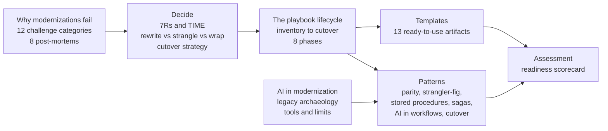

# Lossless Modernization

**The open playbook for modernizing systems that cannot be allowed to break.**

Banks, governments, insurers, healthcare, ERP, mainframes: any system where an output drifting by a penny, a record, or a case is a real-world incident. This repo is a sourced, visual, practitioner-grade reference for taking those systems to modern platforms **without losing a byte of logic or a cent of accuracy**.

- **79% of application modernization projects fail**, at an average cost of $1.5M and 16 months [vFunction/Wakefield, 2022](https://info.vfunction.com/hubfs/Download%20Assets/Wakefield-Report-2022-Why-App-Modernization-Projects-Fail.pdf)
- TSB's big-bang core banking migration cost **~£1B** and the CEO's job [Slaughter and May review, 2019](https://www.techmonitor.ai/leadership/digital-transformation/slaughter-and-may-tsb)
- Queensland Health's payroll replacement ran **~200x over budget**: $6.2M planned, $1.2B+ actual [Commission of Inquiry, 2013](https://www.henricodolfing.ch/en/case-study-9-the-payroll-system-that-cost-queensland-health-au1-25-billion/)

The failures are not technology failures. They are failures of **understanding, verification, and cutover discipline**. This playbook is organized around exactly those three things.

---

## Start here

| You are | 1 hour | Go deeper |
|---|---|---|
| **CTO / engineering leader** | [Why modernizations fail](./why-modernizations-fail/README.md) then [Cutover strategy](./decide/cutover-strategy.md) | [Learning paths](./LEARNING-PATHS.md) |
| **Architect** | [Rewrite vs strangle vs wrap](./decide/rewrite-vs-strangle-vs-wrap.md) then [The playbook lifecycle](./playbook/README.md) | [Learning paths](./LEARNING-PATHS.md) |
| **Hands-on engineer** | [Pattern 01: Parity](./patterns/01-parity.md) then [Templates](./templates/README.md) | [Learning paths](./LEARNING-PATHS.md) |
| **Any role, honest look in the mirror** | [Readiness scorecard](./assessment/readiness-scorecard.md) | one hour, 12 categories, no mercy |

## The map

## What is in this playbook

| Section | What you get |
|---|---|
| **[Why modernizations fail](./why-modernizations-fail/README.md)** | The sourced taxonomy of 12 challenge categories, with the industry's strongest statistics, and **[8 famous post-mortems](./why-modernizations-fail/post-mortems/README.md)**: TSB, Post Office Horizon, Queensland Health, HealthCare.gov, Lidl SAP, FBI Virtual Case File, Birmingham Oracle, California EDD, each mapped to the pattern that would have helped |
| **[Decide](./decide/README.md)** | Decision trees for the three choices every program faces: [strategy per application (7Rs, TIME)](./decide/choose-your-strategy.md), [rewrite vs strangle vs wrap](./decide/rewrite-vs-strangle-vs-wrap.md), and [cutover style](./decide/cutover-strategy.md) |
| **[The playbook lifecycle](./playbook/README.md)** | The artifact lifecycle every major framework converges on: inventory, score, decide, map dependencies, plan waves, build parity evidence, runbook the cutover, record decisions |
| **[Patterns](./patterns/01-parity.md)** | Nine field-tested patterns with diagrams: [Parity](./patterns/01-parity.md), [Strangler-fig](./patterns/02-strangler-fig.md), [Taming stored procedures](./patterns/03-taming-stored-procedures.md), [Event-driven and saga](./patterns/04-event-driven-saga.md), [AI in workflows](./patterns/05-ai-in-workflows.md), [Cutover](./patterns/06-cutover.md), [Reliability under an LLM](./patterns/07-reliability-under-llm.md), plus the [Parity Harness deep-dive](./patterns/parity-harness-deepdive.md) |
| **[Templates](./templates/README.md)** | 13 copy-paste artifacts nobody else ships free and coherent: application inventory with 7R disposition, risk register, wave plan, cutover runbook, rollback plan, **parity report**, ADR, business case, characterization test plan, RACI, legacy knowledge map, dependency map |
| **[Assessment](./assessment/readiness-scorecard.md)** | A readiness scorecard: score your program 0 to 5 across all 12 challenge categories in an hour, and know exactly which chapter to read for every weak spot |
| **[AI in modernization](./ai/README.md)** | The tool landscape (watsonx, AWS Transform, Moderne, Mechanical Orchard), the documented limits, and the signature method: **[AI legacy archaeology](./ai/legacy-archaeology.md)**, using Claude agents to recover intent from undocumented legacy code under human sign-off |
| **[Case studies](./case-studies/flagship-program.md)** | The flagship program behind this playbook: a $1.6T asset-management platform, $4.5B in daily trades, re-architected with zero tolerance for drift |

## The thesis

Modernizing a mission-critical system is not primarily an engineering problem. The cloud target, the services, the pipelines: well understood, and frankly the easy part. The hard part is epistemic: **how do you know the new system is right?** Decades of business logic sit in code no living person fully understands, encoding forgotten regulatory reasons and long-patched edge cases, wired to consumers who will notice if a single value drifts.

> **Parity first.** Speed, cost, and elegance are negotiable. Correctness is not.

The industry is converging on the same conclusion from every direction: Google built [Dual Run](https://cloud.google.com/blog/products/infrastructure-modernization/dual-run-by-google-cloud-helps-mitigate-mainframe-migration-risks) to certify mainframe parity on live traffic, the UK's GDS mandates [dark-launch comparison testing](https://www.gov.uk/service-manual/technology/moving-away-from-legacy-systems), [Mechanical Orchard](https://www.mechanical-orchard.com/platform) sells behavior-first equivalence proof, and [Michael Feathers](https://understandlegacycode.com/blog/key-points-of-working-effectively-with-legacy-code/) taught us to pin behavior with characterization tests two decades ago. In the AI era this matters more, not less: **AI translates and documents; execution-based parity evidence certifies.**

## The proof

This playbook is written from doing it: a **$1.6 trillion** asset-management and trading platform, **$4.5B in trades a day**, 30 years of logic locked in stored procedures and overnight batch, re-architected into an event-driven, API-first cloud system with AI agents inside once-manual workflows. Proven with a **12+ week production parallel run**, **5,000+ business-test scenarios**, and formal three-way sign-off. Read it as a case study: **[the flagship program](./case-studies/flagship-program.md)**. Every pattern is sanitized and generalized: no proprietary code, no employer specifics, just the method.

## Reference

- **[Learning paths](./LEARNING-PATHS.md)**: where to start, by role and time budget
- **[Glossary](./GLOSSARY.md)**: parity harness, strangler-fig, 7Rs, characterization tests, dark launch, and friends
- **[Sources](./SOURCES.md)**: the full annotated bibliography behind every claim
- **[Myth-Buster](./MYTH-BUSTER.md)**: the closing essay on what is actually hard about modernization
- **[Contributing](./CONTRIBUTING.md)**: post-mortems, templates, and corrections welcome; every claim needs a source

## Author

**Nik Jain**: I re-architect trillion-dollar financial systems into AI-native platforms, and build AI-first products from zero. This playbook is the method behind that work, opened up and grounded in the industry's best evidence.
[LinkedIn](https://www.linkedin.com/in/niktechnologist/) · [X](https://x.com/NIkJain1510) · [GitHub](https://github.com/nikjain15)

## License

[MIT](./LICENSE). All content is generalized and sanitized: nothing here reflects any specific employer's proprietary systems, code, or data.

---

legacy modernization · mainframe modernization · strangler fig pattern · parity testing · parallel run · dark launch · characterization tests · COBOL migration · stored procedures · event-driven architecture · saga pattern · cutover runbook · 7Rs · technical debt · AI legacy archaeology · enterprise AI · LLM reliability
