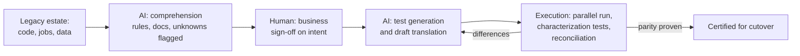

# AI in Legacy Modernization: What Works, What Doesn't, and How to Keep Guarantees

## Exec summary

61% of executives say generative AI is important to their mainframe modernization plans [IBM IBV, 2024](https://www.ibm.com/thought-leadership/institute-business-value/en-us/report/mainframe-application-modernization), and every major vendor now ships an AI modernization product. The evidence supports a narrower claim than the marketing: AI is excellent at comprehension (explaining undocumented code, extracting business rules, generating documentation and tests) and useful but unreliable at translation. No AI system can certify that a translated system behaves like the original. Only execution-based parity evidence can: run both, compare outputs, reconcile every difference. This page maps the tool landscape with each tool's documented limits, states the consensus principle, and links the three in-repo guides for putting AI to work without giving up guarantees.

---

## The landscape

Six efforts define the current state. Each row carries its documented limit, because the limits are where programs get hurt.

| Tool / research | What it is | Documented limit |
|---|---|---|
| [IBM watsonx Code Assistant for Z](https://www.ibm.com/new/announcements/ibm-watsonx-code-assistant-for-z-accelerate-the-application-lifecycle-with-generative-ai-and-automation) | Gen-AI COBOL to Java on a 20B-parameter Granite model: understand, refactor, transform, validate [IBM Research, 2023](https://research.ibm.com/blog/cobol-java-ibm-z) | Works on individual COBOL business services, not whole monoliths; validation testing still maturing |
| [AWS Transform](https://aws.amazon.com/about-aws/whats-new/2025/05/aws-transform-mainframe-generally-available) | Agentic AI for mainframe modernization (GA May 2025): analyzes, documents, refactors, and tests COBOL/PL1/JCL; its "Reimagine" pattern extracts business rules, then pairs with agentic coding tools [AWS, 2025](https://aws.amazon.com/blogs/migration-and-modernization/reimagine-your-mainframe-applications-with-agentic-ai-and-aws-transform/) | Claims of years-to-months are vendor-reported; outputs (documentation, business-rule catalogs, test suites) still require human validation before they can be trusted |
| [Moderne / OpenRewrite](https://docs.openrewrite.org/) | Deterministic mass refactoring via Lossless Semantic Trees: 10,000+ recipes across 10+ languages [Moderne](https://moderne.ai/openrewrite) | Deterministic by design (same recipe, same output, which LLMs cannot promise), but scoped to framework and API migrations more than COBOL estates |
| [Mechanical Orchard (Imogen)](https://www.mechanical-orchard.com/platform) | Behavior-first rewriting: capture real production data flows, build a synthetic replica, generate code with AI, prove behavioral parity transaction by transaction before incremental cutover | Its own positioning is the limit statement for the field: code-only LLM translation is "wishful thinking" [HyperFRAME Research, 2026](https://hyperframeresearch.com/2026/05/22/the-behavior-first-paradigm-moving-mainframe-modernization-past-llm-wishful-thinking/) |
| [Bloop AI](https://scalingdevtools.com/podcast/episodes/louis-bloop) | COBOL to Java combining static transpilation, AI-driven refactoring, and correctness checks | The hybrid design exists because pure LLM output is not trustworthy for semantics, per the founder |
| [LLM comprehension research](https://arxiv.org/html/2507.02182v1) | Multi-agent LLM approaches for explaining COBOL and generating documentation for undocumented systems | Comprehension and explanation is the lowest-risk, highest-adoption use case; the same literature finds LLMs help comprehension more than conversion [arXiv 2411.14971](https://arxiv.org/abs/2411.14971) |

## The consensus principle: AI translates, execution certifies

Three independent lines of evidence converge on one rule.

1. **The parallel-run vendors.** Google Cloud Dual Run exists because translation alone is not proof: it runs mainframe and cloud replica side by side on production transactions and compares outputs before certifying parity [Google Cloud, 2022](https://cloud.google.com/blog/products/infrastructure-modernization/dual-run-by-google-cloud-helps-mitigate-mainframe-migration-risks).
2. **The behavior-first vendors.** Mechanical Orchard makes captured production behavior, not source code, the source of truth, and proves parity transaction by transaction [Mechanical Orchard](https://www.mechanical-orchard.com/platform).
3. **The research.** LLMs default to surface similarity over semantic preservation [arXiv 2404.00971](https://arxiv.org/abs/2404.00971); execution plus LLM judging reaches roughly 95% equivalence detection, meaning execution is doing the heavy lifting [MatchFixAgent, arXiv 2509.16187](https://arxiv.org/pdf/2509.16187); and Berkeley concludes LLM translation needs formal compositional reasoning to be trustworthy [Berkeley EECS-2025-174](https://www2.eecs.berkeley.edu/Pubs/TechRpts/2025/EECS-2025-174.pdf).

So the operating rule for any modernization program: **AI translates and documents; execution-based parity evidence certifies.** AI-produced artifacts are drafts until deterministic evidence (parallel runs, characterization tests, record-for-record reconciliation) says otherwise. This is the reliability model this playbook builds on in [the parity harness](../patterns/parity-harness-deepdive.md) and the [parity report template](../templates/parity-report.md).

## Where AI helps most, in order

**1. Comprehension and archaeology first.** Explaining undocumented systems is the lowest-risk, highest-value use: a wrong explanation gets caught by a human reviewer before it costs anything, unlike a wrong translation in production. The academic literature consistently finds LLMs stronger at comprehension than conversion [arXiv 2411.14971](https://arxiv.org/abs/2411.14971); [arXiv 2508.19663](https://arxiv.org/abs/2508.19663), and multi-agent approaches to explaining COBOL are maturing fast [arXiv 2507.02182](https://arxiv.org/html/2507.02182v1). This playbook's worked method is [Claude agents for legacy archaeology](./legacy-archaeology.md): extraction into reviewable artifacts, explicit "intent unknown" flags, business sign-off. In the flagship program this class of AI workflow saved roughly 661 hours per year and reduced an estimated $4M of risk (program-reported figures, see [the flagship case study](../case-studies/flagship-program.md)).

**2. Test generation second.** Generating characterization tests and scenario suites from extracted rules multiplies scarce expert time: experts review tests instead of writing them. AWS Transform generates test suites alongside documentation [AWS, 2025](https://aws.amazon.com/blogs/migration-and-modernization/reimagine-your-mainframe-applications-with-agentic-ai-and-aws-transform/). Generated tests are still verified the deterministic way: run them against the legacy system and confirm they pass before using them to judge the new one (see the [characterization test plan template](../templates/characterization-test-plan.md)).

**3. Translation last, and only with verification.** Translation is where AI saves the most typing and carries the most risk, so it goes last in trust order: every translated unit is gated by the execution evidence above. Deterministic tools (OpenRewrite recipes, static transpilation) are preferable where they fit, precisely because they remove the model's variance [Moderne](https://docs.openrewrite.org/).

## The failure modes

Know these before scoping an AI-assisted program:

- **Hallucination is systematic, not occasional.** Researchers have built a taxonomy of LLM code hallucinations with 3 primary and 12 specific categories [arXiv 2404.00971](https://arxiv.org/abs/2404.00971). Treat hallucination as a property of the tool to be engineered around, not an anomaly to be hoped away.
- **Context windows cannot hold a mainframe estate.** Cross-program dependencies, JCL orchestration, and shared copybooks span far more than any context window, so per-file analysis silently misses estate-level behavior; COBOL's thin representation in training data compounds it [DataStealth, 2025](https://datastealth.io/blogs/mainframe-modernization-claude-code-cobol). Mitigation: dependency mapping and estate-level inventory before AI analysis, not after (see the [application inventory template](../templates/application-inventory.md)).
- **"JOBOL": unidiomatic translation.** Naive COBOL-to-Java translation produces Java with COBOL's shape: procedural, untestable, and no easier to maintain than the original. Translation is not equivalence, and it is not modernization either [DataStealth, 2025](https://datastealth.io/blogs/mainframe-modernization-claude-code-cobol). The counter-pattern is behavior capture plus intentional re-architecture, the approach behind Mechanical Orchard's Imogen and Microsoft's agentic COBOL migration pipelines [Microsoft DevBlogs](https://devblogs.microsoft.com/).
- **Confident wrongness compounds under scale.** A human reviewer can check one extraction; nobody can hand-check 10,000. The only scalable gate is deterministic: execution parity, reconciliation counts, characterization suites in CI. This is the subject of [Pattern 07: Reliability under an LLM](../patterns/07-reliability-under-llm.md).

## The in-repo guides

Three documents turn this into practice:

1. [Claude agents for legacy archaeology](./legacy-archaeology.md): the signature method. AI reads undocumented stored procedures, extracts rules into reviewable artifacts, flags unknowns, business signs off, parity harness certifies.
2. [Pattern 05: AI agents in workflows](../patterns/05-ai-in-workflows.md): where AI agents sit inside modernization delivery workflows, and the human approval loops around them.
3. [Pattern 07: Reliability under an LLM](../patterns/07-reliability-under-llm.md): how to keep deterministic guarantees when a non-deterministic component is in the loop.

---

**Next:** [Legacy archaeology](./legacy-archaeology.md) · [The parity harness deep dive](../patterns/parity-harness-deepdive.md) · [Readiness scorecard, category 11](../assessment/readiness-scorecard.md)
