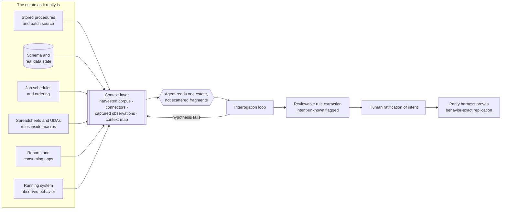
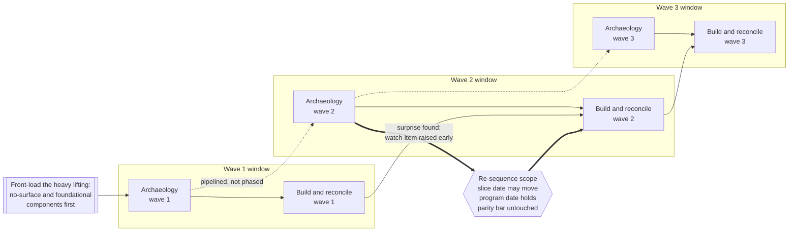

# Legacy-Code Archaeology: Recovering Intent from Undocumented Logic

*The comprehension method at the front of the [Lossless Modernization](../README.md) playbook. Closely tied to [Pattern 03: Taming stored-procedure logic](../patterns/03-taming-stored-procedures.md). Worked at scale on the [flagship program](../case-studies/flagship-program.md), where it was implemented with Claude agents and skills.*

---

## Exec summary

The hardest input to modernizing a decades-old money-critical system is not the target architecture. It is understanding logic that no documentation describes and no living person fully holds. Two things make that hard, and most discussion of "AI for legacy code" addresses only the first: the logic is **dense and undocumented**, and it is **spread across systems never designed to be read together**, including stored procedures, the data state their branches turn on, job ordering, downstream reports, and spreadsheets with business rules compiled into macros.

Legacy-code archaeology recovers that intent deliberately, before translation, in two halves. A **context layer** engineers the estate into something an agent can actually read, including the parts not reachable by default. An **interrogation loop** then has a practitioner ask, hypothesize, test each hypothesis against both the code and observed behavior, hunt the edges, and record confirmed rules in reviewable form. Humans ratify intent; a [parity harness](../patterns/parity-harness-deepdive.md) proves the replication is behavior-exact.

All of it runs under a deadline, and comprehension work has no natural finish line, so it must be scheduled deliberately: heavy lifting front-loaded, digging scoped to the next wave, archaeology pipelined against the build rather than run as its own phase.

The leadership takeaway: the bottleneck is comprehension, comprehension is gated by context, and the context layer is engineering work that has to be funded and sequenced like engineering work.

---

## The problem it solves

Thirty years of business logic can live inside stored procedures. The rules sit in the data layer, undocumented, patched over decades, understood in full by nobody currently on the team. Manual line-by-line reading works but is slow, and worse, it is hard to *review*: one engineer's mental model of a 2,000-line procedure is not something a business stakeholder can check.

But the procedure text is rarely the whole rule. On the flagship program the comprehension bottleneck gated everything downstream, and the reason it was expensive is that answering one business question routinely meant assembling evidence from several different places, none of which referenced the others.

## When this is worth the investment

The full loop is expensive, so applying it everywhere is its own failure. It earns its cost when the logic is undocumented and its original authors are gone, when getting it wrong is a real-world incident rather than a bug report, and when there is no test or specification that already pins the behavior. Where a rule is documented, owned by someone who understands it, or trivially re-derivable, read it, confirm it, and move on. The scheduling rules later in this chapter are what keep the expensive treatment aimed at the components that need it.

## Where the rule actually lives

Before you can extract a rule you have to find all of it. These are the places it hides, and what each one contributes that the others cannot:

| Source | What only it can tell you | Why it gets missed |
|---|---|---|
| Stored procedure and batch source | The written logic: branches, calculations, order of operations | Nothing. This is the part everyone starts with, and the part tooling handles |
| Schema and real data state | Which branches can actually fire. A condition on a flag, reference row, or record state is dead code or critical path depending entirely on the data | Read as syntax rather than as behavior. Historical records exist in states nothing creates anymore |
| Batch orchestration and job ordering | Behavior that exists in no file: a rule that emerges because job A runs before job B | Invisible to any tool that reads code, because it is expressed in a schedule |
| Spreadsheets and user-developed applications | Business rules compiled into Excel macros and VBA that the core system depends on | **No code-translation tool can see a spreadsheet.** These rules do not survive a code-only migration, and nobody notices until a number drifts |
| Downstream reports and consuming apps | The rules the business actually relies on, sometimes recomputed independently and drifted from the procedure | Treated as output rather than as logic, so their embedded SQL is never read |

The user-developed application row is the one that reliably surprises people. A platform with dozens of spreadsheets and dozens of reports hanging off its core does not have its business logic in its code. It has business logic distributed across an estate, and part of that estate is a macro on a business user's desktop.

## The context layer: engineering reach, not copy-pasting

Some of that context is reachable by default and some is not, and **the gap is the work**. On the flagship program the agent could be given procedure source, schema definitions, and non-production data state directly. Job schedules, spreadsheet macros, report definitions, and the behavior of the running system were not reachable by default.

The wrong response to unreachable context is to paste fragments into a chat window. That does not scale past a handful of rules, it produces no durable artifact, and it means every subsequent question re-imports the same context by hand. The right response is to treat reach as an engineering problem and build it, on four fronts:

1. **Harvest everything unreachable into one readable corpus.** Extract the VBA out of the macros as text. Dump job schedules and their dependency graph. Export report definitions and their embedded SQL. Check it all in next to the procedure source, so the agent reads one estate instead of receiving fragments. This single step converts the most-missed sources, spreadsheets and reports, from invisible into greppable.
2. **Build connectors so the agent can query live systems itself.** Programmatic access to schema, non-production data state, and job metadata, so the agent can test its own claims about which branches fire rather than waiting for a human to run a query and paste the result back. This is the difference between an agent that theorizes and an agent that checks.
3. **Capture live-system observations as structured artifacts.** Exercising the running system is the one input that cannot be automated away. So fix its format: every observation gets written into the same corpus in a consistent shape, which turns the least durable input into a reviewable, reusable one instead of a memory in one person's head.
4. **Maintain a legacy context map.** A standing index of where each rule lives: which procedure, which job, which spreadsheet, which report, which observation. It is what makes stitching repeatable rather than rediscovered per rule, and it pairs directly with the [legacy knowledge map template](../templates/legacy-knowledge-map.md), which does the same job for the humans who hold the knowledge.

Build this before scaling the interrogation, not after. Every rule you extract without it costs the same assembly work again.

## The interrogation loop

**This is not a batch pipeline where an agent summarizes a procedure and someone files the summary.** It is an interactive interrogation, run by a practitioner who owns the outcome, in a loop:

0. **Establish the surface.** Confirm you can observe what the thing does. Usually that means the running system. Sometimes it does not exist yet, and you have to build it (see the next section).
1. **Ask.** Point the agent at the assembled context and interrogate it: what does this branch do, when does it fire, what feeds this value, which job writes this row first, what happens on a month-end, what happens when the price is stale?
2. **Hypothesize.** Form a concrete claim about the behavior: "this branch zeroes accrual for holding type X on record dates."
3. **Test the hypothesis, twice.** First against the code, by tracing real examples through the logic with the agent. Then against reality, by observing what the running system actually does. The code tells you what is written; the running system tells you what is true.
4. **Hunt the edges.** Push deliberately into the corners: unusual dates, boundary quantities, rare instrument types, records in states nothing creates anymore, the cases nobody would think to mention in a requirements meeting.
5. **Record.** Each confirmed rule goes into a structured, human-readable extraction: the responsibilities, the branches, the calculations, the special cases, with the un-inferable ones flagged **intent unknown**.

The output is not just faster comprehension. It is *reviewable and verified* comprehension: a structured artifact a stakeholder can read and confirm, where every rule has already survived a test against the real system, rather than an engineer's private mental model.

## The hardest case: when there is no observable surface

Step 3 assumes you can watch the system behave. The worst archaeology targets break that assumption, and they are more common than they sound.

A process can run entirely in the backend for decades with **no screen, no report, and no spreadsheet that exposes what it does**. Nobody in the business has ever seen its output, because there was never anywhere to see it. That is not a documentation gap. It is the absence of any observable surface, and it has three consequences that change the method:

- **There is no user to ask.** The usual fallback, find the person who runs this daily, does not exist. Nobody runs it. It runs.
- **There is no expected answer to agree.** You cannot ask the business to confirm a value they have never been shown, which inverts the normal eval sequence (see below).
- **Hypotheses have nothing to test against.** The only authority on behavior is the process itself.

The method extension is to **construct the surface the legacy never had** before interrogating the logic. Instrument at the data layer: capture the process's real inputs and its real outputs over a representative period, including the odd days. Now you have an observable record, and the loop works again, with captured behavior standing in for the missing product surface. That capture is also the seed of the [characterization test suite](../templates/characterization-test-plan.md) and feeds directly into the [parity harness](../patterns/parity-harness-deepdive.md).

The honest framing for leadership: for this class of component, the first deliverable is not a rewrite. It is observability the system has never had in thirty years, and the program cannot safely proceed on that component without it.

## What the agent gets wrong (and why the loop exists)

The interrogation loop is not ceremony. It exists because every one of these failure modes showed up in practice on the flagship program:

- **Confident but wrong until tested.** The agent's explanation of a branch can sound completely right and still not survive tracing a real example through the code, or a check against observed behavior. Plausibility is not correctness; the hypothesis test is mandatory.
- **Missed cross-procedure and cross-system interactions.** An agent analyzing one procedure well can still miss that two procedures interact through a shared table, a trigger, or batch ordering, and it certainly will not guess that a spreadsheet applies an adjustment downstream. Estate-level behavior does not live in any single file, and context windows do not hold an estate [DataStealth, 2026, vendor analysis](https://datastealth.io/blogs/mainframe-modernization-claude-code-cobol). This is precisely what the context layer is for.
- **Cannot judge intent.** The agent can establish *what* the code does, never *why*. Whether a strange rule is a bug or a deliberate regulatory decision is a question only humans can answer; every such branch goes to ratification.
- **Chokes on size.** The largest, gnarliest procedures had to be decomposed into pieces before the agent could analyze them reliably. Budget for that decomposition work.

These are the documented limits of LLMs on legacy code generally (see [AI in legacy modernization](./README.md)); the loop turns them from silent risks into visible, testable steps.

In practice the wrong answers cluster into three families, and each one is defeated by a different part of the context layer rather than by better prompting:

| Failure family | What it looks like | What actually resolves it |
|---|---|---|
| Ordering-dependent behavior | A confident, coherent explanation that is simply wrong, because the real rule lives in what runs before or after rather than in the procedure | Job schedules and dependency ordering in the corpus |
| Data-dependent branching | Correct reading of the syntax, wrong conclusion about which branches are live path versus effectively dead | Real data state, queryable by the agent rather than described to it |
| Rare cases and unusual days | The normal flow described well, the corners missed: odd dates, unusual quantities, rare types | Deliberate edge-hunting against captured days that contain them |

The practical consequence: when a hypothesis fails, the first question is not "how do I prompt better," it is "which piece of context is missing."

## Who ratifies intent

The agent proposes; **humans confirm.** But "the business" is too coarse a description of who actually holds the answer, and assuming a single business owner can ratify everything is how rules get signed off by people who never knew them. Four constituencies matter, and they hold different kinds of authority:

| Who | What they can settle | Authority |
|---|---|---|
| Business owners | Whether a rule is intended policy, and whether it should survive | Decisional. Their signature is the gate |
| Daily operators of the product | What the system observably does, including the workarounds they perform because it does something odd. Often the only people who know a rule exists at all | Observational, and frequently the source of the question |
| Operations and client-service teams | Which values get queried, which anomalies are normal versus alarming, where breaks surface first | Observational, calibrates what matters |
| Long-tenured engineers and DBAs | Why a patch went in, what the incident was, what the workaround was protecting against | **Historical, not decisional.** They recover the reason; the business still decides the fate |

Keeping that last distinction explicit matters. An engineer remembering why a branch exists is enormously valuable and is not the same as the business agreeing it should continue to exist. Route the memory to the decision, not around it.

This sits squarely inside the reliability model of [Pattern 05](../patterns/05-ai-in-workflows.md) and [Pattern 07](../patterns/07-reliability-under-llm.md): the agent assists, deterministic parity testing validates the replicated behavior, and humans approve. An extracted rule is not trusted because the agent produced it. It is trusted because its intent was ratified and the [parity harness](../patterns/parity-harness-deepdive.md) proves the replication matches legacy behavior exactly.

## Evals and test-driven understanding: why this is genuinely hard

The scenario regime that certifies the new system is built like an eval set: define the cases and their expected answers with the business up front, then run continuously and regressively (the full method is in [the parity harness deep-dive](../patterns/parity-harness-deepdive.md)). Test-driven understanding is also the sharpest tool archaeology has: an extracted rule you can express as an expected answer is a rule you actually understand, and one you cannot is a rule you have only described.

Two things make it much harder in practice than that description suggests, and pretending otherwise is how programs under-plan this work.

**Expected answers exist for outcomes, not for building blocks.** Ask the business what a client's fee or a position's value should be and you will get an answer, because that is a number they see and own. Ask what an intermediate derived value should be, midway through a calculation chain, and often nobody knows, because nobody has ever been shown it. That is not evasiveness. For genuinely invisible components, no human has an expected answer to give. So the sequence inverts: for outcome-level cases the expected answer comes first and archaeology is validated against it, while for building-block cases archaeology comes first, produces a candidate expected answer from the recovered rule plus captured behavior, and the business then ratifies *that* as the specification. Both directions end in a signed expected answer. Only one of them can start there. Plan for both, and never let a building-block value be certified by the same team that derived it.

**Test data does not contain the edge cases.** The states that break things (rare instrument types, mid-cycle events, records in states nothing creates anymore, positions that only exist on certain dates) are largely absent from any test environment. An eval suite built from available test data will pass while proving very little. The cases have to be deliberately constructed, or harvested from the shapes real production data actually takes, which is another reason the [production parallel run](../patterns/parity-harness-deepdive.md) is a gate and not a formality: it is where the scenarios you failed to imagine finally appear.

## Archaeology on a deadline: time is money

Everything above describes rigor. None of it happens in a research lab. It happens inside a program where dates are commitments, and where time is money twice over: the legacy estate costs money every day it keeps running, and a missed milestone costs budget and credibility that the program needs to finish at all. Comprehension work is uniquely dangerous here, because it has no natural finish line. You can always dig one level deeper. Something has to decide when digging stops.

On the flagship program, archaeology had to satisfy four different clocks at once:

| Clock | What it demands |
|---|---|
| Program increment commitments | Committed scope must land in the increment, and archaeology has to produce something demonstrable inside it, not a promise of understanding later |
| Per-wave migration dates | Every rule that a wave's accounts and funds touch must be extracted and ratified before that wave's parallel run can even start |
| Fixed business-calendar dates | Month-end, quarter-end, fiscal and regulatory dates move for nobody, so some windows are immovable regardless of readiness |
| Per-component signed extraction | The ratified extraction is itself a tracked, dated deliverable |

That last row is a deliberate mechanism, not bookkeeping. If comprehension is not on the plan as a dated artifact, it reads as invisible preparation, and invisible preparation is the first thing squeezed when a date gets close. Making the signed extraction a deliverable is what protects the time to do it.

### Four sequencing rules that made the dates

**1. Heavy lifting first.** Structure the timeline so the hardest and most foundational components are taken up earliest: the ones with no observable surface, the ones everything downstream depends on, the ones where discovery is most likely to reshape the plan. Two reasons. The foundation gets built properly instead of being retrofitted under pressure, and the surprises arrive while there is still runway to absorb them. The opposite instinct is the trap: schedule the easy, visible components first because they demo well, and arrive at the genuinely hard ones with no slack left and a date next week.

**2. Only dig into what the next wave needs.** Archaeology is scoped to the components in the upcoming wave, never to the estate for its own sake. If the next wave moves a set of account and fund groups touching six procedures, those six get the loop now and the rest wait for their wave. Comprehension effort is therefore always attached to a dated deliverable, which is what keeps it bounded without anyone having to police it.

**3. Pipeline it, never phase it.** Archaeology on the next wave runs while the current wave is being built and reconciled. Comprehension is never a serial stage the whole program waits on. This is the single highest-leverage scheduling decision available, because a phased "understand everything, then build" plan puts the least predictable work directly on the critical path.

**4. Raise risks and watch-items early, then re-adjust.** Archaeology's job includes reporting what it just found out about the plan. A hidden spreadsheet dependency or a component with no observable surface is a schedule fact, and it is worth far more three weeks early than accurate on the deadline. What then moves is **sequence and scope**: less risky work comes into the increment, the surprised component moves out, and an individual slice's date can slip while the program increment still lands. What never moves is the parity bar. Dates are met by re-sequencing, never by signing an extraction nobody verified.

### What actually eats the calendar, and what to do about it

All four of these consumed real time. None of them is the part anyone plans for.

| Schedule eater | Why it costs more than expected | Countermeasure |
|---|---|---|
| SME and business availability for ratification | Extraction is fast; getting the right person to confirm intent is slow. They have a day job, and they are usually the same scarce people the rest of the program needs | Treat their calendar as a critical-path resource. Book recurring ratification slots in advance, batch rules for review rather than trickling them, and never discover on the deadline that the only authority is on leave |
| Building the context layer and observability | Harvesting macros, schedules and report logic, and instrumenting capture for invisible components, is real engineering effort spent before a single rule is extracted | Fund it as a prerequisite deliverable in an early increment, ahead of the components that depend on it. It is foundation, not overhead |
| Decomposing oversized procedures | The biggest procedures must be broken up before analysis is reliable at all, and this work does not look like progress on any status report | Make it an explicitly tracked task with its own estimate, so it is visible rather than absorbed silently into someone's week |
| The edge-case long tail | Same shape as the parity burndown: fast, encouraging start, then a stubborn tail of rare states and unusual days | Never plan the remaining effort as proportional to what the early passes found. Budget the tail explicitly |

The discipline underneath all of it: schedule pressure is exactly the condition under which programs ship logic nobody verified. That is not a hypothetical failure mode, it is the documented one. TSB went live with 4,424 of 34,671 logged defects still open [Slaughter and May, 2019](https://www.techmonitor.ai/leadership/digital-transformation/slaughter-and-may-tsb), and Queensland Health went live with 2,422 known defects after ten aborted attempts, under pressure to escape a dying system rather than on evidence of readiness [Commission of Inquiry, 2013](https://cabinet.qld.gov.au/documents/2013/aug/health%20payroll%20response/Attachments/Report.pdf). Both hit a date. Neither saved any time.

## What is distinctive here

Archaeology before translation is becoming the industry norm, and that is the right direction of travel. Most "AI for code" tooling still points forward, generating new code and reviewing diffs; this points *backward*, using AI to recover the intent of undocumented legacy so it can be faithfully preserved. Five things separate the method on this page from a well-run documentation-extraction exercise:

- **Context is engineered into reach, not pasted in.** The estate is harvested, connected, and mapped so the agent reads one system. Spreadsheets and report logic, the two sources code-translation tools structurally cannot see, are pulled in first.
- **Hypotheses are tested against the running system, not only the code.** Decades-old estates routinely behave differently from what the source appears to say, because of data state, job ordering, and configuration.
- **Where no observable surface exists, one is built.** Capture inputs and outputs at the data layer to create the observability the legacy never had, rather than certifying a component nobody can watch.
- **Intent is ratified by the right authority, with history separated from decision.** Operators and long-tenured engineers recover what happened; the business decides what survives. "Intent unknown" is a first-class output, not a gap someone quietly fills.
- **Replication is certified downstream by execution-based parity proof.** Comprehension establishes intent; only the [parity harness](../patterns/parity-harness-deepdive.md) proves behavior-exactness.

Taken together, the reframe is from LLM as "coding assistant" to LLM as translator of institutional memory that time nearly erased, with the verification and accountability attached.

## Industry context

The industry is converging on the same conclusion from independent directions. Academic research consistently finds that LLMs are stronger at comprehension of legacy code than at converting it: multi-agent approaches for explaining undocumented COBOL are the lowest-risk, highest-adoption AI use case [arXiv 2507.02182](https://arxiv.org/html/2507.02182v1), and comparative studies find comprehension gains outpace conversion reliability [arXiv 2411.14971](https://arxiv.org/abs/2411.14971); [arXiv 2508.19663](https://arxiv.org/abs/2508.19663). On the vendor side, AWS Transform's "Reimagine" pattern makes the same move at product scale: extract business rules and generate documentation from the mainframe estate first, then hand the recovered intent to agentic coding tools [AWS, 2025](https://aws.amazon.com/blogs/migration-and-modernization/reimagine-your-mainframe-applications-with-agentic-ai-and-aws-transform/). Read that convergence as validation of the sequence, and read the five points above as what a money-critical program has to add on top of it. See [AI in legacy modernization](./README.md) for the full landscape and its documented limits.

## Worked example: the process nobody had ever watched

Sanitized and generalized. It is included because it is the hard case, not the tidy one.

**The situation.** A backend process had been running continuously for more than thirty years, sequencing and routing transactions through the business day. It had no user interface, no report, and no spreadsheet exposing its behavior. Business stakeholders knew it existed and knew the platform depended on it. Not one of them could say how it worked or what its rules were, because there had never been anywhere to look. Its original authors were long gone. The documentation was the code, and the code was thousands of lines of accreted special cases.

Every normal handle was missing. No user to interview. No screen to exercise. No expected answers to agree. And it could not be deferred: too much depended on it.

**1. Assemble the context before asking anything.** The procedure source came in first, then the schema and the real data states its branches tested, then the job schedule that determined what ran before it and what consumed its output. Sources that mattered turned up outside the code entirely: scheduling dependencies that made ordering rules real, and downstream consumers whose own logic revealed which of its outputs were actually load-bearing. All of it landed in one corpus, indexed in the context map.

**2. Build the observable surface the system never had.** Because nothing exposed the process's behavior, the first engineering deliverable was capture: instrument the data layer to record its real inputs and real outputs across a representative period, deliberately including month-ends and unusual days. That capture became the only authority on what the process actually did, and later the seed of its characterization suite.

**3. Interrogate, with everything flagged unknown by default.** The agent produced a first-pass extraction: the responsibilities, the sequencing rules, the branch conditions, the special cases. Because no business authority could confirm intent, every rule started as **intent unknown**. This is the inversion worth noticing: on a visible component most rules arrive with an owner who can confirm them, and here none did.

**4. Test each hypothesis against captured behavior.** Each claim became a concrete prediction: given these inputs on this kind of day, the process emits this. Then check it against the capture. Many survived. The ones that failed were the valuable part, and they failed in three recognizable ways:

- **Rules that depended on what ran before or after.** The behavior was a property of the schedule, not of the procedure, so reading the source gave a confident wrong answer. Only resolved once job ordering and dependencies were in the corpus.
- **Rules that depended on the actual data.** The code read clearly, but which branch was live path and which was effectively dead depended on a flag, a config row, or a record state. Only resolved by checking real data state rather than reasoning about syntax.
- **The rare cases and unusual days.** The normal flow was described well. The corner cases were not: odd dates, unusual quantities, rare types. Only resolved by deliberately hunting the edges against captured days that contained them.

Notice that none of the three could have been caught by reading the procedure more carefully. Each one required a different piece of the context layer, which is the argument for building it first.

**5. Recover history from engineers, decide fate with the business.** Long-tenured engineers and DBAs could account for several of the strangest branches: an incident decades ago, a workaround that became permanent. That is historical authority, and it settled *what happened* without settling *what should continue*. The recovered rules went to business owners as a proposed specification: this is what the process does, here is why each branch appears to exist, here is what we cannot explain. The business ratified the set, retiring the rules that no longer applied and formally preserving the rest.

**6. Certify with parity.** The replicated service was then proven against captured production behavior in the [parity harness](../patterns/parity-harness-deepdive.md), value by value, at intermediate and final stages, through the production parallel run.

**Why this is the example worth studying.** A code-only translation of this component would have produced something plausible, shipped it, and discovered the ordering rules in production, on the days when ordering mattered. Nobody could have caught it in review, because nobody knew the rules and there was nothing to compare against. What made it safe was the sequence: build reach, build observability, interrogate against captured truth, separate history from decision, prove with parity. The output was a component that the business, for the first time in thirty years, could actually describe.

## Pitfalls / anti-patterns

- **Treating the procedure text as the whole rule.** If spreadsheets, job ordering, and report logic are not in the corpus, the extraction is confidently incomplete.
- **Copy-pasting context instead of engineering reach.** It does not scale, it leaves no durable artifact, and it re-imports the same context by hand for every question.
- **Certifying a component with no observable surface.** If nothing can watch it, build the capture first. Do not accept a rewrite of something nobody can check.
- **Trusting the extraction without ratification.** A plausible replication can be subtly wrong. Intent sign-off is mandatory.
- **Letting historical memory substitute for a business decision.** Knowing why a branch exists is not agreement that it should survive.
- **Letting the agent decide what logic *should* be.** It recovers what the logic *is*; humans decide what it should become.
- **Testing against the source only.** If no hypothesis is ever checked against real behavior, the extraction inherits every gap between what the code says and what production does.
- **Building the eval set from available test data.** It will pass and prove little, because the edge cases are not in it.
- **Skipping the parity proof.** Extraction plus sign-off establishes intent; only the parity harness proves behavior-exactness.
- **Hiding the unknowns.** The value is partly in the agent flagging what it *cannot* infer. Suppressing that removes the most important signal.
- **Over-claiming.** This accelerates and de-risks comprehension; it does not remove the need for rigorous human review and parity testing.

## Checklist

**Context layer**
- [ ] Procedure and batch source, schema, and real data state in the agent's reach
- [ ] Spreadsheet and UDA logic extracted to text and harvested into the corpus
- [ ] Job schedules and dependency ordering harvested, not assumed
- [ ] Report and consuming-app definitions harvested, including embedded SQL
- [ ] Connectors built so the agent can query schema, data state, and job metadata itself
- [ ] Live-system observations captured in a consistent, reviewable format
- [ ] Context map maintained: which rule lives in which procedure, job, spreadsheet, report

**Interrogation**
- [ ] An observable surface exists for every component under analysis, or has been built by capturing real inputs and outputs
- [ ] Loop run as ask, hypothesize, test against code AND observed behavior, hunt edges, record
- [ ] Every agent claim verified by tracing a real example or checking captured behavior, never accepted on plausibility
- [ ] Large procedures decomposed; cross-procedure and cross-system interactions checked explicitly
- [ ] Extractions flag "intent unknown" for un-inferable branches

**Ratification and proof**
- [ ] Business owners hold the decisional sign-off on every rule's fate
- [ ] Operators, ops and client-service teams consulted for observed behavior and workarounds
- [ ] Long-tenured engineers and DBAs mined for history, with history kept distinct from decision
- [ ] Building-block expected answers derived from archaeology then ratified, never self-certified by the team that derived them
- [ ] Eval scenarios include deliberately constructed edge cases, not only what test data happens to contain
- [ ] Replicated behavior proven behavior-exact by the parity harness

**Schedule**
- [ ] Signed extraction tracked as a dated deliverable, so comprehension is visible on the plan
- [ ] Hardest and most foundational components front-loaded into the earliest increments
- [ ] Archaeology scoped to the next wave, not to the estate for its own sake
- [ ] Archaeology pipelined against the build, never run as a serial phase everyone waits on
- [ ] Context layer and observability funded in an increment ahead of the components that need them
- [ ] Procedure decomposition tracked as explicit estimated work, not absorbed silently
- [ ] Ratification slots booked with SMEs in advance and rules batched for review
- [ ] Long tail budgeted explicitly, not extrapolated from early findings
- [ ] Watch-items raised as soon as found, with sequence and scope flexing while the parity bar holds

---

**Next:** [AI in legacy modernization](./README.md) | [The Parity Harness deep-dive](../patterns/parity-harness-deepdive.md) | [Flagship case study](../case-studies/flagship-program.md)

*Related: [Pattern 03, Taming stored procedures](../patterns/03-taming-stored-procedures.md) · [Pattern 05, AI agents in workflows](../patterns/05-ai-in-workflows.md) · [Pattern 07, Reliability under an LLM](../patterns/07-reliability-under-llm.md) · [Legacy knowledge map](../templates/legacy-knowledge-map.md) · [Characterization test plan](../templates/characterization-test-plan.md) · [Glossary](../GLOSSARY.md)*
