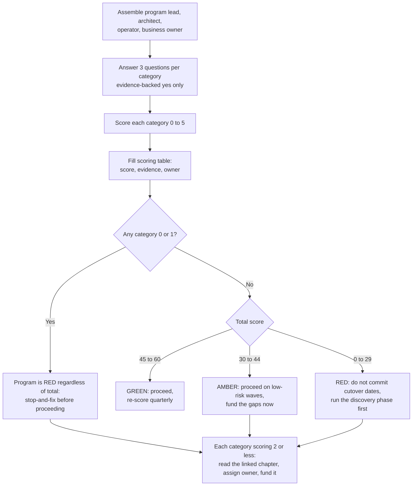

# Modernization Readiness Scorecard

## Exec summary

Score your modernization program 0 to 5 across the 12 categories where programs actually fail: knowledge, talent, data, testing, cutover, cost, scope, governance, vendors, architecture, AI, and inaction. Thirty-six yes/no questions, roughly five minutes per category, one hour total. The UK government runs a similar exercise across its entire legacy estate, and its framing is the right one: scores exist to direct funding and attention, not to shame teams [UK CDDO Legacy IT Risk Assessment Framework](https://gov.uk/government/publications/guidance-on-the-legacy-it-risk-assessment-framework/guidance-on-the-legacy-it-risk-assessment-framework). A low score is not a verdict on your people. It is a map of where the next dollar and the next sprint should go. Every low score links to the chapter of this playbook that fixes it.

---

## How to run this in an hour

1. Get the right people in one room: the program lead, the lead architect, someone who operates the legacy system today, and the business owner. If you cannot assemble that group, that is itself a finding (see category 8).
2. For each category, answer the three yes/no questions honestly. A "yes" only counts if you could show the evidence to an auditor: a document, a test run, a signed decision. "Someone probably knows" is a no.
3. Score the category 0 to 5 using its rubric. Record the evidence and an owner in the scoring table.
4. Total the scores, read the interpretation bands, and turn every category scoring 2 or less into a funded action with the linked chapter as the starting point.

Ground rule, borrowed from the CDDO framework: the point of a red rating is to trigger investment and escalation, not blame [UK CDDO, 2023](https://gov.uk/government/publications/guidance-on-the-legacy-it-risk-assessment-framework/guidance-on-the-legacy-it-risk-assessment-framework). Teams that get punished for honest reds will report ambers forever, and the scorecard becomes theater.

---

## The 12 categories

Each category: three yes/no questions, a 0 to 5 rubric, and where to go if you score 2 or less.

### 1. Understanding and knowledge loss

Only 16% of organizations say their workflows are well documented [Lucid survey via Sentra, 2025](https://www.sentra.app/articles/tribal-knowledge), and the crufty parts of old code embed hard-earned knowledge about corner cases [Spolsky, 2000](https://www.joelonsoftware.com/2000/04/06/things-you-should-never-do-part-i/).

- [ ] Q1. Do you have a complete, current inventory of applications, batch jobs, integrations, reports, and external consumers of this system?
- [ ] Q2. Can you name where the business logic actually lives (application code, stored procedures, batch, spreadsheets, human workarounds), backed by analysis rather than assumption?
- [ ] Q3. Have you compared what the system actually does in production (observed behavior) against what the documentation says it does?

| Score | Anchor |
|---|---|
| 0-1 | No inventory exists; logic location is folklore; nobody has compared docs to observed behavior |
| 2-3 | Partial inventory; logic mapped for the best-known modules only; observation ad hoc |
| 4-5 | Current inventory with owners; logic location mapped and evidenced; observed-vs-documented gaps logged and triaged |

**If you scored 2 or less:** read [Why modernizations fail: knowledge loss](../why-modernizations-fail/README.md), then start the [application inventory template](../templates/application-inventory.md) and [AI-assisted legacy archaeology](../ai/legacy-archaeology.md).

### 2. Talent and the skills cliff

79% of financial firms cite mainframe talent acquisition as a top challenge and 71% report being understaffed [Deloitte, 2025](https://biztechmagazine.com/article/2025/04/how-financial-services-companies-can-maintain-mainframes-cobol-experts-retire). The same scarce experts are needed to validate the new system, so scarcity blocks the modernization itself [TechTarget, 2022](https://www.techtarget.com/searchsoftwarequality/news/252523671/).

- [ ] Q1. Can you name, person by person, who still understands each critical module, and is that list written down rather than assumed?
- [ ] Q2. If your two most knowledgeable legacy engineers resigned tomorrow, could the program still validate the new system's behavior?
- [ ] Q3. Do you have a funded plan (pairing, documentation sprints, AI-assisted extraction) to convert head-knowledge into artifacts before those people leave?

| Score | Anchor |
|---|---|
| 0-1 | Knowledge map does not exist; one or two irreplaceable people; no capture plan |
| 2-3 | Key people known informally; capture happening opportunistically, not funded |
| 4-5 | Written who-knows-what map with risk ratings; validation does not depend on any single person; capture plan funded and tracked |

**If you scored 2 or less:** read the [legacy knowledge map template](../templates/legacy-knowledge-map.md) and [Why modernizations fail: talent](../why-modernizations-fail/README.md).

### 3. Data migration and parity

83% of data migrations fail or overrun (widely attributed to Gartner), and Bloor found only 16% deliver on time and budget [QuerySurge white paper](https://www.querysurge.com/resource-center/white-papers/strategic-optimization-of-enterprise-data-migration-testing). Lidl wrote off 500M euros partly on a single semantic mismatch: inventory keyed on purchase price vs retail price [Computer Weekly, 2018](https://www.computerweekly.com/news/252446965/Lidl-dumps-500m-SAP-project).

- [ ] Q1. Have you profiled the legacy data for quality issues (nulls, duplicates, semantic drift, orphan records) with documented findings?
- [ ] Q2. Can the old and new data models be reconciled record for record, with the semantic mismatches between them explicitly cataloged?
- [ ] Q3. Have you executed at least one full-volume trial migration with reconciliation counts, not just a sample?

| Score | Anchor |
|---|---|
| 0-1 | No profiling; mapping is spreadsheet guesswork; no trial migration run |
| 2-3 | Profiling done on core tables; mapping cataloged but unreconciled; sample-size trials only |
| 4-5 | Full profiling with issue log; record-for-record reconciliation working; full-volume trial completed with signed results |

**If you scored 2 or less:** read [Pattern 06: Parity](../patterns/06-parity.md), the [parity report template](../templates/parity-report.md), and the [TSB post-mortem](../why-modernizations-fail/post-mortems/tsb-bank.md).

### 4. Testing and verification

Legacy code is code without tests [Feathers, 2004](https://www.goodreads.com/en/book/show/44919.Working_Effectively_with_Legacy_Code). TSB went live with 4,424 open defects out of 34,671 logged [Slaughter and May, 2019](https://www.techmonitor.ai/leadership/digital-transformation/slaughter-and-may-tsb); HealthCare.gov compressed end-to-end testing from a planned seven months to one [Harvard D3, 2016](https://d3.harvard.edu/platform-rctom/submission/the-failed-launch-of-www-healthcare-gov/).

- [ ] Q1. Do characterization tests exist that pin the legacy system's actual current behavior, including its bugs and quirks?
- [ ] Q2. Can you capture or replay production traffic and data against the new system to prove functional equivalence?
- [ ] Q3. Is there a defect exit rule for go-live (what severity and count blocks launch), agreed in writing before the date pressure arrives?

| Score | Anchor |
|---|---|
| 0-1 | No characterization tests; equivalence is asserted, not demonstrated; no defect exit rule |
| 2-3 | Tests cover hot paths; some replay capability; exit rule drafted but not signed |
| 4-5 | Characterization suite runs in CI; production-grade replay proves equivalence; signed exit rule with named authority to enforce it |

**If you scored 2 or less:** read the [characterization test plan template](../templates/characterization-test-plan.md) and [The parity harness deep dive](../patterns/parity-harness-deepdive.md).

### 5. Cutover risk

TSB's one-weekend big-bang cutover cost roughly 1B pounds all-in and the CEO's job [Tech Monitor, 2022](https://www.techmonitor.ai/policy/privacy-and-data-protection/tsb-it-crash-migration-bank-fca). Political deadlines forced premature go-lives at HealthCare.gov and Queensland Health [Harvard D3, 2016](https://d3.harvard.edu/platform-rctom/submission/the-failed-launch-of-www-healthcare-gov/).

- [ ] Q1. Is there a rollback plan with pre-agreed trigger conditions at every stage, and zero steps with no reversal path (or a written acceptance for each irreversible step)?
- [ ] Q2. Have you rejected big-bang in favor of phased or parallel-run cutover, or documented exactly why big-bang is unavoidable and how you are compensating?
- [ ] Q3. Is the go/no-go decision owned by someone empowered to delay against commercial or political pressure?

| Score | Anchor |
|---|---|
| 0-1 | Rollback unplanned or untested; big-bang by default; go-live date is politically fixed |
| 2-3 | Rollback documented but never rehearsed; cutover style chosen but compensations thin |
| 4-5 | Rollback rehearsed; phased or parallel cutover with reconciliation; go/no-go authority named and independent of the deadline's owner |

**If you scored 2 or less:** read [Cutover strategy](../decide/cutover-strategy.md), the [cutover runbook template](../templates/cutover-runbook.md), and the [rollback plan template](../templates/rollback-plan.md).

### 6. Cost and duration realism

79% of application modernization projects fail, averaging $1.5M and 16 months [vFunction/Wakefield, 2022](https://info.vfunction.com/hubfs/Download%20Assets/Wakefield-Report-2022-Why-App-Modernization-Projects-Fail.pdf). Queensland Health went from $6.2M to over $1.2B, roughly 200x [The Register, 2026](https://www.theregister.com/2026/01/29/birmingham_oracle_latest/).

- [ ] Q1. Is the business case built in two passes (directional first, then detailed TCO with NPV and payback) rather than a single point estimate?
- [ ] Q2. Does the plan include reference-class evidence (what comparable programs actually cost and took) rather than only bottom-up estimates?
- [ ] Q3. Are there funded contingency and explicit re-baseline checkpoints where the program can be re-scoped or stopped?

| Score | Anchor |
|---|---|
| 0-1 | Single optimistic estimate; no comparables consulted; no checkpoint at which stopping is possible |
| 2-3 | Directional case exists; some comparables; contingency exists but checkpoints are soft |
| 4-5 | Two-pass business case; reference-class checked; contingency funded and stop/re-scope gates in the governance calendar |

**If you scored 2 or less:** read the [business case template](../templates/business-case.md) and [Why modernizations fail: cost and duration](../why-modernizations-fail/README.md).

### 7. The rewrite trap and scope

Full rewrites are the classic strategic mistake [Spolsky, 2000](https://www.joelonsoftware.com/2000/04/06/things-you-should-never-do-part-i/), and feature parity is a moving target: the FBI scrapped Virtual Case File after $170M largely on requirements churn [IEEE Spectrum, 2005](https://spectrum.ieee.org/who-killed-the-virtual-case-file).

- [ ] Q1. Have you explicitly decided between rewrite, strangle, and wrap per application, with the decision recorded, rather than defaulting to one big rewrite?
- [ ] Q2. Is "feature parity" scoped against observed usage (what users actually do) instead of the legacy system's full feature list?
- [ ] Q3. Does each slice of the program deliver measurable value on its own, so the program survives even if later slices are cut?

| Score | Anchor |
|---|---|
| 0-1 | One monolithic rewrite; parity means "everything the old system did"; value arrives only at the end |
| 2-3 | Strategy chosen per major system; parity scope partially usage-based; some interim value |
| 4-5 | Per-application decisions recorded; parity scoped and negotiated against usage data; every wave independently valuable |

**If you scored 2 or less:** read [Rewrite vs strangle vs wrap](../decide/rewrite-vs-strangle-vs-wrap.md) and [Pattern 02: Strangler fig](../patterns/02-strangler-fig.md).

### 8. Organizational and governance strength

Root causes of failure are usually organizational, not technical [Bellotti, Kill It with Fire, 2021](https://nostarch.com/kill-it-fire). HealthCare.gov had 60 contracts across 33 companies and no empowered integrator [Harvard D3, 2016](https://d3.harvard.edu/platform-rctom/submission/the-failed-launch-of-www-healthcare-gov/).

- [ ] Q1. Is there a single accountable executive sponsor who is expected to remain through the program's full duration?
- [ ] Q2. Is there one empowered integrator (person or team) accountable for the system working end to end across all vendors and workstreams?
- [ ] Q3. Do you know, in writing, why previous modernization attempts at this organization failed, and what is different this time?

| Score | Anchor |
|---|---|
| 0-1 | Sponsorship diffuse or rotating; integration is "everyone's job"; history unexamined |
| 2-3 | Sponsor named but stretched; integrator exists without real authority; history known anecdotally |
| 4-5 | Durable named sponsor; integrator with authority over vendors; prior failures analyzed and countermeasures in the plan |

**If you scored 2 or less:** read the [RACI template](../templates/raci.md), the [HealthCare.gov post-mortem](../why-modernizations-fail/post-mortems/healthcare-gov.md), and the [ADR template](../templates/adr.md) for making accountability decisions durable.

### 9. Vendor and lock-in risk

Hertz paid Accenture $32M and received no working website [CMSWire, 2019](https://www.cmswire.com/information-management/10-lessons-from-hertzs-32m-web-design-lawsuit-against-accenture/). Vendor deadlines force marches: SAP ECC support ends 2027 with only about 39% of 35,000 customers migrated by end-2024 [CIO, 2025](https://www.cio.com/article/4000543/).

- [ ] Q1. Have you mapped all licensing and support deadlines and contract constraints that could force your timeline, before they force it?
- [ ] Q2. Are vendor contracts structured with verifiable interim deliverables and exit rights, so you can detect and act on non-delivery early?
- [ ] Q3. Could your own staff operate, test, and evolve the delivered system without the incumbent vendor (no single-supplier dependence for critical knowledge)?

| Score | Anchor |
|---|---|
| 0-1 | Deadlines discovered as they hit; pay-and-pray contracts; vendor holds all critical knowledge |
| 2-3 | Deadlines mapped; some milestone gating; partial internal capability |
| 4-5 | Deadline register maintained; contracts gated on verifiable deliverables with exit rights; internal team can run the estate |

**If you scored 2 or less:** read the [Queensland Health post-mortem](../why-modernizations-fail/post-mortems/queensland-health.md), the [Post Office Horizon post-mortem](../why-modernizations-fail/post-mortems/post-office-horizon.md), and the [decision hub](../decide/README.md).

### 10. Architecture pitfalls and over-modernization

73% of monolith-to-microservices migrations fail or produce slower, more complex systems [Fabres, 2025](https://fabres.eu/blog/why-most-monolith-to-microservices-migrations-fail-part2/), and roughly 42% of adopters are consolidating back toward modular monoliths [byteiota, 2026](https://byteiota.com/microservices-rollback-2026-42-return-to-monoliths/).

- [ ] Q1. Is the target architecture justified by the business problem (scale, change rate, team topology) rather than by industry fashion?
- [ ] Q2. Have you validated that the organization can operationally support the target (on-call, observability, DevOps maturity, infra cost)?
- [ ] Q3. Is there an explicit decision record for each architectural leap (for example monolith to microservices) including the option of a modular monolith?

| Score | Anchor |
|---|---|
| 0-1 | Target chosen from conference talks; ops maturity unassessed; no recorded alternatives |
| 2-3 | Target partially justified; ops gaps known but unfunded; decisions made verbally |
| 4-5 | Target traced to business drivers; ops readiness assessed and funded; ADRs record the alternatives and why they lost |

**If you scored 2 or less:** read [Choose your strategy](../decide/choose-your-strategy.md), [Why modernizations fail: architecture pitfalls](../why-modernizations-fail/README.md), and the [ADR template](../templates/adr.md).

### 11. AI usage and its limits

LLM context windows cannot hold a mainframe estate, and cross-program dependencies get missed [DataStealth, 2025](https://datastealth.io/blogs/mainframe-modernization-claude-code-cobol). Research finds LLMs help comprehension more than conversion [arXiv 2411.14971](https://arxiv.org/abs/2411.14971). The consensus: AI translates and documents, execution-based parity evidence certifies.

- [ ] Q1. Is AI in your program pointed first at comprehension and documentation (archaeology, business-rule extraction, test generation) rather than only at code translation?
- [ ] Q2. Is every AI-produced artifact (extracted rule, translated module, generated test) validated by deterministic execution evidence or human sign-off before it is trusted?
- [ ] Q3. Have you sized AI expectations against documented limits (hallucination, context windows, unidiomatic output) rather than vendor claims alone?

| Score | Anchor |
|---|---|
| 0-1 | AI output shipped on trust; translation-first with no verification loop; expectations set by marketing |
| 2-3 | Verification exists for some outputs; comprehension use growing; limits acknowledged informally |
| 4-5 | Archaeology-first AI workflow; every AI artifact gated by execution parity or business sign-off; limits documented in the plan |

**If you scored 2 or less:** read [AI in legacy modernization](../ai/README.md) and [Pattern 05: Reliability under an LLM](../patterns/05-reliability-under-llm.md).

### 12. Cost of not modernizing

Doing nothing is a decision with a price. California EDD's COBOL systems collapsed under pandemic load amid an estimated $10B to $30B in fraud [CA State Auditor, 2021](https://www.auditor.ca.gov/reports/2020-128.1/index.html). Developers lose 33% to 42% of their week to tech debt, roughly $85B per year in aggregate [Stripe Developer Coefficient, 2018](https://stripe.com/files/reports/the-developer-coefficient.pdf).

- [ ] Q1. Have you quantified the run-cost and risk of the status quo (maintenance spend, incident exposure, key-person risk, compliance deadlines) as a baseline?
- [ ] Q2. Is the do-nothing scenario presented in the business case with the same rigor as the modernization scenarios?
- [ ] Q3. Have you stress-tested what happens to the legacy system under a plausible demand shock or staff departure, and priced that scenario?

| Score | Anchor |
|---|---|
| 0-1 | Status quo assumed free; business case compares only modernization options; no shock scenario |
| 2-3 | Run cost known; risk priced roughly; shock scenarios discussed but not modeled |
| 4-5 | Baseline quantified and audited; do-nothing costed alongside alternatives; shock scenarios modeled with named exposure figures |

**If you scored 2 or less:** read the [California EDD post-mortem](../why-modernizations-fail/post-mortems/california-edd.md) and the [business case template](../templates/business-case.md).

---

## Scoring table template

Copy this table into your program wiki. One row per category, one named owner per row. The example row shows the expected fidelity of evidence.

| # | Category | Score (0-5) | Evidence | Owner | Action if <=2 |
|---|---|---|---|---|---|
| 3 | Data migration and parity | 2 | Profiling done on 4 of 11 core tables (link); no full-volume trial yet; mapping doc v0.3 unreconciled | <Data workstream lead> | Fund full-volume trial by <date>; start [parity report](../templates/parity-report.md) |
| 1 | Understanding and knowledge loss | <0-5> | <link to artifact or "none"> | <name> | <linked chapter + date> |
| 2 | Talent and the skills cliff | <0-5> | <evidence> | <name> | <action> |
| ... | ... | ... | ... | ... | ... |
| 12 | Cost of not modernizing | <0-5> | <evidence> | <name> | <action> |
| | **Total** | **<0-60>** | | | |

## Interpretation bands

Honest thresholds. Most programs assessing themselves for the first time land in amber or red, and that is the expected result, not a failure of the exercise: 79% of modernization projects fail [vFunction/Wakefield, 2022](https://info.vfunction.com/hubfs/Download%20Assets/Wakefield-Report-2022-Why-App-Modernization-Projects-Fail.pdf), which means the median program that felt ready was not.

| Band | Total | Meaning | What to do |
|---|---|---|---|
| Green | 45-60, and no category below 2 | Foundations in place. You are ahead of the vast majority of programs. | Proceed. Re-score quarterly; scores decay as people leave and scope moves. |
| Amber | 30-44 | Real gaps that will surface mid-program, when they are most expensive. | Proceed only on low-risk waves. Fund every category at 2 or less before committing cutover dates. |
| Red | 0-29 | The program as currently set up matches the profile of the documented failures in this playbook. | Do not commit go-live dates. Run a funded discovery phase against the lowest categories first. |

**Override rule (worst-indicator-dominates), per the CDDO approach where any red indicator escalates the whole asset [UK CDDO, 2023](https://gov.uk/government/publications/guidance-on-the-legacy-it-risk-assessment-framework/guidance-on-the-legacy-it-risk-assessment-framework):** any single category scored 0 or 1 makes the program red regardless of total. A program with excellent testing and a politically fixed big-bang cutover date is a red program.

Two more honesty rules:

- Score with evidence, not optimism. If the group debates whether an answer is yes, it is a no.
- Publish the scores. A scorecard the steering committee never sees directs neither funding nor attention, which was the entire point.

## Making it an accountability mechanism

To adopt this beyond a one-off workshop:

- [ ] Baseline score recorded before any cutover date is committed
- [ ] Re-score quarterly and at every wave boundary; trend reported to the steering committee
- [ ] Every category at 2 or less has a named owner, a funded action, and a target re-score date
- [ ] Go/no-go gates reference the scorecard: no wave cutover while its relevant categories are below 3
- [ ] Scores are never used in individual performance reviews (the CDDO lesson: punished honesty becomes dishonesty)

---

**Next:** [Why modernizations fail](../why-modernizations-fail/README.md) · [The decision hub](../decide/README.md) · [Templates index](../templates/README.md)
