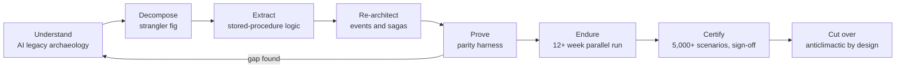

# Flagship Case Study: Modernizing a $1.6T Asset-Management Platform Without Losing a Cent

*Written by [Nik Jain](https://github.com/nikjain15), modernization lead for a core module of this platform, responsible end to end from product vision and budget through team, requirements, and delivery. Full role detail in [My role](#my-role).*

**Exec summary.** A $1.6 trillion asset-management platform, moving $4.5 billion in trades a day, was re-architected from 30 years of stored-procedure and overnight-batch logic into an event-driven, API-first cloud system. The binding constraint was never speed or cost. It was parity: identical outputs, to the cent, at every intermediate and final stage. The program used strangler-fig decomposition, AI-assisted legacy archaeology, a purpose-built parity harness, a 12+ week production parallel run, and 5,000+ scenario business testing to earn a formal three-way sign-off. Over 50% of the platform migrated with 95-100% on-time delivery and zero loss of trading accuracy. In an industry where 79% of modernization projects fail [vFunction/Wakefield, 2022](https://info.vfunction.com/hubfs/Download%20Assets/Wakefield-Report-2022-Why-App-Modernization-Projects-Fail.pdf), the difference was not better technology. It was better evidence.

All details are sanitized and generalized: no employer names, no proprietary code, no client data. Numbers are limited to the program's shareable reference figures.

## Context: what the platform did

The legacy system was the operational core of a large asset-management business:

- **$1.6T** in assets on platform, **$4.5B** in trades flowing through per day.
- Roughly **30 years** of accumulated business logic, most of it living in database stored procedures and overnight batch jobs rather than application code.
- Dozens of upstream and downstream consumers: trading, accounting, reporting, client-facing tools. Any drift in any value would surface somewhere as a reconciliation break.
- **35+ user-developed applications and 70+ reports** hanging off the core, serving **300K+ advisors**.
- A delivery organization of **50+ engineers, architects, QA, and design across the US, Ireland, and India**.

The target was an event-driven, API-first cloud platform with AI agents embedded in once-manual workflows. The technology target was conventional. The risk profile was not: this class of system is exactly where the worst public failures live, from TSB's one-weekend core-banking cutover that cost roughly £1B [Slaughter and May, 2019](https://www.techmonitor.ai/leadership/digital-transformation/slaughter-and-may-tsb) to Lidl writing off €500M when its new system's data model disagreed with the old one's semantics [Computer Weekly, 2018](https://www.computerweekly.com/news/252446965/Lidl-dumps-500m-SAP-project).

## The constraint: parity, not speed

Most modernization programs optimize for delivery speed, cloud cost, or architectural elegance. When the system moves real money, none of those is the binding constraint. The program was governed by one rule:

> The new system must produce identical outputs to the old one, value by value, at intermediate and final stages. The only acceptable difference is one the business consciously accepted and signed.

That rule reshaped everything. Timelines flexed. Scope was staged. The parity bar never moved. A two-cent discrepancy was never about two cents: it was a thread that, pulled, exposed a buried logic difference that had to be decided deliberately instead of shipped silently. The full argument for parity as the organizing principle is in [Pattern 01: Parity](../patterns/01-parity.md) and the closing essay, [The Myth-Buster](../MYTH-BUSTER.md).

## The method

### 1. Strangler-fig decomposition

The platform was peeled apart service by service while the legacy system remained the source of truth, following the incremental-replacement approach Fowler named in 2004 [Fowler, 2004](https://martinfowler.com/bliki/StranglerFigApplication.html). Migration itself was staged **by account and fund groups**: rather than moving whole applications at once, subsets of the book moved to the new system in waves, and the migrated population expanded only as each wave proved itself against the parity bar. No slice took traffic until it had parity evidence behind it, and every slice had a route back. The working mechanics are in [Pattern 02: Strangler-fig decomposition](../patterns/02-strangler-fig.md); the per-slice sequencing lives in a [wave plan](../templates/wave-plan.md).

### 2. Stored-procedure extraction

The hardest technical material was 30 years of business rules written in SQL and executed in the data layer. Each rule had to be located, understood, extracted into role-based microservices, and proven behaviorally identical. Industry tooling automates only part of this class of work and leaves the remainder for manual conversion and behavioral regression [AWS Database Blog](https://aws.amazon.com/blogs/database/challenges-when-migrating-from-oracle-to-postgresql-and-how-to-overcome-them/), which is why extraction was treated as a first-class workstream, not a conversion detail. Method in [Pattern 03: Taming stored-procedure logic](../patterns/03-taming-stored-procedures.md).

### 3. Event-driven re-architecture

Overnight batch became event-driven intraday processing. Global rollback, the batch world's safety net, was replaced with sagas and idempotent per-service replay, so a failure mid-flow could be healed by replaying one service rather than rewinding the world. Design detail in [Pattern 04: Event-driven and saga re-architecture](../patterns/04-event-driven-saga.md).

### 4. AI legacy archaeology

No living person fully understood the legacy logic, and no documentation described it. The program built Claude-based agents into an **interrogation workflow**: a practitioner asked the agent questions about undocumented stored procedures, formed hypotheses about behavior, and tested every hypothesis both against the code and against the live legacy system's observed behavior, hunting edge cases deliberately, before any rule was recorded and taken to business stakeholders for validation. Humans owned every sign-off; the AI accelerated comprehension, not decisions. This matches where the research says LLMs genuinely help legacy work: comprehension more than conversion [arXiv 2411.14971](https://arxiv.org/abs/2411.14971). Full writeup in [AI legacy archaeology](../ai/legacy-archaeology.md), with the tool landscape in [ai/README.md](../ai/README.md). Beyond archaeology, AI agents embedded in production workflows removed **~661 hours/year** of manual toil and reduced **$4M** of operational risk, under the guardrails described in [Pattern 05: AI agents in mission-critical workflows](../patterns/05-ai-in-workflows.md).

### 5. The parity harness

The center of gravity of the whole program. A purpose-built comparison harness pulled from both systems on a schedule and reconciled **every record at every level**: each transaction, each position, each intermediate calculation value, each final output, because two systems can agree on totals while disagreeing on everything underneath. Nothing was sampled. Every discrepancy was triaged into one of three buckets: new-system defect (fix), legacy defect (fix consciously, with sign-off), or accepted difference (logged, owned, signed). Methodology in [The Parity Harness deep-dive](../patterns/parity-harness-deepdive.md); the evidence format is the [parity report template](../templates/parity-report.md), with behavior pinned first via a [characterization test plan](../templates/characterization-test-plan.md).

### 6. The 12+ week production parallel run

Parity on test data is necessary and insufficient. Money-critical edge cases, month-ends, corporate actions, stale prices, unusual market days, only show up in real production flow over time. So the new system ran against production for **12+ weeks** with legacy as the source of truth, reconciling continuously. The shape of that run is the lesson: the comparison was relatively clean early, and the long tail of rare cases consumed most of the twelve weeks, which is exactly why the duration is a gate rather than a buffer (the full burndown story is in the [deep-dive field notes](../patterns/parity-harness-deepdive.md)). This is the same principle behind Google Cloud's Dual Run offering for mainframe migration [Google Cloud, 2022](https://cloud.google.com/blog/products/infrastructure-modernization/dual-run-by-google-cloud-helps-mitigate-mainframe-migration-risks) and UK GDS dark-launch guidance [UK GDS Service Manual](https://www.gov.uk/service-manual/technology/moving-away-from-legacy-systems). Cutover mechanics in [Pattern 06: Cutover](../patterns/06-cutover.md) and [decide/cutover-strategy.md](../decide/cutover-strategy.md).

### 7. 5,000+ scenario business testing

The scenario regime was built the way AI teams build evals: **the test cases and their expected answers were defined with the business up front**, then the system was run against them continuously and regressively. Most of the 5,000+ scenarios were automated, a smaller set stayed manual, and regular data-comparison checks ran between cycles. A dedicated team of QA, engineers, and production-parallel experts owned the flow of evidence, deliberately hunting the tail: the rare instrument types, the mid-cycle events, the forgotten regulatory treatments. Business testing was not a QA phase bolted on at the end. It ran throughout, feeding discrepancies back into archaeology and extraction, and because the expected answers were agreed in advance, a mismatch was a finding, never a debate.

### 8. Formal sign-off

Go-live required three named signatures: business, architecture, engineering. The gate was defined as parity threshold met AND time-in-parallel served AND business sign-off given. Each cutover executed from a stepped [cutover runbook](../templates/cutover-runbook.md) with a pre-agreed [rollback plan](../templates/rollback-plan.md). Because the pipeline was already proven in production, cutover was an anticlimax: a promotion of evidence, not a leap of faith.

### How the evidence stacked

No single artifact carried the go-live decision. Each gate added a different kind of proof, and all had to hold at once:

| Gate | Question it answers | Evidence artifact | Who signs |
|---|---|---|---|
| Characterization tests | Do we know what the legacy actually does today? | [Characterization test plan](../templates/characterization-test-plan.md) and suite | Engineering lead |
| Parity harness runs | Does the new system match, value by value? | [Parity report](../templates/parity-report.md) with discrepancy log | Parity/QA lead |
| Business scenario testing | Does it match on the cases that matter to the business? | Scenario results mapped to the 5,000+ catalog | Business owners |
| Production parallel run | Does it hold up against real flow, over time? | 12+ weeks of continuous reconciliation | Architecture |
| Accepted-difference log | Is every deviation deliberate? | Signed entries, one per difference | Business, per entry |
| Cutover rehearsal | Can we execute the switch and the way back? | [Cutover runbook](../templates/cutover-runbook.md) and [rollback plan](../templates/rollback-plan.md), rehearsed | Program and business |

The stack is the point. A program that has only tests has opinions. A program that has all six has evidence, and evidence is what people will sign their names to.

## Results

- **50%+ of the platform migrated** to the new architecture, with legacy retired behind it slice by slice.
- **Zero loss of trading accuracy** through migration: the parity bar held.
- **95-100% on-time delivery** across program increments, from a 50+ person team on three continents.
- Overnight batch replaced by event-driven intraday processing with real-time visibility.
- **35+ applications and 70+ reports modernized**, serving **300K+ advisors**.
- **~661 hours/year** of manual work removed and **$4M** of risk reduced via AI-assisted workflows.

## My role

I was the **modernization lead for a core platform module**, accountable for it end to end. The figures above are program-level. My direct remit was the full lifecycle of one of the platform's core modules, and in practice that meant owning every stage of it rather than a slice:

- **Product vision and target architecture.** Defining what the modernized module should be, event-driven and API-first, and what it should deliberately not attempt.
- **Business case and budget.** Building the case and securing the approvals, which on a parity-first program means defending spend on evidence infrastructure that produces no user-visible feature. The [business case template](../templates/business-case.md) is the shape of that argument.
- **Building the team.** Standing up and leading the delivery organization described above: engineers, architects, QA, and design across the US, Ireland, and India.
- **Requirements, recovered rather than collected.** There was no requirements document to gather. I ran AI agents against the legacy stored procedures myself to recover what the rules actually were, then took every recovered rule to business stakeholders to confirm it before it became a requirement. That hands-on archaeology, not a handoff to analysts, is how the specification for a 30-year-old module got written.
- **Delivery and the schedule.** Owning execution against committed dates, and the sequencing discipline that let the program hit them without lowering the parity bar.

Four things in this playbook are decisions I drove, working with SMEs, business partners, and other leads rather than alone:

| What I drove | Why it mattered |
|---|---|
| **Parity as the contract, proven by a purpose-built harness** | Establishing that outputs had to match value by value at intermediate and final stages, that the only allowed difference was one the business signed, and that a dedicated comparison harness would be the evidence. It is the organizing idea of this entire playbook: [Pattern 01](../patterns/01-parity.md), [harness deep-dive](../patterns/parity-harness-deepdive.md) |
| **AI-assisted legacy archaeology** | Using agents to recover intent from undocumented logic, testing every hypothesis against both the code and the live system, flagging what could not be inferred, and routing every rule through business ratification: [legacy-code archaeology](../ai/legacy-archaeology.md) |
| **Expected answers agreed with the business up front** | Running scenario testing as an eval set rather than an end-phase QA gate, so a mismatch was a finding and never a debate |
| **Wave sequencing and schedule discipline** | Migration by account and fund groups, heaviest and most foundational work front-loaded, archaeology pipelined against the build, risks raised early so sequence flexed while dates held |

None of it was solo work. The recovered rules were only trustworthy because SMEs, business owners, and long-tenured engineers corrected them, and the evidence pipeline only held because a dedicated QA and production-parallel team ran it every day. My part was setting the bar, choosing the methods, building the team that could execute them, and refusing to move the bar when the calendar got tight.

## What made it work

1. **Parity was the contract, and it never flexed.** Scope and timing were negotiable. Correctness was not. Every stakeholder knew which one would give.
2. **The harness came before the services.** Parity infrastructure was built early and ran throughout, so every slice was born with its evidence pipeline attached, instead of facing a testing phase at the end.
3. **Comprehension was staffed as engineering work.** Understanding 30-year-old logic was treated as the critical path, and AI archaeology plus business validation was the workstream that cleared it.
4. **Legacy stayed the source of truth until evidence said otherwise.** No slice was trusted on the strength of its code review. It was trusted on the strength of its reconciliation record.
5. **Time in parallel was a gate, not a buffer.** The 12+ weeks were a hard entry criterion for cutover, immune to schedule pressure.
6. **The business owned the meaning of the numbers.** Engineers can prove two values differ. Only the business can say which one is right. 5,000+ scenarios and named sign-offs made that ownership real.
7. **Old bugs were fixed consciously, never silently.** A legacy defect was corrected with sign-off and logged as an accepted difference, so no behavior change ever shipped by accident.

## What the industry data says this avoided

Each lesson above is the inverse of a documented failure mode. The [post-mortem library](../why-modernizations-fail/post-mortems/README.md) holds the full cases.

| Program lesson | The failure it prevents | Evidence |
|---|---|---|
| Parity as the unmovable contract | Going live with known defects: TSB went live with 4,424 of 34,671 logged defects still open | [Slaughter and May, 2019](https://www.techmonitor.ai/leadership/digital-transformation/slaughter-and-may-tsb) via [tsb-bank.md](../why-modernizations-fail/post-mortems/tsb-bank.md) |
| Harness before services, testing throughout | Compressed end-stage testing: HealthCare.gov cut end-to-end testing from months to weeks before launch | [Harvard D3, 2016](https://d3.harvard.edu/platform-rctom/submission/the-failed-launch-of-www-healthcare-gov/) via [healthcare-gov.md](../why-modernizations-fail/post-mortems/healthcare-gov.md) |
| Comprehension staffed as engineering | Semantic mismatch discovered too late: Lidl's €500M write-off keyed on a purchase-price vs retail-price data-model assumption | [Computer Weekly, 2018](https://www.computerweekly.com/news/252446965/Lidl-dumps-500m-SAP-project) via [lidl-sap.md](../why-modernizations-fail/post-mortems/lidl-sap.md) |
| Legacy as source of truth, strangled incrementally | The big-bang rewrite trap: FBI's Virtual Case File burned $170M and shipped nothing | [IEEE Spectrum, 2005](https://spectrum.ieee.org/who-killed-the-virtual-case-file) via [fbi-virtual-case-file.md](../why-modernizations-fail/post-mortems/fbi-virtual-case-file.md) |
| Time in parallel as a hard gate | One-weekend cutover of 5.2M customers with no tested way back: TSB, roughly £1B total cost | [FCA/TSB coverage, 2022](https://www.techmonitor.ai/policy/privacy-and-data-protection/tsb-it-crash-migration-bank-fca) |
| Business ownership of correctness | Payroll go-live over tester objections: Queensland Health produced 35,000 payroll anomalies and a $6.2M project became $1.2B+ | [Queensland inquiry summary, dossier sources](../why-modernizations-fail/post-mortems/queensland-health.md) |
| Conscious handling of legacy defects | Institutional denial that the system could be wrong: Post Office Horizon led to roughly 900 wrongful prosecutions | [Computer Weekly](https://www.computerweekly.com/feature/Post-Office-Horizon-scandal-explained-everything-you-need-to-know) via [post-office-horizon.md](../why-modernizations-fail/post-mortems/post-office-horizon.md) |

The aggregate stats sharpen the contrast: 79% of modernization projects fail at an average cost of $1.5M [vFunction/Wakefield, 2022](https://info.vfunction.com/hubfs/Download%20Assets/Wakefield-Report-2022-Why-App-Modernization-Projects-Fail.pdf), and 83% of data migrations fail or overrun, a figure widely attributed to Gartner [QuerySurge summary](https://www.querysurge.com/resource-center/white-papers/strategic-optimization-of-enterprise-data-migration-testing). The programs that beat those odds are the ones that treat evidence of correctness, not delivery of code, as the product.

**Next:** [The Parity Harness deep-dive](../patterns/parity-harness-deepdive.md) | [Why modernizations fail](../why-modernizations-fail/README.md) | [The Myth-Buster](../MYTH-BUSTER.md)
