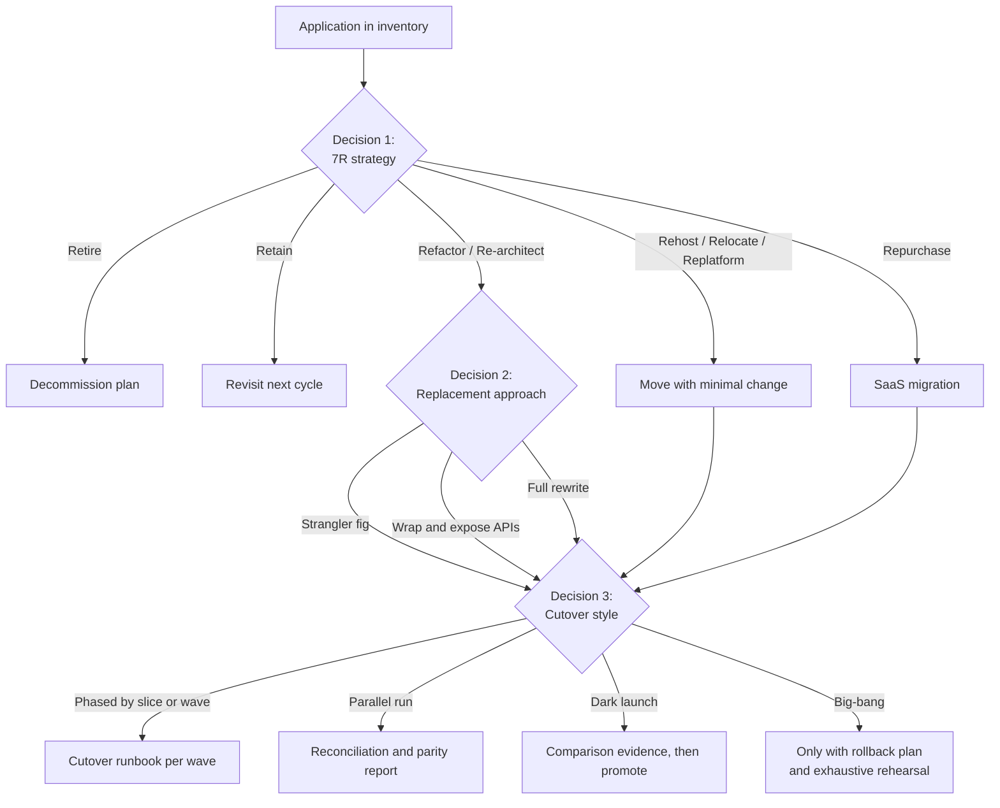

# Decide: The Three Decisions Every Modernization Program Faces

**Exec summary.** Every modernization program, from a single monolith to a 10,000-application estate, is forced through the same three decisions: what to do with each application (the strategy), how to replace the ones you keep (the approach), and how to switch traffic to the new system (the cutover). Programs that fail usually skipped or rushed one of the three: they rewrote what should have been retired, big-banged what should have been strangled, or cut over in a weekend what needed a 12-week parallel run. This section gives you one decision tree per question, each with sourced tradeoffs and links to the templates that capture the outcome.

## The three decisions

| # | Decision | Question it answers | Doc |
|---|----------|--------------------|-----|
| 1 | **Strategy per application** | Keep, kill, move, buy, or rebuild each app? The 7Rs and Gartner TIME vocabulary. | [choose-your-strategy.md](choose-your-strategy.md) |
| 2 | **Replacement approach** | For apps you rebuild: rewrite from scratch, strangle incrementally, or wrap and extend? | [rewrite-vs-strangle-vs-wrap.md](rewrite-vs-strangle-vs-wrap.md) |
| 3 | **Cutover style** | Big-bang weekend, parallel run, phased waves, or dark launch? | [cutover-strategy.md](cutover-strategy.md) |

The decisions are sequential and per-application. A portfolio of 200 apps might retire 40, repurchase 30, rehost 80, and rebuild 50, and each of those 50 rebuilds still needs its own approach and cutover decision. Frameworks from [AWS, 2023](https://docs.aws.amazon.com/prescriptive-guidance/latest/strategy-migration/overview.html), [Azure CAF, 2024](https://learn.microsoft.com/en-us/azure/cloud-adoption-framework/overview), and [Gartner TIME](https://www.leanix.net/en/wiki/apm/gartner-time-model) all enforce this one-decision-per-application discipline.

## How the three decisions connect

Every path that keeps an application running ends at Decision 3. Even a "simple" rehost needs a cutover style, a runbook, and a rollback plan. TSB's 2018 disaster was not a bad strategy decision, it was a bad cutover decision: one weekend, 5.2 million customers, no tested way back [Slaughter and May, 2019](https://www.techmonitor.ai/leadership/digital-transformation/slaughter-and-may-tsb).

## Where the outputs go

Each decision produces an artifact, not just a meeting outcome:

- Decision 1 fills the 7R disposition column of the [application inventory](../templates/application-inventory.md).
- Decision 2 is recorded as an [ADR](../templates/adr.md) per application, with the rejected options and why.
- Decision 3 produces the [cutover runbook](../templates/cutover-runbook.md), [rollback plan](../templates/rollback-plan.md), and [parity report](../templates/parity-report.md).

If you cannot point at the artifact, the decision has not been made. It has been postponed.

**Next:** [choose-your-strategy.md](choose-your-strategy.md) | [playbook/README.md](../playbook/README.md) | [why-modernizations-fail/README.md](../why-modernizations-fail/README.md)
