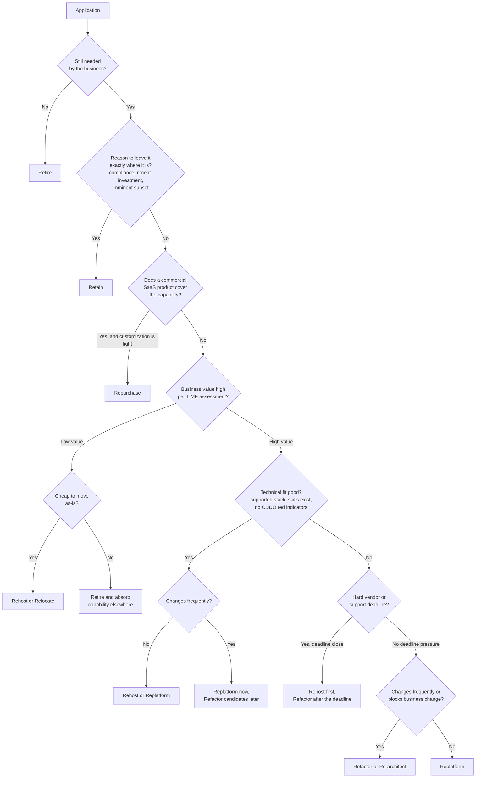

# Choose Your Strategy: The 7Rs and the TIME Model

**Exec summary.** Before anyone writes code, every application gets exactly one disposition from a fixed vocabulary. Gartner defined the original 5Rs in 2010 (Rehost, Refactor, Revise, Rebuild, Replace) [Gartner, 2010](https://www.gartner.com/en/documents/1485116); AWS evolved them into the 7Rs now used across the industry: Retire, Retain, Rehost, Relocate, Repurchase, Replatform, Refactor/Re-architect [AWS Prescriptive Guidance, 2023](https://docs.aws.amazon.com/prescriptive-guidance/latest/strategy-migration/overview.html). Gartner's TIME model (Tolerate, Invest, Migrate, Eliminate) gives you the portfolio-level 2x2 that feeds the per-application 7R call [LeanIX](https://www.leanix.net/en/wiki/apm/gartner-time-model). The output is one filled row per application in the [application inventory](../templates/application-inventory.md). Skipping this step is how programs end up rewriting applications nobody uses: portfolio assessments routinely find 10 to 20 percent of an estate can simply be retired.

## Why a fixed vocabulary matters

Modernization programs stall when every steering committee re-litigates strategy in free text. A fixed vocabulary forces three things:

1. **One decision per application.** Not "we'll modernize the estate" but "app 47 gets Replatform, here is why."
2. **Comparable effort estimates.** Rehost effort is well understood; Refactor effort is not. Naming the R names the risk class.
3. **An auditable record.** The disposition matrix becomes the contract between architecture, finance, and delivery. AWS MAP, Azure CAF, and Google's migration framework all require it as a gate artifact [AWS MAP](https://aws.amazon.com/migration-acceleration-program/), [Azure CAF, 2024](https://learn.microsoft.com/en-us/azure/cloud-adoption-framework/overview), [Google Cloud](https://docs.cloud.google.com/architecture/migration-to-gcp-getting-started).

## Step 1: TIME, the portfolio filter

Gartner's TIME model plots every application on two axes: **business value** and **technical fit** [LeanIX](https://www.leanix.net/en/wiki/apm/gartner-time-model).

| | Low technical fit | High technical fit |
|---|---|---|
| **High business value** | **Migrate**: the app matters but the platform is failing it. This is your modernization backlog. | **Invest**: keep improving. Add features, pay down debt incrementally. |
| **Low business value** | **Eliminate**: retire or replace with SaaS. Do not spend modernization budget here. | **Tolerate**: leave it alone. Revisit next assessment cycle. |

TIME is deliberately coarse. Its job is to shrink the problem: the Migrate quadrant is usually 20 to 40 percent of the estate, and that is where the 7R analysis earns its cost. Score business value with the application's owners (revenue supported, users served, cost of failure) and technical fit with engineering (supportability, skills availability, vendor status). The UK CDDO framework's seven legacy indicators (out-of-support software, expired contracts, skills scarcity, business-need mismatch, unsuitable hardware, known vulnerabilities, recent incidents) make a good technical-fit rubric [UK CDDO](https://gov.uk/government/publications/guidance-on-the-legacy-it-risk-assessment-framework/guidance-on-the-legacy-it-risk-assessment-framework).

## Step 2: The 7Rs, the per-application decision

AWS extended Gartner's 5Rs to seven dispositions [AWS Prescriptive Guidance, 2023](https://docs.aws.amazon.com/prescriptive-guidance/latest/strategy-migration/overview.html); overviews at [TechTarget](https://www.techtarget.com/searchcloudcomputing/tip/The-Rs-of-cloud-migration-How-to-choose-the-right-method) and [NetApp](https://www.netapp.com/blog/aws-cvo-blg-strategies-for-aws-migration-the-new-7th-r-explained/).

### Decision tree: one application through the questions

Two of these paths deserve emphasis:

- **Retire is a first-class outcome.** Application portfolio assessments exist partly to find the apps nobody will miss [AWS APA guide](https://docs.aws.amazon.com/pdfs/prescriptive-guidance/latest/application-portfolio-assessment-guide/application-portfolio-assessment-guide.pdf). Every retired app is a rewrite you did not fund.
- **Rehost now, refactor later is legitimate.** Under a hard deadline (SAP ECC support ends 2027, and only about 39 percent of 35,000 ECC customers had migrated by end-2024 [CIO, 2025](https://www.cio.com/article/4000543/)), moving as-is buys time. The trap is forgetting the "later": budget the refactor in the same business case or it never happens.

### Tradeoff table: all seven Rs

| R | What it is | Effort | Risk | Payoff | When it is right | When it is wrong |
|---|---|---|---|---|---|---|
| **Retire** | Decommission; absorb or drop the capability | Low | Low | Immediate cost and attack-surface reduction | Usage logs show near-zero traffic; capability duplicated elsewhere | Hidden consumers exist (batch feeds, month-end reports); check the dependency map first |
| **Retain** | Leave in place, revisit later | None now | Grows silently over time | Zero spend now | Recent investment still amortizing; compliance freeze; sunset already scheduled | Used as a euphemism for "no decision"; CDDO red indicators accumulating [UK CDDO](https://gov.uk/government/publications/guidance-on-the-legacy-it-risk-assessment-framework/guidance-on-the-legacy-it-risk-assessment-framework) |
| **Rehost** | Lift and shift to new infrastructure, no code change | Low to medium | Low to medium | Datacenter exit, infra savings; no functional gain | Deadline-driven moves; stable apps; first wave of a large migration | The app's problem is the code, not the hardware; rehosting a mess gives you a mess with a cloud bill |
| **Relocate** | Move at hypervisor or platform level (for example VMware estate to cloud) | Low | Low | Fastest bulk move, minimal retesting | Large virtualized estates under time pressure | Anything needing per-app change; it defers every hard decision |
| **Repurchase** | Drop the custom app for SaaS or COTS | Medium | Medium | Vendor carries maintenance forever | Commodity capability (HR, CRM, expenses); light customization | Deep custom logic: Lidl abandoned SAP after 500M EUR partly because its pricing model could not fit the package [Computer Weekly, 2018](https://www.computerweekly.com/news/252446965/Lidl-dumps-500m-SAP-project) |
| **Replatform** | Targeted changes to exploit the new platform (managed DB, containers), core code intact | Medium | Medium | Real operational gains without a rewrite | Middle ground: app is sound, platform is the constraint | Scope creep: "while we're in here" turns a replatform into an unplanned refactor |
| **Refactor / Re-architect** | Restructure or rebuild the application itself | High | High | Only option that changes what the business can do | High value, poor fit, high change frequency; the TIME Migrate quadrant | Low-change, low-value apps; doing it big-bang (see [rewrite-vs-strangle-vs-wrap.md](rewrite-vs-strangle-vs-wrap.md)); 79 percent of modernization projects fail at an average of $1.5M [vFunction/Wakefield, 2022](https://info.vfunction.com/hubfs/Download%20Assets/Wakefield-Report-2022-Why-App-Modernization-Projects-Fail.pdf) |

## Step 3: Record it

The decision is not done until the row is filled. The [application inventory template](../templates/application-inventory.md) carries the 7R disposition columns: app, owner, business value score, technical fit score, TIME quadrant, chosen R, rationale, target wave. For contested calls (usually Refactor vs Repurchase vs Retire), write an [ADR](../templates/adr.md) so the losing options and their reasons survive staff turnover.

## Checklist

- [ ] Every application scored on business value and technical fit, with the owner in the room
- [ ] TIME quadrant assigned; Eliminate and Tolerate quadrants explicitly parked, not silently dropped
- [ ] One 7R disposition per application with a one-line rationale
- [ ] Retire candidates checked against the dependency map for hidden consumers
- [ ] Every "Rehost now, refactor later" has the refactor funded in the business case
- [ ] Vendor and support deadlines captured per application (SAP ECC 2027 class of problem)
- [ ] Disposition matrix reviewed by finance against the [business case](../templates/business-case.md)
- [ ] Contested decisions recorded as [ADRs](../templates/adr.md)

**Next:** [rewrite-vs-strangle-vs-wrap.md](rewrite-vs-strangle-vs-wrap.md) | [../templates/application-inventory.md](../templates/application-inventory.md) | [../playbook/README.md](../playbook/README.md)
