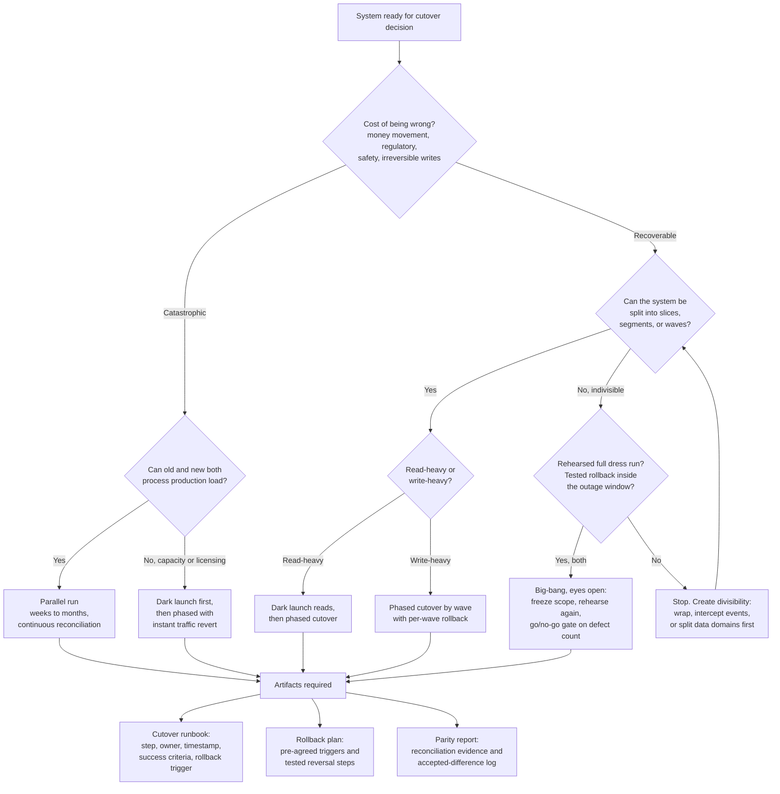

# Cutover Strategy: Big-Bang vs Parallel Run vs Phased vs Dark Launch

**Exec summary.** The cutover is where modernization programs die in public. TSB migrated 1.3 billion records for 5.2 million customers in one weekend in April 2018, went live with 4,424 open defects, had never load-tested one of its two data centers, and paid roughly £1B including £366M in direct costs and £48.6M in regulatory fines; the CEO resigned [Slaughter and May, 2019](https://www.techmonitor.ai/leadership/digital-transformation/slaughter-and-may-tsb), [FCA, 2022](https://www.techmonitor.ai/policy/privacy-and-data-protection/tsb-it-crash-migration-bank-fca). The industry-standard alternatives all share one idea: prove the new system on real traffic before you depend on it, and keep a way back after you do. Google's Dual Run runs mainframe and replica side by side on production transactions [Google Cloud, 2022](https://cloud.google.com/blog/products/infrastructure-modernization/dual-run-by-google-cloud-helps-mitigate-mainframe-migration-risks); GDS dark-launches new services and compares answers [GDS Service Manual](https://www.gov.uk/service-manual/technology/moving-away-from-legacy-systems); the USDS playbook says never big-bang and let users revert [USDS Playbook](https://playbook.usds.gov/). Pick the style per system, then produce the three artifacts that make it executable: [cutover runbook](../templates/cutover-runbook.md), [rollback plan](../templates/rollback-plan.md), [parity report](../templates/parity-report.md).

## Problem

At some moment, production traffic must move from a system with decades of proven behavior to one with none. Roughly 64 percent of migrations suffer unforeseen outages [Oracle whitepaper via iceDQ](https://icedq.com/resources/case-studies/tsb-bank-data-migration-failure), and the cutover moment is where every earlier shortcut (untested infrastructure, unreconciled data, open defects) presents its bill at once. The cutover style decision is really a decision about where you buy your evidence: before go-live (parallel run, dark launch), during a contained go-live (phased), or not at all (big-bang).

## The four styles

### Big-bang (Stop the World Cutover)

Freeze, migrate everything, switch, unfreeze. Thoughtworks catalogs it as Stop the World Cutover and treats it as the option of last resort [Thoughtworks](https://martinfowler.com/articles/patterns-legacy-displacement/). It is legitimate only when the change is genuinely indivisible (some core-ledger swaps, some vendor package boundaries) and only with exhaustive rehearsal and a tested rollback. TSB is the canonical failure: political pressure to exit a per-customer licensing deal with Lloyds fixed the date, testing compressed to fit, and there was no incremental fallback once the corrupted experience hit all 5.2M customers simultaneously [Slaughter and May, 2019](https://www.techmonitor.ai/leadership/digital-transformation/slaughter-and-may-tsb). The pattern generalizes: HealthCare.gov compressed end-to-end testing from seven months to one and launched to the whole country at once [Harvard D3, 2016](https://d3.harvard.edu/platform-rctom/submission/the-failed-launch-of-www-healthcare-gov/).

### Parallel run (Dual Run)

Old and new both process production load for an extended period; outputs are reconciled continuously; the old system remains the system of record until the evidence says otherwise. Google productized this as Dual Run, built on Santander's technology: mirror production transactions to the cloud replica, compare outputs, certify parity before cutover [Google Cloud, 2022](https://cloud.google.com/blog/products/infrastructure-modernization/dual-run-by-google-cloud-helps-mitigate-mainframe-migration-risks). Mechanical Orchard takes the same stance for AI-assisted rewrites: behavioral parity proven transaction by transaction before incremental cutover [Mechanical Orchard](https://www.mechanical-orchard.com/platform). Cost is the catch: you run two estates and a reconciliation pipeline, roughly doubling operational cost for the duration [Brainhub](https://brainhub.eu/library/big-bang-migration-vs-trickle-migration). For money-critical systems the cost is the insurance premium. Our flagship program ran a 12+ week production parallel run reconciling $4.5B in daily trades before the legacy path was retired; the [parity report](../templates/parity-report.md) is the artifact that makes that evidence auditable.

### Phased / wave cutover

Split by capability, customer segment, geography, or application wave, and cut over one slice at a time with its own runbook and rollback. This is the natural cutover mode of a strangler program (each slice is a mini-cutover) and of large portfolio migrations, where the [wave plan](../templates/wave-plan.md) groups applications by dependency and priority [AWS wave planning](https://docs.aws.amazon.com/prescriptive-guidance/latest/large-migration-portfolio-playbook/wave-planning.html). USDS codifies the operating rules: route a small fraction of traffic first, grow it as confidence grows, and keep the legacy path available so users can revert after launch [USDS Playbook](https://playbook.usds.gov/). Early waves should be low-risk apps chosen to exercise the runbook machinery, not the crown jewels.

### Dark launch

The new system receives real production requests and produces answers, but nobody sees them: responses are compared against the legacy system's and discarded. GDS recommends exactly this for legacy replacement, sending real queries to the new API and comparing results with the old before any user depends on it [GDS Service Manual](https://www.gov.uk/service-manual/technology/moving-away-from-legacy-systems); Thoughtworks catalogs it as Dark Launching [Thoughtworks](https://martinfowler.com/articles/patterns-legacy-displacement/). It is the cheapest way to buy production-grade parity evidence because it needs no dual system of record and no user-facing risk. Its limit: it validates reads and computations well, but write-path parity still needs reconciliation of stored outcomes, which pushes you toward a parallel run for stateful cores.

## Decision framework

## Tradeoff table

| Style | Evidence bought before users depend on it | Cost | Rollback story | When right | Cautionary / exemplar |
|---|---|---|---|---|---|
| **Big-bang** | None from production; only test environments and rehearsals | Lowest run cost, highest tail risk | All or nothing, inside one outage window | Genuinely indivisible changes with rehearsed rollback | TSB 2018: ~£1B, 4,424 open defects at go-live [Slaughter and May, 2019](https://www.techmonitor.ai/leadership/digital-transformation/slaughter-and-may-tsb) |
| **Parallel run** | Full production behavior, reconciled continuously | Highest: two estates plus reconciliation pipeline [Brainhub](https://brainhub.eu/library/big-bang-migration-vs-trickle-migration) | Trivial: old system never stopped being authoritative | Money-critical, write-heavy cores | Google Dual Run / Santander [Google Cloud, 2022](https://cloud.google.com/blog/products/infrastructure-modernization/dual-run-by-google-cloud-helps-mitigate-mainframe-migration-risks) |
| **Phased / wave** | Production evidence from early slices de-risks later ones | Medium; long coexistence period to manage | Per-slice revert; blast radius capped at one wave | Divisible estates, strangler programs, portfolio migrations | USDS: route gradually, let users revert [USDS Playbook](https://playbook.usds.gov/) |
| **Dark launch** | Production request/response parity, zero user exposure | Low to medium; comparison infrastructure only | Nothing to roll back; new system is invisible | Read-heavy paths, API replacements, pre-cutover certification for any other style | GDS dark-launch comparisons [GDS Service Manual](https://www.gov.uk/service-manual/technology/moving-away-from-legacy-systems) |

The styles compose. A strong money-critical sequence is: dark launch to shake out gross errors, parallel run to certify parity, phased cutover by segment with the legacy revert path held open, and big-bang never.

## Pitfalls

- **Date-driven go-live.** TSB's date served a licensing deal; HealthCare.gov's served a statute. When the date is fixed, scope and evidence must be the variables. A go/no-go gate that cannot say no is theater. Going live with thousands of known defects is a decision, and it was made at TSB and at Queensland Health (35,000 payroll anomalies) [Slaughter and May, 2019](https://www.techmonitor.ai/leadership/digital-transformation/slaughter-and-may-tsb).
- **Untested rollback.** A rollback plan that has never been executed in rehearsal is a hypothesis. The [rollback plan](../templates/rollback-plan.md) requires pre-agreed trigger conditions and a timed, tested reversal, per AWS pre-cutover practice [AWS, 2023](https://docs.aws.amazon.com/prescriptive-guidance/latest/best-practices-migration-cutover/pre-cutover-stage.html).
- **Reconciliation as sampling.** Spot checks pass while systematic errors accumulate. Reconcile record-for-record and log every accepted difference with an owner and reason in the [parity report](../templates/parity-report.md).
- **Parallel run without an exit rule.** Define upfront what evidence ends the run (for example N consecutive clean reconciliation cycles across month-end and quarter-end), or it runs forever at double cost.
- **Ignoring rehearsal load.** TSB never load-tested one of its two data centers [Slaughter and May, 2019](https://www.techmonitor.ai/leadership/digital-transformation/slaughter-and-may-tsb). Rehearse at production volume, through peak events, on the real infrastructure.

## Checklist

- [ ] Cutover style chosen per system and recorded as an [ADR](../templates/adr.md)
- [ ] [Cutover runbook](../templates/cutover-runbook.md) written: every step has an owner, timestamp, success criteria, and rollback trigger
- [ ] [Rollback plan](../templates/rollback-plan.md) rehearsed end to end at least once, inside the agreed outage window
- [ ] [Parity report](../templates/parity-report.md) populated with production-grade reconciliation evidence before go/no-go
- [ ] Go/no-go gate has defect-count and reconciliation thresholds agreed before the meeting, with a named owner empowered to say no
- [ ] Full dress rehearsal completed at production volume, including peak load
- [ ] Legacy revert path preserved for a defined post-launch period (USDS play)
- [ ] Parallel-run exit criteria defined before the run starts

**Next:** [../playbook/README.md](../playbook/README.md) | [../why-modernizations-fail/post-mortems/tsb-bank.md](../why-modernizations-fail/post-mortems/tsb-bank.md) | [../patterns/06-cutover.md](../patterns/06-cutover.md)
