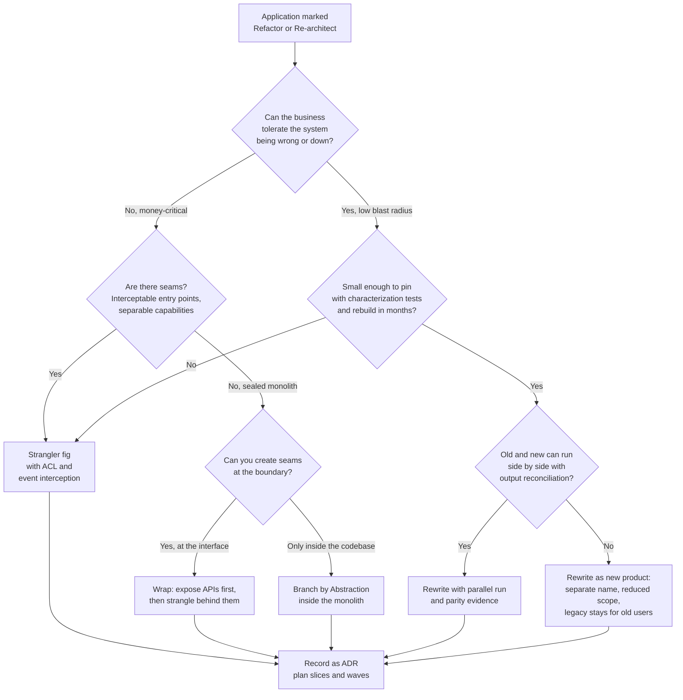

# Rewrite vs Strangle vs Wrap: The Core Decision

**Exec summary.** For every application marked Refactor or Re-architect, you now choose how: replace it all at once (rewrite), replace it slice by slice while the old system keeps running (strangle), or leave it alone and put a modern interface in front of it (wrap). The evidence is lopsided: Spolsky called the big-bang rewrite "the single worst strategic mistake" a software company can make [Spolsky, 2000](https://www.joelonsoftware.com/2000/04/06/things-you-should-never-do-part-i/), and 79 percent of modernization projects fail at an average cost of $1.5M over 16 months [vFunction/Wakefield, 2022](https://info.vfunction.com/hubfs/Download%20Assets/Wakefield-Report-2022-Why-App-Modernization-Projects-Fail.pdf). Default to strangle for systems that must keep running, wrap when you need speed or the legacy core is untouchable, and rewrite only when the system is small, well understood, or genuinely unsalvageable. The Thoughtworks Patterns of Legacy Displacement catalog is the shared vocabulary for whichever path you pick [Thoughtworks](https://martinfowler.com/articles/patterns-legacy-displacement/).

## Problem

The legacy system encodes decades of business rules, many undocumented: only 16 percent of organizations say their workflows are well documented [Lucid via Sentra, 2025](https://www.sentra.app/articles/tribal-knowledge). You must produce a modern replacement without losing behavior the business depends on, while the system keeps processing production load. The three families of approach differ in where they put the risk: a rewrite concentrates it at one go-live, a strangler spreads it across many small cutovers, a wrap defers it.

## The three approaches

### 1. Strangler fig (incremental replacement)

Fowler's 2004 pattern, named for the fig that grows around a host tree: build the new system around the edges of the old, intercept traffic, and move behavior across slice by slice until the legacy core can be switched off [Fowler, 2004](https://martinfowler.com/bliki/StranglerFigApplication.html). Each slice gets its own build, parity check, and cutover, so no single event can take the business down.

Key enabling patterns:

- **Event Interception and Divert the Flow**: capture the calls or events entering the legacy system and route selected ones to the new implementation [Thoughtworks](https://martinfowler.com/articles/patterns-legacy-displacement/).
- **Branch by Abstraction**: for changes inside a codebase you must keep shipping, introduce an abstraction layer over the old implementation, migrate callers to it, build the new implementation behind it, then flip and delete [Hammant via Fowler](https://martinfowler.com/bliki/BranchByAbstraction.html).
- **Anti-Corruption Layer (ACL)**: a translation facade between new and old models so legacy semantics do not leak into the new design [Evans, DDD 2003; Microsoft pattern doc](https://learn.microsoft.com/en-us/azure/architecture/patterns/anti-corruption-layer). The ACL is scaffolding: plan its removal.
- **Transitional Architecture**: the temporary routing, sync, and comparison machinery you build knowing you will throw it away. Budget for it explicitly; it is the price of never being down [Thoughtworks](https://martinfowler.com/articles/patterns-legacy-displacement/).

See the full treatment in [../patterns/02-strangler-fig.md](../patterns/02-strangler-fig.md).

### 2. Wrap and expose (leave the core, modernize the interface)

The UK Government Digital Service guidance: put the legacy system behind well-defined APIs, let new consumers integrate with the wrapper, and control migration pace behind the interface [GDS Service Manual](https://www.gov.uk/service-manual/technology/moving-away-from-legacy-systems). IBM's Z modernization Redbook makes the same move on-mainframe: expose CICS/IMS transactions as OpenAPI services and modernize around a core that stays put [IBM Redbook SG24-8532, 2023](https://redbooks.ibm.com/abstracts/sg248532.html).

Wrapping is honest about what it is: risk deferral, not risk elimination. The core stays legacy, with its skills cliff (79 percent of firms cite mainframe talent as a top challenge [Deloitte, 2025](https://biztechmagazine.com/article/2025/04/how-financial-services-companies-can-maintain-mainframes-cobol-experts-retire)) and its run cost. Its value is that it decouples the consumers first, which makes a later strangler migration dramatically cheaper: once everything talks to the API, you can swap what is behind it without another consumer migration. Wrap is usually phase one of strangle, not an alternative endpoint.

### 3. Full rewrite (replace in one program)

Build the new system in parallel, then cut over. Spolsky's 2000 essay stands because the failure mode keeps recurring: the old code's "crufty-looking parts embed hard-earned knowledge about corner cases," and a rewrite throws that knowledge away, then freezes the business while it is relearned [Spolsky, 2000](https://www.joelonsoftware.com/2000/04/06/things-you-should-never-do-part-i/). Netscape's 4-to-6 rewrite ceded the browser market; the FBI's Virtual Case File burned $170M and was scrapped without shipping, with feature-parity-as-moving-target a root cause [IEEE Spectrum, 2005](https://spectrum.ieee.org/who-killed-the-virtual-case-file). A widely circulated figure puts 72 percent of large rewrites over budget or failed outright; treat it as directional (it is hard to trace to a primary study), but the vFunction 79 percent figure is a published survey [vFunction/Wakefield, 2022](https://info.vfunction.com/hubfs/Download%20Assets/Wakefield-Report-2022-Why-App-Modernization-Projects-Fail.pdf).

Herb Caudill's review of six rewrite stories adds the nuance Spolsky's essay lacks: rewrites succeed when the team changes the rules, not just the code. Basecamp rewrote as a new product with its own name and let old customers stay on the old version forever; FogBugz avoided the rewrite by transpiling; Visual Studio Code succeeded as a fresh product beside its predecessor rather than a replacement of it [Caudill, 2019](https://medium.com/@herbcaudill/lessons-from-6-software-rewrite-stories-635e4c8f7c22).

**When a rewrite is right:**

- The system is small enough that one team can hold its behavior in their heads, and a [characterization test suite](../templates/characterization-test-plan.md) can pin that behavior first [Feathers, 2004](https://understandlegacycode.com/blog/key-points-of-working-effectively-with-legacy-code/).
- The platform is terminal: the runtime, language, or vendor is dead and no incremental path exists off it.
- You can run old and new side by side and reconcile outputs before anyone depends on the new one (which quietly turns your "rewrite" into a parallel-run strangler at the cutover stage; see [cutover-strategy.md](cutover-strategy.md)).
- The new system is allowed to be a different product with a smaller scope, not a feature-parity clone. Thoughtworks explicitly warns against blanket feature parity as a requirement [Thoughtworks](https://martinfowler.com/articles/patterns-legacy-displacement/).

## The reference vocabulary: Patterns of Legacy Displacement

Cartwright, Horn, and Lewis catalog the moves all three approaches are built from. Use these names in ADRs and design docs so decisions are searchable and comparable [Thoughtworks catalog](https://martinfowler.com/articles/patterns-legacy-displacement/):

| Activity | Patterns |
|---|---|
| **Understand outcomes** | Create Town Plan; Event Storming; Identify Business Capabilities |
| **Break into parts** | Extract Product Lines; Extract Value Streams; Feature Parity (with its warning label) |
| **Deliver incrementally** | Canary Release; Critical Aggregator; Dark Launching; Divert the Flow; Event Interception; Legacy Mimic; Revert to Source; Stop the World Cutover; Transitional Architecture |
| **Change the organization** | Build as You Mean to Continue; Incremental Displacement; New Co; Protected Pilot |

## Decision framework

## Tradeoff table

| Approach | Time to first value | Total cost | Risk profile | Knowledge-loss risk | When right | When wrong |
|---|---|---|---|---|---|---|
| **Strangler fig** | Weeks to months (first slice) | High, spread over time; transitional architecture is real cost | Many small reversible cutovers | Low: old system is the oracle until each slice proves parity | Money-critical systems with findable seams; long-lived programs | Tiny systems where scaffolding costs more than a clean rebuild; teams that never finish the last 20 percent |
| **Wrap and expose** | Fast: consumers get modern APIs in months | Low now, core run cost continues | Defers core risk; adds a facade to operate | None removed: core knowledge still ages out | Untouchable core, hard deadlines, prerequisite step before strangling | Sold as the endpoint: five years later the COBOL is still there and the experts are gone |
| **Branch by abstraction** | Continuous: trunk ships throughout | Medium | Small in-repo steps, always releasable | Low | Replacing components inside a codebase you must keep shipping | Replacing whole systems; no CI or test harness to keep trunk green |
| **Full rewrite** | Slow: value arrives only at the end | Looks lower, historically overruns; FBI VCF $170M scrapped [IEEE Spectrum, 2005](https://spectrum.ieee.org/who-killed-the-virtual-case-file) | One large cutover concentrates all risk | High: corner-case knowledge discarded [Spolsky, 2000](https://www.joelonsoftware.com/2000/04/06/things-you-should-never-do-part-i/) | Small well-understood systems; terminal platforms; new-product reframings [Caudill, 2019](https://medium.com/@herbcaudill/lessons-from-6-software-rewrite-stories-635e4c8f7c22) | Large, live, money-critical systems; feature-parity clones of poorly understood behavior |

## Pitfalls

- **The eternal strangler.** The last 20 percent of legacy never dies because the transitional architecture works well enough. Set retirement dates per slice and track legacy decommissioning as a first-class deliverable.
- **The wrap that became the architecture.** A facade with no funded phase two is a Retain decision wearing a Refactor badge.
- **Rewrite with feature-parity scope.** "Everything the old system does" is unbounded when nobody knows everything the old system does. Scope to observed behavior from the [legacy knowledge map](../templates/legacy-knowledge-map.md) and production traffic, not to folklore.
- **No parity evidence.** Whichever approach you choose, the cutover argument is only as good as the reconciliation data behind it. That is the [parity report's](../templates/parity-report.md) job, and it is the program's credibility currency.

## Checklist

- [ ] Approach chosen per application and recorded as an [ADR](../templates/adr.md) with rejected alternatives
- [ ] Seam inventory done; entry points and interception options mapped [Feathers, 2004](https://understandlegacycode.com/blog/key-points-of-working-effectively-with-legacy-code/)
- [ ] Characterization tests planned before any behavior moves ([template](../templates/characterization-test-plan.md))
- [ ] Transitional architecture costed and its teardown scheduled
- [ ] If wrapping: phase-two strangulation funded, not implied
- [ ] If rewriting: scope defined by observed behavior, side-by-side run planned, revert path preserved
- [ ] Thoughtworks pattern names used in design docs for shared vocabulary

**Next:** [cutover-strategy.md](cutover-strategy.md) | [../patterns/02-strangler-fig.md](../patterns/02-strangler-fig.md) | [../why-modernizations-fail/post-mortems/fbi-virtual-case-file.md](../why-modernizations-fail/post-mortems/fbi-virtual-case-file.md)
