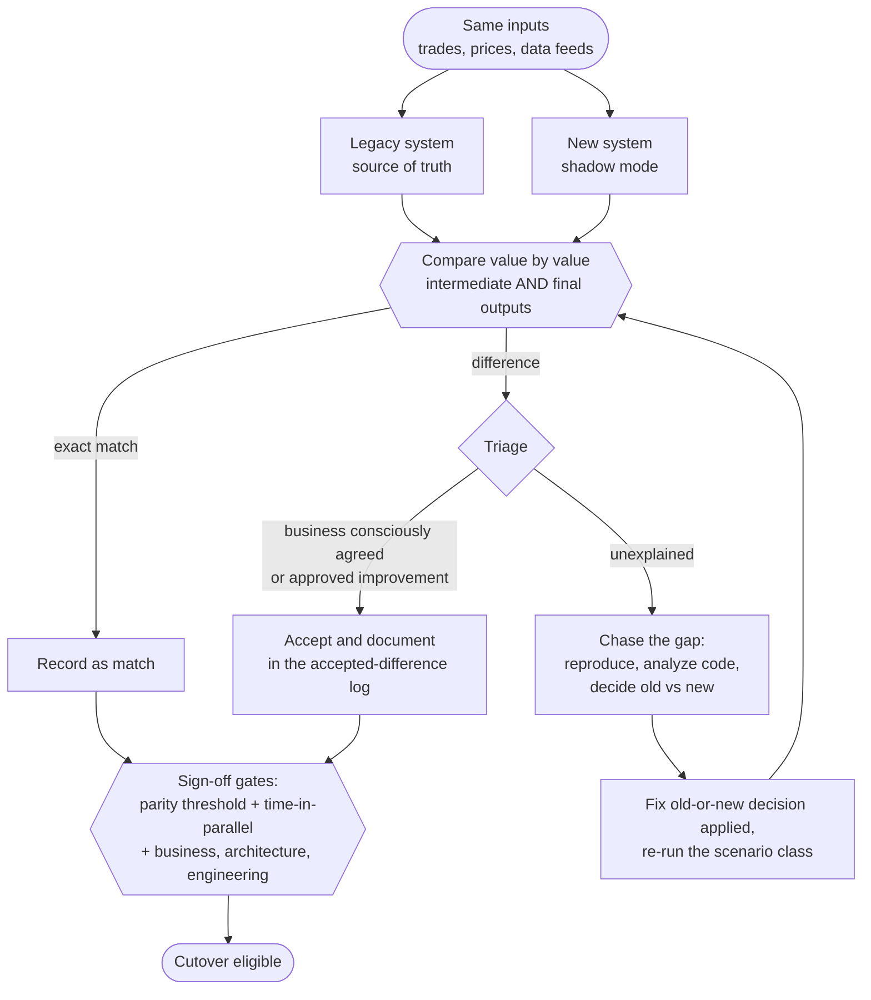

# Pattern 01, Parity

*The core, signature pattern of [Lossless Modernization](../README.md). For the full methodology, see the [Parity Harness deep-dive](./parity-harness-deepdive.md). Where this fits in the lifecycle: the "build parity evidence" phase of the [playbook](../playbook/README.md), producing the [parity report](../templates/parity-report.md) that gates [cutover](./06-cutover.md).*

---

## Exec summary

When a system moves real money, the modernization's success is not measured by architecture, velocity, or cost. It is measured by one thing: does the new system produce the **same outputs** as the old one, exactly, for every case that matters? That is parity, and it is the whole product.

Parity is proven, not asserted. On a large asset-management / trading platform, it was proven with side-by-side functional testing, a **12+ week production parallel run**, business testing across **5,000+ scenarios**, and formal sign-off from business, architecture, and engineering. The only differences allowed were ones the business consciously agreed to in advance. Everything else was a defect to chase down.

The leadership takeaway: budget for parity as the main event, not a QA afterthought. The rewrite is a fraction of the effort. Establishing enough evidence that the business will sign its name to a cutover is where the program is won or lost.

---

## Problem

A legacy system produces outputs that real money and dozens of downstream consumers depend on. You are rebuilding it. How do you *know* the new system is correct, correct enough that the business will let you switch off the old one? Unit tests do not answer this: they test what you thought to test, and the legacy system's behavior includes thirty years of edge cases and forgotten reasons that nobody thought to write down.

## When it applies

- Outputs feed money movement, regulatory reporting, or systems that will break on a drift of a penny.
- The legacy behavior is the *de facto* specification, and no written spec fully captures it.
- Downstream consumers depend on values to a specific grain and cannot absorb silent changes.
- "Close enough" is not acceptable, because a rounding error is a reconciliation break or a real financial one.

If your outputs are cosmetic or easily corrected after the fact, you do not need this pattern's rigor. If they are not, you need all of it.

## The approach

The whole pattern is one loop, run until it stops finding anything:

Parity is established through a layered regime, each layer catching what the previous one misses:

1. **Side-by-side functional testing.** For defined inputs, run old and new and compare outputs directly. Catches the obvious and the structural.
2. **Stored-procedure and logic analysis.** Read the legacy logic line by line to understand *why* it produces what it produces, so you can distinguish a genuine difference from an intended one. See [Pattern 03](./03-taming-stored-procedures.md).
3. **Multi-week production parallel run.** Run the new system alongside the live legacy system on real production inputs for **12+ weeks**, with the legacy system remaining the source of truth. This surfaces the edge cases and timing behaviors that only real data across many trading cycles produces.
4. **5,000+ scenario business testing.** Business stakeholders exercise the new system across thousands of distinct scenarios, because it took hundreds of distinct scenarios to be confident no edge case was missed.
5. **Intermediate *and* final parity.** Reconcile not only the terminal outputs but the intermediate calculation stages, so two systems cannot agree on the answer by accident while disagreeing on the method.
6. **Formal sign-off.** Business, architecture, and engineering each sign that parity is proven, backed by defined architecture diagrams (ASO) and the harness evidence, compiled as a [parity report](../templates/parity-report.md).

### What counts as a match

Data must match **exactly**. The only acceptable difference is one the business **consciously agreed** during requirements, or an approved product improvement. Specifically:

- **Rounding differences are not accepted** unless a sound business rule was explicitly agreed.
- **Old bugs are fixed, not replicated**, with business sign-off, and never at the cost of trading accuracy.
- **Timing differences are accepted only** where overall values and trading accuracy per trading cycle are not compromised.

Anything else that differs is a gap to be chased, not tolerated. Every accepted difference goes in the accepted-difference log of the [parity report](../templates/parity-report.md), traceable to the person and date of the decision.

### Chasing a gap

When the harness flags a discrepancy: reproduce it, work with the business to understand *why* the values differ, analyze the code to find the exact logic or calculation difference, decide whether old or new is correct, and resolve it. This is deliberately regressive, rigorous work, often re-run across hundreds of scenarios to ensure the fix did not miss a neighboring edge case.

## A generic worked example

A legacy nightly batch computes an end-of-day valuation per account. The new system recomputes it intraday. In the parallel run, one account's valuation differs by $0.02 on days where a corporate action settles mid-cycle.

- **Do not** wave it off as rounding. Chase it.
- Code analysis reveals the legacy procedure applied a fee accrual *before* the corporate action, while the new service applied it *after*.
- Work with the business: which order is correct? Suppose the legacy order was a latent bug that had been quietly producing slightly wrong accruals for years.
- The business signs off to **fix, not replicate**: the new system uses the correct order. The difference is documented as an approved improvement, and downstream consumers are notified.
- Re-run the affected scenario class (every account touched by a mid-cycle corporate action) to confirm no other case regressed.

The $0.02 was never about two cents. It was a thread that, pulled, revealed a real logic difference that had to be consciously decided rather than silently carried forward.

## Industry grounding

This pattern is the program-scale version of an idea the industry keeps rediscovering under different names:

- **Google Cloud Dual Run** runs a mainframe and its cloud replica side by side on production transactions and compares outputs to certify parity before cutover, built on technology developed at Santander [Google Cloud, 2022](https://cloud.google.com/blog/products/infrastructure-modernization/dual-run-by-google-cloud-helps-mitigate-mainframe-migration-risks).
- The **UK GDS Service Manual** prescribes "dark-launch testing": send real queries to the new API, compare its answers with the old system's, and only trust it when they agree [GDS Service Manual](https://www.gov.uk/service-manual/technology/moving-away-from-legacy-systems).
- **Mechanical Orchard** builds its whole platform on "behavior-first" modernization: capture real production data flows and prove behavioral parity transaction by transaction, because code-level translation alone cannot certify equivalence [Mechanical Orchard](https://www.mechanical-orchard.com/platform).
- At unit grain, this is **characterization testing**: Michael Feathers' *Working Effectively with Legacy Code* (2004) pins the actual current behavior of untested code before changing it, on the principle that "legacy code is simply code without tests" [summary](https://understandlegacycode.com/blog/key-points-of-working-effectively-with-legacy-code/). Plan yours with the [characterization test plan template](../templates/characterization-test-plan.md).
- One caution from the Thoughtworks catalog: the **Feature Parity** pattern warns against blanket "rebuild everything the old system had" [Patterns of Legacy Displacement](https://martinfowler.com/articles/patterns-legacy-displacement/). Output parity for what you keep is non-negotiable; keeping every feature is a choice. Decide scope first, then prove parity on what survives.

The reason all of these exist: proving functional equivalence is the hard problem of modernization, and data-migration efforts fail or overrun in the large majority of cases, a figure of 83% is widely attributed to Gartner [QuerySurge white paper](https://www.querysurge.com/resource-center/white-papers/strategic-optimization-of-enterprise-data-migration-testing).

## Pitfalls / anti-patterns

- **Treating parity as QA sign-off at the end.** Parity is the spine of the program, not a gate you bolt on late.
- **Accepting rounding "noise" without a rule.** Every accepted difference must trace to a conscious business decision. "Probably rounding" is how real logic bugs hide.
- **Final parity only.** Matching final outputs while ignoring intermediate stages lets two wrong methods cancel out and pass.
- **Replicating legacy bugs to force a match.** Sometimes correct, but only with explicit business sign-off, never by default, and never where trading accuracy suffers.
- **Under-sampling scenarios.** A few hundred happy-path cases will not surface the edge cases that live in the long tail. It took thousands.
- **Ending the parallel run early.** Confidence comes from many trading cycles, including month-ends, corporate actions, and unusual market days.

## Decision framework

Ask, in order:

1. **Do the outputs move money or feed systems that will break on drift?** If yes, full parity rigor is mandatory.
2. **Is legacy behavior the real spec?** If yes, you must reconcile against the legacy system, not against a document.
3. **Can any difference be tolerated?** Only if the business consciously agrees it in advance. Default to zero tolerance.
4. **Do you have both intermediate and final reconciliation?** If not, you cannot yet trust a match.
5. **Have you run long enough, across enough scenarios, to have seen the tail?** If not, you are not ready to sign off.

If any answer is "no" for a money-critical output, you are not at parity yet, regardless of how good the new architecture looks.

## Checklist

- [ ] Side-by-side functional testing in place for defined inputs
- [ ] Legacy logic read and understood well enough to explain every output
- [ ] Production parallel run active, legacy remains source of truth, 12+ weeks targeted
- [ ] 5,000+ scenario business-testing regime exercised, including the long tail
- [ ] Intermediate **and** final parity both reconciled
- [ ] Every accepted difference traces to a documented, business-agreed decision
- [ ] Any legacy bug being fixed rather than replicated has explicit sign-off
- [ ] Timing differences confirmed not to compromise per-cycle trading accuracy
- [ ] Chasing-a-gap workflow followed for every discrepancy, with regression across neighboring scenarios
- [ ] Formal sign-off obtained from business, architecture, and engineering

---

*Next: [Pattern 02, Strangler-fig](./02-strangler-fig.md) · Deep-dive: [The Parity Harness](./parity-harness-deepdive.md) · Template: [Parity report](../templates/parity-report.md) · Cautionary tale: [TSB Bank](../why-modernizations-fail/post-mortems/tsb-bank.md)*
