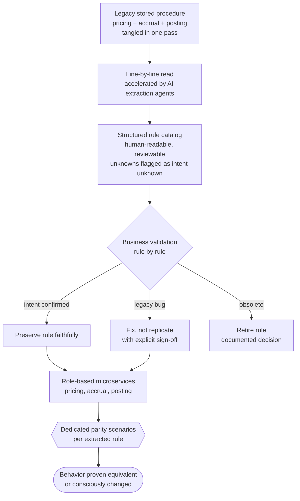

# Pattern 03, Taming stored-procedure logic

*Part of the [Lossless Modernization](../README.md) playbook. Features the signature innovation, see also [Claude agents for legacy-code archaeology](../ai/legacy-archaeology.md). Capture who still understands each procedure in the [legacy knowledge map](../templates/legacy-knowledge-map.md).*

---

## Exec summary

In decades-old financial systems, the business rules do not live in application code. They live in the database, as stored procedures. Thirty years of accrual logic, corporate-action handling, fee schedules, and edge-case patches are written in SQL and executed inside the data layer. To modernize, you have to extract that logic faithfully, without changing behavior, and move it somewhere it can scale.

Two moves made this tractable on a large asset-management / trading platform. First, the extraction itself was accelerated by a genuine innovation: **purpose-built Claude agents and skills that read and replicate legacy stored-procedure logic**, with every extracted rule validated by business stakeholders for sign-off. Second, the destination was not a lift-and-shift. The logic was **distributed into role-based microservices**, each owning one responsibility, producing a scalable system rather than a re-hosted monolith.

The hardest part was never the SQL syntax. It was the **undocumented edge cases and forgotten historical business reasons** buried in code no one had fully understood in years.

---

## Problem

Business-critical logic is trapped inside stored procedures: dense, decades-old, sparsely documented SQL that encodes rules whose original authors are long gone. You must reproduce its behavior *exactly* in a modern architecture, without a written specification of what it is supposed to do, because the code *is* the specification.

## When it applies

- Core business logic executes in the database rather than an application tier.
- The procedures are old, large, and under-documented.
- Behavior must be preserved to the grain ([parity](./01-parity.md) applies to every extracted rule).
- The target architecture is meant to scale and evolve, so a straight port of the procedures is not acceptable.

## The approach

The extraction pipeline, from opaque SQL to signed-off services:

### Understanding it

1. **Read the SQL line by line.** There is no shortcut around comprehension. Every branch, every accumulator, every special-case flag encodes a rule that some downstream number depends on.
2. **Build AI agents to read and replicate the logic.** Rather than rely solely on manual reading, build **Claude skills/agents** that ingest a procedure, extract its logic into a structured, human-readable form, and propose a faithful replication. This is [legacy-code archaeology](../ai/legacy-archaeology.md): AI applied to understanding the modernization's own inputs. It accelerates comprehension and, crucially, makes the extracted logic *reviewable*.
3. **Validate with business stakeholders.** Every extracted rule is taken back to the business owners who understand the *intent* behind it, and signed off. The agent proposes; the business confirms. This is how forgotten historical reasons get recovered, or consciously retired.

### Where the logic goes

The extracted logic is **distributed into role-based microservices**, each owning a specific responsibility, rather than lifted and shifted as one block. A monolithic procedure that priced, accrued, and posted in one pass becomes (for example) a pricing service, an accrual service, and a posting service, each independently testable, scalable, and [replayable](./04-event-driven-saga.md).

### The hardest part

The genuine difficulty is not translating SQL to services. It is the **undocumented edge cases and forgotten historical business reasons**: the branch that exists because of a regulation from fifteen years ago, the special case that handles one instrument type in an unusual way, the quiet patch that fixed a bug nobody recorded. These are exactly what the [parity harness](./parity-harness-deepdive.md) and the chasing-a-gap workflow are built to surface.

## A generic worked example

A single legacy procedure computes daily income for a portfolio. Reading it reveals three intertwined responsibilities and one baffling branch:

- **Pricing:** selects and adjusts prices, with a special case for instruments that priced stale.
- **Accrual:** computes income accrual, with day-count conventions that vary by instrument type.
- **Posting:** writes results, with a rounding step applied at an unusual point.
- **The baffling branch:** a condition that zeroes out accrual for a narrow class of positions on specific dates.

Using a Claude agent, the team extracts each responsibility into a structured description and drafts a microservice per responsibility. The baffling branch is flagged as "intent unknown." Taken to the business, it turns out to encode a legitimate regulatory treatment for a specific holding type. It is documented, preserved deliberately in the accrual service, and covered by dedicated parity scenarios, rather than being silently dropped or blindly copied.

## Industry grounding

- The 70/30 split is real and documented: AWS reports that migration tooling auto-converts roughly 70% of Oracle PL/SQL when moving to PostgreSQL, leaving the remaining ~30%, the dense, business-critical procedures, for manual conversion and behavioral regression testing [AWS Database Blog](https://aws.amazon.com/blogs/database/challenges-when-migrating-from-oracle-to-postgresql-and-how-to-overcome-them/). The 30% is where this pattern lives.
- Before touching any procedure, pin its current behavior with **characterization tests**, Michael Feathers' remedy for code whose behavior is its only specification [Working Effectively with Legacy Code, 2004](https://understandlegacycode.com/blog/key-points-of-working-effectively-with-legacy-code/). Feathers' **seam** concept, a place to alter behavior without editing the code there, is how you get a procedure under test at all. Plan it with the [characterization test plan template](../templates/characterization-test-plan.md).
- Vendors converge on the same shape at mainframe scale: AWS Blu Age refactors COBOL to Java with functional-equivalence testing as the acceptance bar [AWS Mainframe Modernization](https://docs.aws.amazon.com/m2/latest/userguide/refactoring-m2.html), and AWS Transform extracts business rules from COBOL/PL1 with agentic AI before regeneration [AWS, 2025](https://aws.amazon.com/blogs/migration-and-modernization/reimagine-your-mainframe-applications-with-agentic-ai-and-aws-transform/).
- The research consensus on AI's role matches this pattern's design: LLMs default to surface similarity over semantic preservation [arXiv 2404.00971](https://arxiv.org/abs/2404.00971), so **AI translates, execution-based parity evidence certifies**. The agent proposes the rule catalog; the business validates intent; the [parity harness](./parity-harness-deepdive.md) proves behavior.
- The tribal-knowledge risk is quantified: only 16% of organizations say their workflows are well documented [Lucid survey via Sentra, 2025](https://www.sentra.app/articles/tribal-knowledge). Record who still understands each procedure in the [legacy knowledge map](../templates/legacy-knowledge-map.md) before those people leave.

## Pitfalls / anti-patterns

- **Lift-and-shift.** Porting procedures verbatim into a new runtime reproduces the monolith's un-scalability and its opacity. Distribute by responsibility instead.
- **Trusting extraction without validation.** An AI agent (or a human) can produce a plausible replication that is subtly wrong. Business sign-off on the *intent* is non-negotiable.
- **Dropping "dead-looking" branches.** The weird branch that seems like dead code is often the one encoding a rare but real regulatory case. Investigate before removing.
- **Skipping the line-by-line read.** Summaries and assumptions miss the edge cases that live in the details, and those are precisely the expensive ones.
- **Treating comprehension as a one-time task.** As you build, you will discover interactions between procedures; keep re-validating.
- **Preserving known bugs by reflex.** Some extracted behavior is a genuine legacy bug. Fix or replicate is a conscious, signed-off business decision (see [Pattern 01](./01-parity.md)), not a default.

## Decision framework

1. **Does the business logic live in the database?** If yes, this pattern is central to your program.
2. **Do you understand every branch's intent?** If not, extract it into a reviewable form and validate with the business before replicating.
3. **Lift-and-shift or decompose?** Decompose by responsibility unless the procedure is trivially small and stable.
4. **For each extracted rule: preserve, fix, or retire?** A conscious, signed-off decision per rule, never an accident.
5. **Is each extracted rule covered by parity scenarios?** If not, it is not yet safe to trust.

## Checklist

- [ ] Legacy procedures read line by line, not summarized
- [ ] AI agents/skills built to extract and replicate logic into a reviewable form
- [ ] Every extracted rule validated with business stakeholders for intent and sign-off
- [ ] Logic distributed into role-based microservices, not lifted and shifted
- [ ] Undocumented edge cases explicitly surfaced, investigated, and dispositioned
- [ ] "Preserve / fix / retire" decided consciously per rule, with sign-off
- [ ] Each extracted rule covered by dedicated parity scenarios
- [ ] Interactions between procedures re-validated as decomposition proceeds

---

*Previous: [Pattern 02, Strangler-fig](./02-strangler-fig.md) · Next: [Pattern 04, Event-driven & saga](./04-event-driven-saga.md) · Deep-dive: [Legacy-code archaeology](../ai/legacy-archaeology.md) · Template: [Characterization test plan](../templates/characterization-test-plan.md)*
