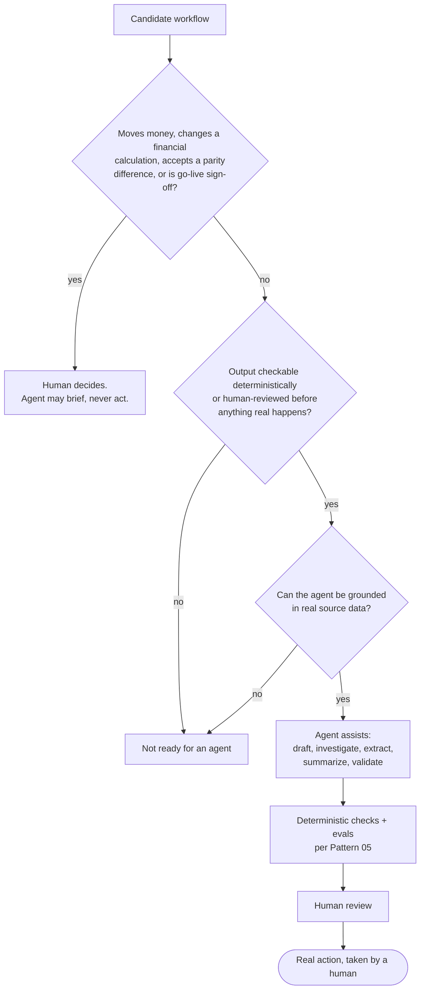

# Pattern 04, AI agents in mission-critical workflows

*Part of the [Lossless Modernization](../README.md) playbook. See also [Pattern 05: Reliability under an LLM](./05-reliability-under-llm.md) and the [AI-era modernization landscape](../ai/README.md).*

---

## Exec summary

AI agents earn their place in a money-critical system by removing toil, not by making decisions that move money. On a large asset-management / trading platform, agents took over or assisted a specific, bounded set of once-manual workflows: answering repetitive business-user FAQs, automating manual operational steps, investigating why a number looks off, reading and replicating legacy stored-proc logic, modernizing reports and UDAs, drafting analysis and summaries for stakeholders, and running data validation and anomaly detection. Collectively this contributed to **~661 hours/year saved** and **$4M of risk reduced**, and helped modernize **35+ UDAs and 70+ reports** serving **300K+ advisors**.

The bright line is authority. **Humans always decide** the things that matter: the final cutover/go-live sign-off, any change to trading or financial calculations, whether to accept a parity difference, and anything that moves money or executes a trade. Agents assist; they do not act on those. (Notably, the team deliberately did **not** hand agents ticket triage/routing.)

The leadership takeaway: the ROI of agents here is toil reduction and faster investigation under a hard authority boundary, not autonomy over financial decisions.

---

## Problem

A modernization program generates enormous amounts of repetitive, manual, judgment-adjacent work: answering the same business questions, chasing anomalies, translating legacy logic, rebuilding reports and UDAs, drafting stakeholder summaries, validating data. It is slow and expensive to do by hand, but the domain is unforgiving: a wrong action can move money or corrupt a financial calculation. Where can AI safely help?

## When it applies

- The workflow is repetitive, manual, or investigation-heavy, and currently a drain on skilled people.
- The agent's output can be checked deterministically or reviewed by a human before anything real happens.
- The task is *assistive* (draft, classify, investigate, summarize, extract) rather than *authoritative* (decide, approve, execute).

It does **not** apply to any step that itself moves money, changes a trading/financial calculation, or constitutes a go-live decision. Those stay human.

## The approach

Every candidate workflow passes through the same gates before an agent touches it:

### Where agents help

- **Answering repetitive business-user FAQs**, grounded in real source data.
- **Automating manual operational workflow steps** that are well-defined and checkable.
- **Investigating why a number looks off**, gathering and correlating the relevant data to accelerate a human's diagnosis.
- **Reading and replicating legacy stored-proc logic** (see [legacy-code archaeology](../ai/legacy-archaeology.md)).
- **Modernizing reports and UDAs**, extracting and restating their logic.
- **Drafting analysis and summaries** for stakeholders, for human review.
- **Data validation and anomaly detection**, flagging for human attention.

### Where humans always decide

- **Final cutover / go-live sign-off.**
- **Any change to a trading or financial calculation.**
- **Accepting a parity difference.**
- **Anything that moves money or executes a trade.**

These are not gray areas. They are the fixed boundary the whole design respects.

### What was deliberately not automated

Ticket triage/routing was **not** handed to agents. Naming the things you deliberately chose *not* to automate is as important as naming what you did: it signals a considered boundary rather than blanket enthusiasm.

### How agents are bounded

Every assistive agent sits behind the reliability controls in [Pattern 05](./05-reliability-under-llm.md): the agent only assists while humans approve real actions, deterministic checks validate agent output, agent behavior is evaluated with evals, and answers are grounded in real source data rather than generated from memory.

## A generic worked example

A business user reports that a portfolio's income number "looks low" today.

1. An **investigation agent** gathers the relevant inputs: the day's price updates, the accrual steps, the positions touched, and the corresponding legacy values from the parallel run.
2. It **correlates and drafts a summary**: "Income is lower because instrument X priced stale and its accrual was suppressed under the known regulatory branch; here are the contributing positions and the matching legacy behavior."
3. A **human analyst reviews** the draft. If it points to a genuine logic difference, the human decides how to proceed, and any change to the accrual calculation, or acceptance of a parity difference, is a human decision with sign-off.

The agent compressed hours of manual data-gathering into minutes. It never changed a number or accepted a difference. That stayed with the human.

## Industry grounding

- The demand side is real: 61% of executives say generative AI is important to their mainframe modernization plans [IBM IBV, 2024](https://datastealth.io/blogs/mainframe-modernization-claude-code-cobol), and the major vendors have shipped agentic tooling, from IBM watsonx Code Assistant for Z [IBM](https://research.ibm.com/blog/cobol-java-ibm-z) to AWS Transform, whose "Reimagine" pattern extracts business rules and pairs with agentic coding tools including Claude Code [AWS, 2025](https://aws.amazon.com/blogs/migration-and-modernization/reimagine-your-mainframe-applications-with-agentic-ai-and-aws-transform/). The full tool landscape is surveyed in [AI-era modernization](../ai/README.md).
- The research says comprehension beats conversion: LLMs help engineers *understand* legacy code more reliably than they *translate* it, with multi-agent explanation of COBOL an active research area [arXiv 2507.02182](https://arxiv.org/html/2507.02182v1); translation studies show models favor surface similarity over semantic preservation [arXiv 2404.00971](https://arxiv.org/abs/2404.00971).
- That is exactly the boundary this pattern draws. The agent workload above is comprehension-and-toil-shaped: investigate, extract, draft, validate. The industry consensus in one line: **AI translates, execution-based parity evidence certifies**. Certification stays with the [parity harness](./parity-harness-deepdive.md) and human sign-off, never with the model.
- The authority boundary also matches behavior-first vendors' positioning: Mechanical Orchard calls code-only LLM translation "wishful thinking" and makes captured behavior, not generated code, the source of truth [HyperFRAME Research, 2026](https://hyperframeresearch.com/2026/05/22/the-behavior-first-paradigm-moving-mainframe-modernization-past-llm-wishful-thinking/).

Track each agent's failure modes and blast radius in the program [risk register](../templates/risk-register.md) like any other operational dependency.

## Pitfalls / anti-patterns

- **Giving agents authority over money or calculations.** The single most important line to never cross.
- **Ungrounded answers.** An agent answering business questions from parametric memory rather than real source data will eventually be confidently wrong. Ground everything.
- **No deterministic check on output.** Assistive output that feeds any workflow must be validatable, not taken on faith.
- **Automating judgment-heavy routing prematurely.** The program chose not to automate ticket triage/routing; resist automating things whose misclassification is costly and hard to check.
- **Skipping evals.** Without repeatable behavior tests, you cannot tell when an agent regresses.
- **Blurring assist vs. act.** If an "assistant" quietly starts taking real actions, you have crossed the boundary without deciding to.

## Decision framework

For any candidate workflow, ask:

1. **Does this step move money, change a financial calculation, accept a parity difference, or constitute go-live?** If yes, keep it human. Full stop.
2. **Can the agent's output be checked deterministically or reviewed before anything real happens?** If no, it is not ready for an agent.
3. **Can the agent be grounded in real source data?** If no, do not let it answer authoritatively.
4. **Do you have evals for its behavior?** If no, build them before trusting it.
5. **Is the value toil reduction / faster investigation?** That is the sweet spot. Autonomy over decisions is not.

## Checklist

- [ ] Agent scope is assistive (draft/classify/investigate/summarize/extract), never authoritative
- [ ] Money movement, trade execution, and financial-calculation changes remain human decisions
- [ ] Cutover/go-live sign-off remains a human decision
- [ ] Accepting any parity difference remains a human decision
- [ ] Agent answers are grounded in real source data
- [ ] Agent output is deterministically checkable or human-reviewed before real effect
- [ ] Evals in place for agent behavior
- [ ] Workflows deliberately *not* automated are named and understood (for example, ticket triage/routing)

---

*Previous: [Pattern 03, Event-driven & saga](./03-event-driven-saga.md) · Next: [Pattern 07, Cutover](./07-cutover.md) · Related: [Pattern 05, Reliability under an LLM](./05-reliability-under-llm.md) · Landscape: [AI-era modernization](../ai/README.md)*
