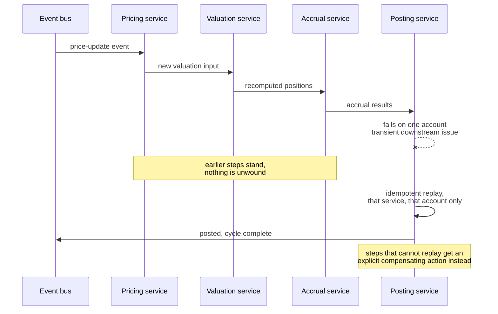

# Pattern 04, Event-driven & saga re-architecture

*Part of the [Lossless Modernization](../README.md) playbook. Builds on the service decomposition from [Pattern 03](./03-taming-stored-procedures.md); record the architecture choices it forces as [ADRs](../templates/adr.md).*

---

## Exec summary

The legacy system ran on an overnight batch: everything recomputed once a night, results available the next morning. The modern business needs **multiple intraday trading cycles**, morning through afternoon, driven by events: a trade, a price update, a data feed. The re-architecture moves from "recompute everything on a schedule" to "react to each event as it happens."

Two design choices carry most of the value. First, **each microservice owns one responsibility**, so the system is decomposed by what things *do*, not by when a batch runs them. Second, failure handling is **idempotent per-service replay**, not global rollback: when one service fails, you replay *that* service to regenerate the correct output, instead of unwinding the entire workflow. The payoff is real-time visibility into the book plus a dramatic improvement over batch-speed processing.

The leadership takeaway: event-driven is not just faster, it changes what failure costs. Recovery becomes local and cheap instead of global and expensive.

---

## Problem

A nightly batch architecture cannot deliver intraday results, gives no real-time visibility, and fails expensively: when a batch breaks, the typical recovery is to rerun large swaths of it. The business needs to process trades, prices, and data feeds continuously across the trading day, with fast, localized recovery when something goes wrong.

## When it applies

- The business needs intraday, event-triggered processing rather than scheduled batch.
- Work decomposes naturally into single-responsibility steps.
- Real-time visibility into state (positions, valuations, exposures) has business value.
- Failures should be recoverable locally, without reprocessing everything.

## The approach

One intraday cycle, with a failure handled by local replay instead of global rollback:

1. **Model triggers as events.** The drivers of computation are events: a trade executes, a price updates, a data feed arrives. Each event flows into the services that care about it, kicking off the relevant intraday cycle rather than waiting for night.
2. **One responsibility per service.** Decompose so that each microservice owns exactly one job (pricing, accrual, position keeping, posting, and so on). This is the same role-based decomposition that [taming stored procedures](./03-taming-stored-procedures.md) produces.
3. **Coordinate with sagas.** A business process that spans several services is coordinated as a saga: a sequence of local steps, each in its owning service, rather than one distributed transaction. Steps proceed, and where needed, compensate.
4. **Recover by idempotent replay.** When a service fails, **replay that specific service** for the affected input to regenerate the correct output. Because each service is idempotent, replaying it any number of times yields the same correct result, with no harmful side effects. There is no need to roll back the whole workflow.

### Why per-service replay beats global rollback

Global rollback treats the workflow as one atomic unit: any failure unwinds everything, which is slow, disruptive, and often impractical across many services and many intraday cycles. Per-service idempotent replay treats each responsibility as independently recoverable: the blast radius of a failure is one service's output for one input, and recovery is a targeted rerun. This keeps intraday processing resilient without freezing the whole system on every hiccup.

## A generic worked example

A price update arrives for an instrument mid-morning:

1. The **pricing service** consumes the price-update event and produces a new valuation input.
2. That triggers the **valuation service**, which recomputes affected positions.
3. The **accrual service** and **posting service** follow, each reacting to the prior step's output.
4. Suppose the posting service fails on one account due to a transient downstream issue. Rather than rolling back the pricing and valuation work, the operator (or an automated control) **replays the posting service** for that one account. Because posting is idempotent, the replay regenerates the correct posted result exactly once in effect, and the intraday cycle completes correctly.

The book reflects the price change within the cycle, and the failure cost one account's re-post, not a batch rerun.

## Industry grounding

- The saga idea predates microservices by decades: Garcia-Molina and Salem introduced sagas in 1987 as long-lived transactions decomposed into steps with compensating actions [Sagas, SIGMOD 1987](https://www.cs.cornell.edu/andru/cs711/2002fa/reading/sagas.pdf). The modern microservices formulation is Chris Richardson's [saga pattern](https://microservices.io/patterns/data/saga.html).
- Feeding an event-driven target from a still-live legacy system is the Thoughtworks **Event Interception** pattern: capture the flows entering legacy and route copies to the new services, so both can process the same reality during the parallel run [Patterns of Legacy Displacement](https://martinfowler.com/articles/patterns-legacy-displacement/).
- IBM's mainframe modernization Redbook names event-driven patterns as one of its three families for hybrid-cloud targets, alongside application-centric and data-access-centric [IBM Redbook SG24-8532, 2023](https://redbooks.ibm.com/abstracts/sg248532.html).
- A caution before decomposing: 73% of monolith-to-microservices migrations fail or produce slower, more complex systems [Fabres analysis](https://fabres.eu/blog/why-most-monolith-to-microservices-migrations-fail-part2/), and roughly 42% of adopters have consolidated back toward modular monoliths [ByteIota, 2026](https://byteiota.com/microservices-rollback-2026-42-return-to-monoliths/). Decompose because the business needs intraday event processing and local recovery, not because microservices are fashionable. If batch timing is genuinely fine, the decision framework below says stop.

Each ownership boundary and each replay-vs-compensate choice is an architecture decision worth recording as an [ADR](../templates/adr.md).

## Pitfalls / anti-patterns

- **Non-idempotent services.** If replaying a service double-counts or double-posts, per-service replay becomes dangerous. Idempotency is a hard requirement, not a nicety.
- **Hidden global transactions.** Reintroducing a distributed transaction across services to "make it safe" defeats the point and reintroduces global failure modes.
- **Services that own more than one responsibility.** Blurred ownership makes replay ambiguous: which part are you replaying, and what are its side effects?
- **Event ordering assumptions.** Assuming events always arrive in a tidy order leads to subtle corruption; design for out-of-order and duplicate events.
- **Losing parity discipline.** Faster and event-driven does not relax the accuracy bar. Every intraday result still has to reconcile against the legacy source of truth during the parallel run (see [Pattern 01](./01-parity.md)).
- **No compensation strategy.** For steps that cannot simply be replayed, define compensating actions explicitly rather than hoping failures do not happen mid-saga.

## Decision framework

1. **Does the business need intraday, event-driven processing?** If batch timing is genuinely fine, do not add this complexity.
2. **Can work be cleanly decomposed into single-responsibility services?** If not, resolve ownership first (see [Pattern 03](./03-taming-stored-procedures.md)).
3. **Is each service idempotent?** If not, make it so before relying on replay.
4. **Rollback or replay?** Prefer localized idempotent replay; reserve compensation for steps that cannot be replayed.
5. **How do you handle out-of-order and duplicate events?** Design it explicitly, do not assume order.

## Checklist

- [ ] Triggers modeled as events (trade, price update, data feed), not schedules
- [ ] Each microservice owns exactly one responsibility
- [ ] Multi-service processes coordinated as sagas with defined steps
- [ ] Every service is idempotent, replay yields the same correct output
- [ ] Failure recovery is per-service replay, not global rollback
- [ ] Compensating actions defined for steps that cannot be simply replayed
- [ ] Out-of-order and duplicate events handled by design
- [ ] Intraday results still reconciled against the legacy source of truth during parallel run

---

*Previous: [Pattern 03, Taming stored procedures](./03-taming-stored-procedures.md) · Next: [Pattern 05, AI agents in workflows](./05-ai-in-workflows.md) · Template: [ADR](../templates/adr.md) · [Glossary](../GLOSSARY.md)*
