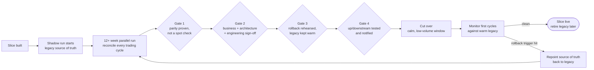

# Pattern 06, Cutover / go-live

*Part of the [Lossless Modernization](../README.md) playbook. For choosing big-bang vs parallel-run vs phased in the first place, see [cutover strategy](../decide/cutover-strategy.md). Execution artifacts: the [cutover runbook](../templates/cutover-runbook.md) and [rollback plan](../templates/rollback-plan.md).*

---

## Exec summary

Cutover is the moment the new system replaces the old one as the source of truth for a slice of functionality. In a money-critical system it is the highest-risk moment in the whole program, so the goal is to make it *anticlimactic*: by the time you flip the switch, the outcome is already known, because the new system has been proven in parallel for weeks.

Nothing goes live until five things are true: parity is proven over the **multi-week parallel run**; business, architecture, and engineering have signed off; a **rollback plan is ready**; and upstream and downstream systems have been tested and notified. Cutover is choreography, not a leap of faith.

The leadership takeaway: a good cutover is boring. If it feels dramatic, you cut over too early.

---

## Problem

At some point the new system must actually take over. Do it too early and you risk moving money on unproven logic. Do it carelessly, without a rollback path or without notifying the systems that depend on you, and a single problem cascades across the estate. How do you make the transition safe and reversible?

## When it applies

- A slice has been built, run in parallel, and appears to be at [parity](./01-parity.md).
- Real money, downstream systems, or reporting depend on the outputs about to change hands.
- The transition needs to be reversible if something unexpected appears.

## The approach

The road from parallel run to go-live, with rollback as a first-class path:

Cutover is gated. Verify **all** of the following before flipping any slice live:

1. **Parity proven over the multi-week parallel run.** Not a spot check: sustained agreement across **12+ weeks** and many trading cycles, with only business-agreed differences remaining (see [Pattern 01](./01-parity.md) and the [Parity Harness](./parity-harness-deepdive.md)), compiled in the [parity report](../templates/parity-report.md).
2. **Business + architecture + engineering sign-off.** All three constituencies formally agree the slice is ready. This is the same three-way sign-off that defines "done" for a strangler-fig slice ([Pattern 02](./02-strangler-fig.md)).
3. **Rollback plan ready.** A concrete, tested path back to the legacy system as source of truth if a problem emerges after cutover, written down as a [rollback plan](../templates/rollback-plan.md) with pre-agreed trigger conditions. A rollback plan that has never been tested is a hope, not a plan.
4. **Upstream and downstream systems tested and notified.** Every consumer that depends on the outputs has been tested against the new system's outputs and told when the change happens. No downstream system should be surprised.

Only when all four hold do you cut the slice over, old to new. The event itself runs off a [cutover runbook](../templates/cutover-runbook.md): every step with an owner, a timestamp, a success criterion, and a rollback trigger. Then you watch it closely, ready to invoke rollback if needed.

### Staged, not big-bang

Cutover follows the strangler-fig grain: one slice at a time, blast radius limited to that slice. Shadow traffic and the parallel run mean the new system has already processed real inputs before it becomes authoritative, so cutover is the promotion of an already-proven pipeline, not the first real test of an untested one.

The slicing axis matters as much as the slicing. On the flagship program, waves were cut **by account and fund groups**, not by whole applications: a subset of the book moved, proved itself in production, and the migrated population expanded wave by wave. Population-based waves keep every wave's blast radius bounded and give every wave the same shaped evidence (the same reconciliation, on a smaller book), which makes each go/no-go call a repeat of a decision the program has already practiced.

## A generic worked example

An equity-fund valuation slice has run in parallel for 13 weeks. The harness shows exact reconciliation except for one documented, business-agreed improvement.

1. **Gate 1, parity:** sustained agreement across quarter-end, corporate actions, and unusual market days. Passed.
2. **Gate 2, sign-off:** business (owns the numbers), architecture (owns the design), and engineering (owns the delivery) all sign. Passed.
3. **Gate 3, rollback:** the plan is to repoint the source-of-truth flag back to legacy, which is still running warm; the team rehearses it in a lower environment. Ready.
4. **Gate 4, up/downstream:** the reconciliation feed, reporting, and two downstream risk systems are tested against the new outputs and told the cutover date and time. Notified.

The team cuts equity-fund valuation over on a low-volume day, watches the first several cycles against the still-warm legacy system, and confirms clean operation. The next slice begins its own gated march.

## Industry grounding

- The cautionary anchor is **TSB Bank, 2018**: 1.3 billion records for 5.2 million customers migrated in a single weekend, with 4,424 defects still open at go-live out of 34,671 logged, and one of two data centres never load-tested. Cost: £366M direct, £48.6M in fines, roughly £1B total, and the CEO's resignation [Slaughter and May review, 2019](https://www.techmonitor.ai/leadership/digital-transformation/slaughter-and-may-tsb). Full analysis: [TSB post-mortem](../why-modernizations-fail/post-mortems/tsb-bank.md). Every gate in this pattern exists because TSB skipped it.
- The **USDS Digital Services Playbook** made "never big-bang" official US government doctrine: route traffic to the new system gradually, run alpha and beta in parallel, and let users revert to legacy after launch [playbook.usds.gov](https://playbook.usds.gov/).
- **AWS Prescriptive Guidance** ships a downloadable cutover runbook structure, activities, timeline, per-step owners and success criteria, and treats the rollback plan with pre-agreed triggers as a mandatory section, not an appendix [AWS cutover runbook guide](https://docs.aws.amazon.com/prescriptive-guidance/latest/cutover-runbook/welcome.html), [pre-cutover best practices](https://docs.aws.amazon.com/prescriptive-guidance/latest/best-practices-migration-cutover/pre-cutover-stage.html). This playbook's [cutover runbook template](../templates/cutover-runbook.md) follows the same step/owner/timestamp/success-criteria/rollback-trigger shape.
- When a hard cutover is genuinely unavoidable, the Thoughtworks catalog names it **Stop the World Cutover** and treats it as the option of last resort [Patterns of Legacy Displacement](https://martinfowler.com/articles/patterns-legacy-displacement/).

## Pitfalls / anti-patterns

- **Cutting over on a spot check.** A few clean days is not a multi-week parallel run. The tail lives in month-ends and corporate actions.
- **Untested rollback.** If you have never exercised the rollback, you do not have one.
- **Surprising downstream systems.** A consumer that was not tested or not notified turns your clean cutover into their incident.
- **Big-bang cutover.** Flipping many slices at once reconcentrates the risk strangler-fig was designed to spread out.
- **Turning off the old system immediately.** Keep legacy warm and available for rollback until the new slice has proven itself live.
- **Cutting over on a high-volume, high-stakes day.** Prefer a calm window so that if something appears, you have room to respond.
- **Skipping any of the three sign-offs.** Business, architecture, and engineering each see different risks; all three matter.

## Decision framework

1. **Is parity proven over the full multi-week parallel run, not a spot check?** If no, wait.
2. **Have all three constituencies signed off?** If no, you are not ready.
3. **Is there a tested, concrete rollback path with legacy kept warm?** If no, build and rehearse it first.
4. **Are all upstream and downstream systems tested and notified?** If no, do not cut over.
5. **Is this the smallest sensible slice, on the calmest sensible window?** Prefer both.

## Checklist

- [ ] Parity proven over the multi-week (12+ week) production parallel run
- [ ] Only business-agreed differences remain, all documented
- [ ] Business, architecture, and engineering sign-off all obtained
- [ ] Rollback plan concrete **and** rehearsed, legacy kept warm
- [ ] Every upstream and downstream consumer tested against new outputs
- [ ] Every consumer notified of the cutover timing
- [ ] Cutover staged (one slice), not big-bang
- [ ] Cutover scheduled for a calm window, with close post-cutover monitoring
- [ ] Legacy retired only after the new slice has proven itself live

---

*Previous: [Pattern 05, AI agents in workflows](./05-ai-in-workflows.md) · Next: [Pattern 07, Reliability under an LLM](./07-reliability-under-llm.md) · Templates: [Cutover runbook](../templates/cutover-runbook.md), [Rollback plan](../templates/rollback-plan.md) · Cautionary tale: [TSB Bank](../why-modernizations-fail/post-mortems/tsb-bank.md)*
