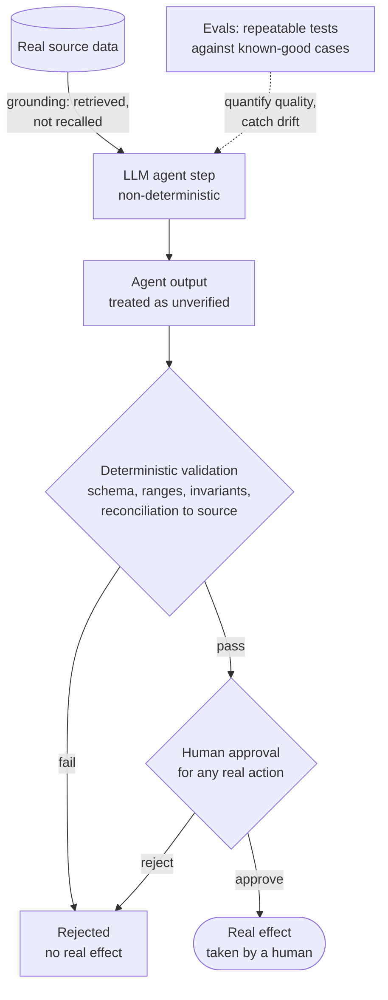

# Pattern 07, Reliability with an LLM in the loop

*Part of the [Lossless Modernization](../README.md) playbook. Companion to [Pattern 05: AI agents in workflows](./05-ai-in-workflows.md); the documented limits of LLMs on legacy code live in [AI-era modernization](../ai/README.md).*

---

## Exec summary

An LLM is non-deterministic. A money-critical system demands hard guarantees. Those two facts are not in conflict if you place the LLM correctly: **the agent only assists, and humans approve real actions.** Around that boundary you add three reinforcing controls: **deterministic checks/validation** on the agent's output, **evals** that test the agent's behavior repeatably, and **grounding** that ties every answer to real source data.

The result is a system where the non-deterministic part can be wrong without the system being wrong, because nothing the agent produces takes effect without a deterministic check or a human decision behind it.

The leadership takeaway: you do not make an LLM reliable by making it deterministic. You make the *system* reliable by bounding what the LLM's output is allowed to do.

---

## Problem

You want the leverage of AI agents (Pattern 05) inside a system where a wrong output can move money or corrupt a financial calculation. But LLMs are non-deterministic and can be confidently wrong. How do you keep the system's guarantees intact when part of it is a language model?

## When it applies

- An LLM or agent participates in a workflow that touches money-critical data or decisions.
- The workflow needs hard reliability guarantees despite the model's non-determinism.
- You can insert deterministic checks and/or human approval between the agent's output and any real effect.

## The approach

Deterministic guardrails wrap the non-deterministic step on every side: grounded inputs before it, validation and human approval after it, evals around it.

Four controls, layered:

1. **The agent only assists; humans approve real actions.** This is the load-bearing control. The LLM drafts, classifies, investigates, and summarizes. It never holds authority over money movement, trade execution, financial-calculation changes, or parity-difference acceptance. Those are human decisions (see [Pattern 05](./05-ai-in-workflows.md)).
2. **Deterministic checks / validation on agent output.** Whatever the agent produces is validated by deterministic logic before it feeds anything: schema checks, range and reconciliation checks, invariants that must hold. If the output fails the check, it does not proceed, regardless of how confident the agent sounded.
3. **Evals / testing of agent behavior.** The agent's behavior is measured against known-good expectations, repeatably, so quality is quantified and regressions are caught. Evals turn "it seemed fine" into evidence.
4. **Grounding.** Answers are tied to real source data, retrieved rather than recalled. A grounded agent can be checked against its sources; an ungrounded one is guessing. Grounding is what makes both human review and deterministic validation tractable, because there is a source to check against.

### Why this holds

Non-determinism is only dangerous when it has authority. Strip authority (control 1), and a wrong output becomes a rejected draft, not a bad action. Add deterministic validation (control 2), and many wrong outputs are caught before a human even sees them. Add evals (control 3), and you know your error rates and catch drift. Add grounding (control 4), and every output is anchored to something verifiable. The LLM stays non-deterministic; the system stays reliable.

## A generic worked example

An anomaly-detection agent flags that a fund's exposure looks off and drafts an explanation.

- **Grounding:** the agent's explanation cites the specific positions, prices, and feed timestamps it drew from, all retrieved from real source data.
- **Deterministic check:** before the flag is surfaced, deterministic reconciliation confirms the figures the agent cited actually reconcile to the source, and that its cited positions exist. If the agent hallucinated a position, the check rejects the output.
- **Evals:** the agent has been evaluated against a library of known anomalies and known-clean cases, so its false-positive and false-negative behavior is understood.
- **Human approves:** an analyst reviews the grounded, validated draft and decides what, if anything, to change. No exposure figure or calculation is altered by the agent.

The agent accelerates detection and explanation. The guarantees come from the checks and the human, not from trusting the model.

## Industry grounding

- The failure modes are cataloged: research taxonomies identify 3 primary and 12 specific categories of LLM code hallucination [arXiv 2404.00971](https://arxiv.org/abs/2404.00971). Confidence and correctness are formally unrelated, which is why control 2 binds on deterministic checks, never on tone.
- Execution beats inspection: combining execution-based checking with LLM judging reaches roughly 95% accuracy at detecting semantic equivalence, far above inspection of code text alone [MatchFixAgent, arXiv 2509.16187](https://arxiv.org/pdf/2509.16187). That is the research-scale version of this pattern's rule: the binding check runs the output against reality.
- Berkeley's analysis of LLM-driven translation concludes models need formal, compositional reasoning support to guarantee semantics; unaided generation cannot [Berkeley EECS-2025-174](https://www2.eecs.berkeley.edu/Pubs/TechRpts/2025/EECS-2025-174.pdf).
- The contrast case proves the principle from the other side: Moderne/OpenRewrite chose deterministic rule-based transformation precisely because "same recipe, same output every time" is a promise LLMs cannot make [OpenRewrite docs](https://docs.openrewrite.org/). Where determinism is achievable, prefer it; where you want the LLM's flexibility, wrap it in the controls above.
- Consensus, once more: **AI translates, execution-based parity evidence certifies.** In this program the certifying machinery is the [parity harness](./parity-harness-deepdive.md); tool-by-tool limits are surveyed in [AI-era modernization](../ai/README.md).

## Pitfalls / anti-patterns

- **Giving the LLM authority to close the loop.** The moment an agent can take a real action unreviewed, non-determinism becomes a live risk to money.
- **"It sounded confident."** Confidence is not correctness. Only the deterministic check and the source matter.
- **No grounding.** Ungrounded answers cannot be validated or trusted; they are plausible text, not verified fact.
- **No evals.** Without repeatable behavior tests you cannot detect regressions or quantify reliability.
- **Validating with another LLM only.** A non-deterministic checker on a non-deterministic output does not give you a hard guarantee; the binding check must be deterministic.
- **Treating the agent as correct until proven wrong.** Default to "unverified" and let the checks and humans confer trust.

## Decision framework

1. **Does the agent's output ever take real effect without a human or a deterministic check?** If yes, fix that first; it is the whole ballgame.
2. **Is every answer grounded in retrievable source data?** If no, do not trust it.
3. **Is there a deterministic validation between output and effect?** If no, add one.
4. **Do you have evals quantifying behavior?** If no, build them.
5. **Where the check cannot be deterministic, is a human the approver?** It must be.

## Checklist

- [ ] Agent is assistive only; humans approve all real actions
- [ ] Deterministic validation sits between agent output and any effect
- [ ] The binding check is deterministic, not another model
- [ ] Every agent answer is grounded in real, retrievable source data
- [ ] Evals quantify agent behavior and catch regressions
- [ ] Agent output is treated as unverified until checked or approved
- [ ] No path exists for the agent to move money, execute a trade, or change a financial calculation

---

*Previous: [Pattern 06, Cutover](./06-cutover.md) · Related: [Pattern 05, AI agents in workflows](./05-ai-in-workflows.md) · Landscape: [AI-era modernization](../ai/README.md) · Closing essay: [The Myth-Buster](../MYTH-BUSTER.md)*
