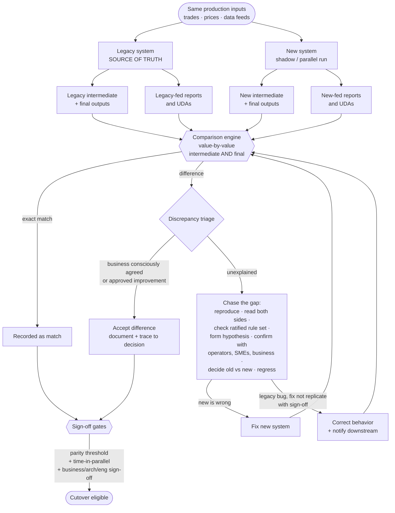

# The Parity Harness, deep-dive

*The signature methodology behind [Pattern 06: Parity](./06-parity.md). This is the machinery that turns "we think the new system is right" into "the business, architecture, and engineering have signed that it is." Its evidence is compiled in the [parity report template](../templates/parity-report.md).*

---

## Exec summary

The parity harness is the source of truth for whether a modernized, money-critical system can be trusted. It runs the legacy and new systems side by side on the same inputs, compares their outputs value by value at both intermediate and final stages, extends that comparison outward to the reports and spreadsheets the business actually reads, triages every discrepancy, and feeds a set of formal sign-off gates. On a large asset-management / trading platform it underwrote **5,000+ scenario** business testing and a **12+ week** production parallel run, with the legacy system remaining the source of truth throughout.

Its discipline is captured in one rule: **data must match exactly, and the only acceptable difference is one the business consciously agreed.** Everything else is a gap to be chased down to its root cause and resolved before go-live.

---

## What the harness is

A harness, not a test suite. On the flagship program this was a **purpose-built comparison harness**: a dedicated tool that pulled from both systems on a schedule, compared automatically, and produced break reports for triage. It comprises:

- **Dual execution.** The same inputs drive both the legacy system and the new system.
- **Output capture.** Both systems' outputs are captured at defined points, intermediate stages *and* final outputs.
- **Comparison engine.** A value-by-value comparator that reconciles captured outputs to the required grain. On the flagship program the grain was **every record, at every level**: each transaction, each position, each intermediate calculation value, each final output. Nothing was sampled.
- **Discrepancy triage.** A workflow that classifies each mismatch and routes it to resolution.
- **Sign-off gates.** Formal checkpoints where business, architecture, and engineering agree that parity is proven.

### Keeping up with the volume

Comparing every record at every level on a platform moving billions a day is only feasible with two mechanics, and both shape how you plan the work:

- **Scheduled batch comparison.** The harness pulled from both systems on a schedule and compared in bulk rather than attempting real-time reconciliation. Differences surface within a cycle, not within a second, which is the right trade: the goal is certainty before cutover, not live alerting.
- **Breaks grouped and deduplicated by root cause.** Thousands of individual record breaks caused by one logic difference collapse into a single item to investigate. Without this, the triage queue is unreadable and the team works the same defect repeatedly.

The second mechanic has a reporting consequence worth stating to leadership before anyone asks: **raw break counts are a misleading progress metric.** One rule difference can produce a hundred thousand breaks, and fixing it can close them all at once, so a chart of break volume will swing wildly while real progress is steady. Track **distinct unresolved root causes**. That number is small, honest, and hard to game.

## The layers of parity testing

The harness supports several layers, each catching what the others miss:

### 1. Side-by-side functional testing
For defined, curated inputs, run both systems and compare. This is the fast inner loop: it catches structural and obvious differences early, before the expensive production parallel run.

### 2. Multi-week production parallel run (shadow run)
Run the new system alongside the live legacy system on **real production inputs** for **12+ weeks**. The legacy system remains the source of truth and continues to drive real outcomes; the new system's outputs are captured only for comparison. This is where the real edge cases surface: the ones that only appear across many trading cycles, month-ends, corporate actions, and unusual market days. No amount of curated test input substitutes for real production flow over time.

**How this coexists with waves.** A reader doing the arithmetic will notice that migrating in waves and running each wave in parallel for 12+ weeks would take years if done serially. It does not, because **the waves overlap**. On the flagship program the parallel run was a standing capability rather than a per-wave event: several populations were in reconciliation simultaneously, at different stages, while earlier waves had already cut over. Each wave still had to serve its own minimum time in parallel before becoming cutover-eligible, so the gate was never shortened. Only the calendar overlapped.

That has a design consequence for the harness. It must handle **concurrent comparisons across populations in different states**, which means every captured output and every discrepancy has to carry which wave and which population it belongs to. A harness built for one comparison at a time will not survive the second wave.

### 3. 5,000+ scenario business testing, run as evals
The scenario regime was built the way modern AI teams build an eval set, before that framing had a name here: **define the test cases and the expected answers *with* the business up front, then run the system against them continuously.** The business co-authored the test plan (what to test, what the right answer is); most scenarios were automated with a smaller manual set; and the whole suite was run regressively, over and over, with regular data-comparison checks between runs. A dedicated team owned it: QA, engineers, and production-parallel experts working as one unit. It took **hundreds of distinct scenarios** just to be confident no edge case was missed in a given area, and the full regime spanned **5,000+**. Business co-authorship is what connects raw value comparison to real-world meaning: the expected answer is agreed before the comparison runs, so a mismatch is a finding, never a debate.

**The exception that has to be planned for.** "Agree the expected answer up front" works for outcomes the business sees and owns: a fee, a position value, a report figure. It does not work for **intermediate building blocks**, where often nobody has an expected answer to give because nobody has ever been shown that value. For those, the sequence inverts: [archaeology](../ai/legacy-archaeology.md) produces a candidate expected answer from the recovered rule plus captured legacy behavior, and the business ratifies *that* as the specification. Both routes end in a signed expected answer. Only one of them can start there. Assume every case is the first kind and the intermediate-parity layer will quietly go uncertified.

### 4. Logic analysis across the whole estate
Reading the legacy logic (accelerated by [legacy-code archaeology](../ai/legacy-archaeology.md)) so that when a difference appears, you can explain *why* each system produces what it does, and decide which is correct. Pin the pre-change behavior with a [characterization test plan](../templates/characterization-test-plan.md).

The scope of "the logic" is wider than the procedures. Rules live in the data state branches turn on, in job ordering, in spreadsheet macros, and in the reports themselves, and a difference can originate in any of them. That is why the harness and the archaeology work off the same [context layer](../ai/legacy-archaeology.md) rather than off the procedure source alone.

## Parity beyond the core: the consuming layer

Reconciling the core system's own outputs is necessary and not sufficient. On a platform of any age, values do not stop at the core. They flow outward into reports and into spreadsheets and user-developed applications, and **those consumers frequently apply logic of their own**: an adjustment, an override, a differently-rounded total, a rule that was easier to add in Excel than to change in the core. A report is therefore not merely a view of reconciled values. It is a computation, and it needs its own proof.

On the flagship program the parity bar extended over that outer layer: **reports and user-developed applications were reconciled too**, not assumed to follow from matching core values. Four techniques were used, and they answer different questions:

| Technique | What it proves | When to reach for it |
|---|---|---|
| **Re-point the consumer at the new system** | The consumer still works, and its own logic produces the same result on new-system data. Run one copy fed by legacy and one fed by the new system, then compare their outputs | The default for any consumer that survives the migration unchanged |
| **Reconcile the dataset feeding it** | The inputs are identical, so anything the consumer computes from them is unchanged | Cheap, automatable, good for the large tail of consumers with no logic of their own |
| **Compare rendered output value by value** | The artifact the business actually signs matches, figure for figure | Client-facing, regulatory, and high-visibility reports where the rendered number is the deliverable |
| **Rebuild the logic into the platform, then compare against the old spreadsheet** | The rule now lives in a governed service and still produces what the spreadsheet did | Where a spreadsheet held real business rules. This retires shadow logic rather than preserving it |

That last row is the one with strategic consequence. A spreadsheet holding business rules is an un-versioned, un-tested, single-owner dependency at the edge of a money-critical platform. Modernization is the opportunity to bring it inside, and the parity comparison against its historical output is what makes doing so safe. Migrating the core while leaving the macros in place preserves the problem in a new architecture.

The counting rule that follows: a wave is not reconciled when the core matches. It is reconciled when everything the business reads matches.

## Intermediate vs. final parity

The harness reconciles at two levels, and **both are required**:

- **Final parity:** the terminal, business-consumed outputs (trades, positions, NAVs, report values) match.
- **Intermediate parity:** the intermediate calculation stages along the way also match.

Requiring both is not redundant. Two systems can reach the same final number by different paths, and sometimes both paths are wrong in ways that cancel. Intermediate parity closes that door: it forces agreement on the *method*, not just the *answer*, so a match is a real match rather than a coincidence.

## What counts as a match

The bar is exactness, with one narrow exception:

- **Data must match exactly.**
- **The only acceptable difference** is one the business **consciously agreed** during requirements, or an **approved product improvement**.
- **Rounding differences are not accepted** unless a sound business rule was explicitly agreed.
- **Old bugs are fixed, not replicated**, with business sign-off, and never at the cost of trading accuracy.
- **Timing differences are accepted only** where overall values and trading accuracy *per trading cycle* are not compromised.

Every accepted difference is documented and traceable to a decision, in the accepted-difference log of the [parity report](../templates/parity-report.md). "Probably just rounding" is not a disposition; it is how a real logic bug hides.

## The data-flow diagram

## The chasing-a-gap workflow

This is the [interrogation loop](../ai/legacy-archaeology.md) again, pointed at a difference instead of at a procedure. The sequence matters, and the most common mistake is getting it backwards by taking a raw discrepancy to a stakeholder and asking what it means.

When the comparison engine flags an unexplained difference:

1. **Reproduce** the discrepancy reliably.
2. **Own it, and do the work first.** A practitioner takes the difference and reads the legacy logic and the new code against each other until they can locate the exact divergence. This is not triage-by-delegation. The person chasing the gap is accountable for understanding it.
3. **Check the archaeology output before investigating from scratch.** The ratified rule set is the reference. If the behavior was already recovered and signed, the question is usually "which side departed from the agreed rule," which is a far faster question than "what does this system do."
4. **Form a hypothesis.** State plainly what you believe is happening and why: this value differs because the legacy applies the fee before the mid-cycle event and the new service applies it after.
5. **Take the hypothesis to the people who can confirm or kill it.** Daily operators and SMEs for what normally happens, long-tenured engineers and DBAs for why the legacy behaves that way, business owners for what the value is supposed to mean. Arriving with a hypothesis rather than a question turns a multi-week investigation into a short conversation, and it respects the scarcest resource on the program, which is their attention.
6. **Decide which is correct.** Old and new can each be right or wrong. Sometimes the legacy behavior is a long-standing bug.
7. **Resolve consciously.** Fix the new system, or, if the legacy was wrong, **fix rather than replicate** with business sign-off and downstream notification, never at the cost of trading accuracy.
8. **Regress across neighbors.** Re-run the affected scenario class, often hundreds of scenarios, to confirm the fix did not miss an adjacent edge case.

This work is deliberately regressive and rigorous. The whole point is that no edge case slips through.

**Why hypothesis-first is a schedule decision, not just good manners.** Business owners, operators, and long-tenured engineers are the same scarce people the rest of the program needs, and their availability is one of the reliable schedule eaters on this kind of work. A queue of unexplained differences waiting on stakeholder time will pace the entire parallel run. A queue of hypotheses awaiting confirmation moves at a completely different speed.

## When the harness is the one that is wrong

Not every break is a finding. A new harness produces false breaks, and on the flagship program they came from three sources. Each has a different fix, and all three have to be closed before the harness's output can be trusted:

| False-break source | What it looks like | The fix |
|---|---|---|
| **Snapshot timing** | The two systems were read at slightly different moments, so a value legitimately in flight looks like a mismatch | Align capture to cycle boundaries and logical checkpoints, never to clock times |
| **Format and type differences** | The same value in different clothing: precision, date formats, null versus empty, trailing spaces, sign conventions | Normalize in the comparator, deliberately and visibly, so normalization can be audited and never silently swallows a real difference |
| **Scope and mapping errors** | The harness compared the wrong things: a field mapped to the wrong counterpart, or a population including accounts not yet migrated | Treat mappings and population definitions as reviewed artifacts, versioned per wave |

**Why this matters more than it sounds.** A harness that cries wolf gets discounted, and a discounted harness is worse than no harness, because the program still believes it has evidence. Once the team learns that breaks are often noise, "probably the harness" becomes the disposition of choice, and it hides real logic bugs exactly the way "probably just rounding" does.

So the harness has to be certified before it can certify anything. Prove it against known-identical inputs and expect zero breaks; introduce a deliberate, known difference and confirm it is caught. Only then does its silence mean something. Budget a settling-in period at the start of the parallel run where a meaningful share of breaks turn out to be the harness, and treat closing those as the same priority as closing real ones.

## Field notes: what the burndown actually looks like

Two things about the flagship program's parallel run are worth knowing before you plan yours, because they invert the common intuition:

**The bulk matches early; the tail is the program.** The comparison was relatively clean soon after switch-on: the structural and obvious differences fall fast. What consumed most of the 12+ weeks was a stubborn long tail of rare edge cases: month-ends, corporate actions settling mid-cycle, unusual market days, positions that only exist in certain states on certain dates. If your plan assumes the work is proportional to the initial break count, you will declare victory around week three and be wrong. Count distinct root causes instead, for the reasons above. The parallel run is long precisely because the tail only surfaces across many real trading cycles.

**Every family of mismatch shows up.** It is tempting to model discrepancies as one dominant cause. In practice all four families appeared and each had to be chased differently:

| Family | What it looks like | How it hides |
|---|---|---|
| Timing and ordering | Same steps, different order or point in the cycle; drifts appear only on days when the order matters (a fee applied before vs after a mid-cycle corporate action) | Matches perfectly on quiet days |
| Forgotten special-case rules | A branch that fires only for a specific holding type, flag, or date range that nobody living knew existed | Looks like a new-system bug until the legacy code is read line by line |
| Rounding and precision | Different rounding points or numeric precision producing penny-level drifts | Reads as harmless noise; "probably rounding" is how logic bugs survive |
| Dirty historical data | The old system silently tolerated bad data; the new one handles it differently | The mismatch is real but the defect is in the data, not either system's logic |

The triage workflow has to distinguish these, because the fix is different in each case: reorder, preserve consciously, agree a rounding rule, or repair the data. On the flagship program the default resolution for genuine legacy bugs was **fix properly with business sign-off**: the business formally approved the intentional difference, it was documented in the accepted-difference log, and downstream consumers were notified. Replicating a known bug to force a match was the rare, explicitly signed exception, never the default.

## The sign-off gates

Parity is not declared by the harness alone; it is *ratified*. A slice becomes eligible for [cutover](./07-cutover.md) only when all of the following hold together:

- **Parity threshold** met: outputs reconcile, with only documented, business-agreed differences remaining, at both intermediate and final levels.
- **Time-in-parallel** satisfied: the slice has run alongside the legacy system long enough (12+ weeks in this program) to have seen the tail.
- **Formal sign-off** from **business, architecture, and engineering**, backed by defined architecture diagrams (ASO) and the harness evidence.

Each constituency sees different risk: business owns the meaning of the numbers, architecture owns the design's soundness, engineering owns the delivery. All three signatures are required.

## Industry grounding

The harness has independent precedents at every layer, which is worth knowing when you defend the budget for it:

- **Google Cloud Dual Run** is a productized version of the same architecture: mainframe and cloud replica run side by side on production transactions, outputs compared, parity certified before cutover; the tech originated inside Santander's own core-banking migration [Google Cloud, 2022](https://cloud.google.com/blog/products/infrastructure-modernization/dual-run-by-google-cloud-helps-mitigate-mainframe-migration-risks).
- **GDS dark-launch testing** is the UK government's version of the shadow run: send live queries to the new system, compare with the old, trust nothing until they agree [GDS Service Manual](https://www.gov.uk/service-manual/technology/moving-away-from-legacy-systems).
- **Mechanical Orchard** makes captured production behavior the source of truth and proves parity transaction by transaction before incremental cutover, explicitly rejecting code-only translation as certification [Mechanical Orchard](https://www.mechanical-orchard.com/platform).
- **Characterization tests** (Feathers, 2004) are the unit-scale ancestor: pin what the code actually does, then hold it there while you change everything underneath [summary](https://understandlegacycode.com/blog/key-points-of-working-effectively-with-legacy-code/). A curated side-by-side input set is a golden master in the same tradition.
- The research agrees the comparison must be execution-based: running outputs against reality plus judgment reaches ~95% semantic-equivalence detection, where reading code alone does not [MatchFixAgent, arXiv 2509.16187](https://arxiv.org/pdf/2509.16187). The consensus in one line: AI translates, execution-based parity evidence certifies.

## Anti-patterns specific to the harness

- **Final-only reconciliation.** Skipping intermediate parity lets compensating errors pass.
- **Core-only reconciliation.** Matching the core's values proves nothing about reports and spreadsheets that apply logic of their own. A wave is reconciled when everything the business reads matches.
- **Taking raw differences to stakeholders.** Arriving without a hypothesis burns the scarcest resource on the program and paces the whole parallel run on other people's calendars.
- **Curated inputs only.** Without the real production parallel run, the long-tail edge cases never appear.
- **Silent tolerance.** Any threshold that quietly swallows small differences will swallow real bugs. Accept differences only by explicit decision.
- **"Probably the harness."** The mirror image of "probably rounding." Once the team is allowed to dismiss breaks as tooling noise, the harness has stopped being evidence. Certify the harness first, then hold it blameless only on proof.
- **Short parallel runs.** Ending early trades weeks of patience for months of production risk.
- **Chasing without regressing.** Fixing one instance of a gap without re-running its scenario class leaves siblings undiscovered.
- **Harness as afterthought.** The harness is the spine of the program; treating it as end-stage QA is the classic, expensive mistake.

## Checklist

- [ ] Harness certified before use: zero breaks on known-identical inputs, and a deliberately introduced difference is caught
- [ ] Capture aligned to cycle boundaries, not clock times
- [ ] Format and type normalization explicit and auditable
- [ ] Field mappings and population definitions reviewed and versioned per wave
- [ ] Dual execution: same inputs drive legacy and new
- [ ] Outputs captured at intermediate **and** final stages
- [ ] Value-by-value comparison to the required grain
- [ ] Breaks grouped and deduplicated by root cause, with progress tracked as distinct unresolved causes rather than raw break volume
- [ ] Side-by-side functional testing as the fast inner loop
- [ ] Production parallel run (12+ weeks), legacy remains source of truth
- [ ] Reports and user-developed applications reconciled, not assumed to follow from core parity
- [ ] Spreadsheet-resident business rules rebuilt into the platform and compared against historical output
- [ ] Harness handles concurrent comparisons across waves, with every output and discrepancy tagged by wave and population
- [ ] 5,000+ scenario business testing, including the long tail
- [ ] "Match" defined as exact, exceptions only by conscious business agreement
- [ ] Every accepted difference documented and traceable to a decision
- [ ] Building-block expected answers derived from archaeology then ratified, never assumed to pre-exist
- [ ] Chasing-a-gap workflow followed to root cause, hypothesis formed before stakeholders are engaged, with neighbor regression
- [ ] Legacy bugs fixed-not-replicated only with sign-off and downstream notification
- [ ] Sign-off gates require parity threshold + time-in-parallel + business/arch/eng sign-off

---

**Next:** [Flagship case study](../case-studies/flagship-program.md) | [Legacy-code archaeology](../ai/legacy-archaeology.md) | [Parity report template](../templates/parity-report.md)

*Back to [Pattern 06, Parity](./06-parity.md) · Related: [Cutover](./07-cutover.md) · [Cutover strategy](../decide/cutover-strategy.md) · Templates: [Characterization test plan](../templates/characterization-test-plan.md), [Wave plan](../templates/wave-plan.md)*
