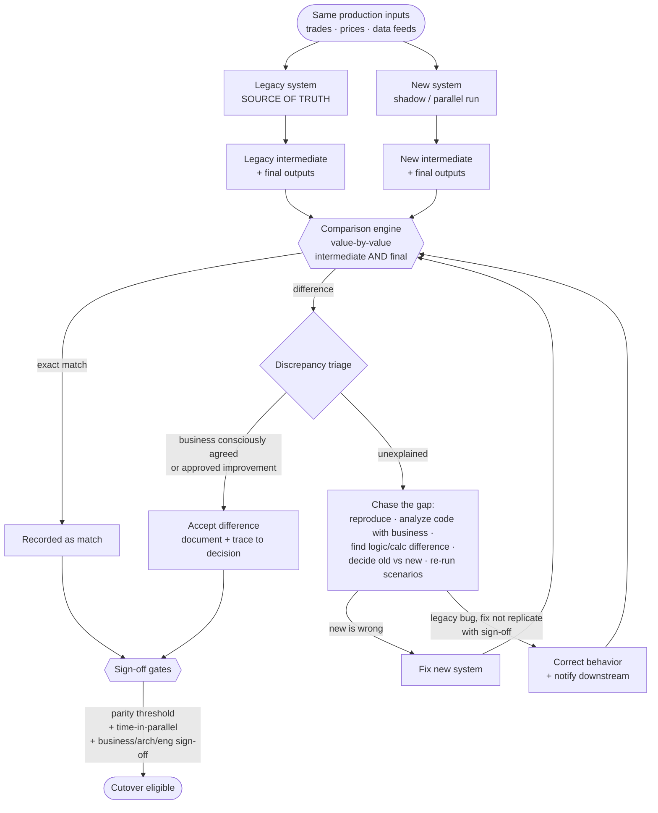

# The Parity Harness, deep-dive

*The signature methodology behind [Pattern 01: Parity](./01-parity.md). This is the machinery that turns "we think the new system is right" into "the business, architecture, and engineering have signed that it is." Its evidence is compiled in the [parity report template](../templates/parity-report.md).*

---

## Exec summary

The parity harness is the source of truth for whether a modernized, money-critical system can be trusted. It runs the legacy and new systems side by side on the same inputs, compares their outputs value by value at both intermediate and final stages, triages every discrepancy, and feeds a set of formal sign-off gates. On a large asset-management / trading platform it underwrote **5,000+ scenario** business testing and a **12+ week** production parallel run, with the legacy system remaining the source of truth throughout.

Its discipline is captured in one rule: **data must match exactly, and the only acceptable difference is one the business consciously agreed.** Everything else is a gap to be chased down to its root cause and resolved before go-live.

---

## What the harness is

A harness, not a test suite. On the flagship program this was a **purpose-built comparison harness**: a dedicated tool that pulled from both systems on a schedule, compared automatically, and produced break reports for triage. It comprises:

- **Dual execution.** The same inputs drive both the legacy system and the new system.
- **Output capture.** Both systems' outputs are captured at defined points, intermediate stages *and* final outputs.
- **Comparison engine.** A value-by-value comparator that reconciles captured outputs to the required grain. On the flagship program the grain was **every record, at every level**: each transaction, each position, each intermediate calculation value, each final output. Nothing was sampled.
- **Discrepancy triage.** A workflow that classifies each mismatch and routes it to resolution.
- **Sign-off gates.** Formal checkpoints where business, architecture, and engineering agree that parity is proven.

## The layers of parity testing

The harness supports several layers, each catching what the others miss:

### 1. Side-by-side functional testing
For defined, curated inputs, run both systems and compare. This is the fast inner loop: it catches structural and obvious differences early, before the expensive production parallel run.

### 2. Multi-week production parallel run (shadow run)
Run the new system alongside the live legacy system on **real production inputs** for **12+ weeks**. The legacy system remains the source of truth and continues to drive real outcomes; the new system's outputs are captured only for comparison. This is where the real edge cases surface: the ones that only appear across many trading cycles, month-ends, corporate actions, and unusual market days. No amount of curated test input substitutes for real production flow over time.

### 3. 5,000+ scenario business testing, run as evals
The scenario regime was built the way modern AI teams build an eval set, before that framing had a name here: **define the test cases and the expected answers *with* the business up front, then run the system against them continuously.** The business co-authored the test plan (what to test, what the right answer is); most scenarios were automated with a smaller manual set; and the whole suite was run regressively, over and over, with regular data-comparison checks between runs. A dedicated team owned it: QA, engineers, and production-parallel experts working as one unit. It took **hundreds of distinct scenarios** just to be confident no edge case was missed in a given area, and the full regime spanned **5,000+**. Business co-authorship is what connects raw value comparison to real-world meaning: the expected answer is agreed before the comparison runs, so a mismatch is a finding, never a debate.

### 4. Stored-procedure / logic analysis
Reading the legacy logic (accelerated by [AI-assisted legacy archaeology](../ai/legacy-archaeology.md)) so that when a difference appears, you can explain *why* each system produces what it does, and decide which is correct. Pin the pre-change behavior with a [characterization test plan](../templates/characterization-test-plan.md).

## Intermediate vs. final parity

The harness reconciles at two levels, and **both are required**:

- **Final parity:** the terminal, business-consumed outputs (trades, positions, NAVs, report values) match.
- **Intermediate parity:** the intermediate calculation stages along the way also match.

Requiring both is not redundant. Two systems can reach the same final number by different paths, and sometimes both paths are wrong in ways that cancel. Intermediate parity closes that door: it forces agreement on the *method*, not just the *answer*, so a match is a real match rather than a coincidence.

## What counts as a match

The bar is exactness, with one narrow exception:

- **Data must match exactly.**
- **The only acceptable difference** is one the business **consciously agreed** during requirements, or an **approved product improvement**.
- **Rounding differences are not accepted** unless a sound business rule was explicitly agreed.
- **Old bugs are fixed, not replicated**, with business sign-off, and never at the cost of trading accuracy.
- **Timing differences are accepted only** where overall values and trading accuracy *per trading cycle* are not compromised.

Every accepted difference is documented and traceable to a decision, in the accepted-difference log of the [parity report](../templates/parity-report.md). "Probably just rounding" is not a disposition; it is how a real logic bug hides.

## The data-flow diagram

## The chasing-a-gap workflow

When the comparison engine flags an unexplained difference:

1. **Reproduce** the discrepancy reliably.
2. **Understand *why* with the business.** Bring the domain owners in to interpret what the difference means in the real world.
3. **Analyze the code** to find the exact logic or calculation difference between old and new.
4. **Decide which is correct.** Old and new can each be right or wrong. Sometimes the legacy behavior is a long-standing bug.
5. **Resolve consciously.** Fix the new system, or, if the legacy was wrong, **fix rather than replicate** with business sign-off and downstream notification, never at the cost of trading accuracy.
6. **Regress across neighbors.** Re-run the affected scenario class, often hundreds of scenarios, to confirm the fix did not miss an adjacent edge case.

This work is deliberately regressive and rigorous. The whole point is that no edge case slips through.

## Field notes: what the burndown actually looks like

Two things about the flagship program's parallel run are worth knowing before you plan yours, because they invert the common intuition:

**The bulk matches early; the tail is the program.** The comparison was relatively clean soon after switch-on: the structural and obvious differences fall fast. What consumed most of the 12+ weeks was a stubborn long tail of rare edge cases: month-ends, corporate actions settling mid-cycle, unusual market days, positions that only exist in certain states on certain dates. If your plan assumes the work is proportional to the initial break count, you will declare victory around week three and be wrong. The parallel run is long precisely because the tail only surfaces across many real trading cycles.

**Every family of mismatch shows up.** It is tempting to model discrepancies as one dominant cause. In practice all four families appeared and each had to be chased differently:

| Family | What it looks like | How it hides |
|---|---|---|
| Timing and ordering | Same steps, different order or point in the cycle; drifts appear only on days when the order matters (a fee applied before vs after a mid-cycle corporate action) | Matches perfectly on quiet days |
| Forgotten special-case rules | A branch that fires only for a specific holding type, flag, or date range that nobody living knew existed | Looks like a new-system bug until the legacy code is read line by line |
| Rounding and precision | Different rounding points or numeric precision producing penny-level drifts | Reads as harmless noise; "probably rounding" is how logic bugs survive |
| Dirty historical data | The old system silently tolerated bad data; the new one handles it differently | The mismatch is real but the defect is in the data, not either system's logic |

The triage workflow has to distinguish these, because the fix is different in each case: reorder, preserve consciously, agree a rounding rule, or repair the data. On the flagship program the default resolution for genuine legacy bugs was **fix properly with business sign-off**: the business formally approved the intentional difference, it was documented in the accepted-difference log, and downstream consumers were notified. Replicating a known bug to force a match was the rare, explicitly signed exception, never the default.

## The sign-off gates

Parity is not declared by the harness alone; it is *ratified*. A slice becomes eligible for [cutover](./06-cutover.md) only when all of the following hold together:

- **Parity threshold** met: outputs reconcile, with only documented, business-agreed differences remaining, at both intermediate and final levels.
- **Time-in-parallel** satisfied: the slice has run alongside the legacy system long enough (12+ weeks in this program) to have seen the tail.
- **Formal sign-off** from **business, architecture, and engineering**, backed by defined architecture diagrams (ASO) and the harness evidence.

Each constituency sees different risk: business owns the meaning of the numbers, architecture owns the design's soundness, engineering owns the delivery. All three signatures are required.

## Industry grounding

The harness has independent precedents at every layer, which is worth knowing when you defend the budget for it:

- **Google Cloud Dual Run** is a productized version of the same architecture: mainframe and cloud replica run side by side on production transactions, outputs compared, parity certified before cutover; the tech originated inside Santander's own core-banking migration [Google Cloud, 2022](https://cloud.google.com/blog/products/infrastructure-modernization/dual-run-by-google-cloud-helps-mitigate-mainframe-migration-risks).
- **GDS dark-launch testing** is the UK government's version of the shadow run: send live queries to the new system, compare with the old, trust nothing until they agree [GDS Service Manual](https://www.gov.uk/service-manual/technology/moving-away-from-legacy-systems).
- **Mechanical Orchard** makes captured production behavior the source of truth and proves parity transaction by transaction before incremental cutover, explicitly rejecting code-only translation as certification [Mechanical Orchard](https://www.mechanical-orchard.com/platform).
- **Characterization tests** (Feathers, 2004) are the unit-scale ancestor: pin what the code actually does, then hold it there while you change everything underneath [summary](https://understandlegacycode.com/blog/key-points-of-working-effectively-with-legacy-code/). A curated side-by-side input set is a golden master in the same tradition.
- The research agrees the comparison must be execution-based: running outputs against reality plus judgment reaches ~95% semantic-equivalence detection, where reading code alone does not [MatchFixAgent, arXiv 2509.16187](https://arxiv.org/pdf/2509.16187). The consensus in one line: AI translates, execution-based parity evidence certifies.

## Anti-patterns specific to the harness

- **Final-only reconciliation.** Skipping intermediate parity lets compensating errors pass.
- **Curated inputs only.** Without the real production parallel run, the long-tail edge cases never appear.
- **Silent tolerance.** Any threshold that quietly swallows small differences will swallow real bugs. Accept differences only by explicit decision.
- **Short parallel runs.** Ending early trades weeks of patience for months of production risk.
- **Chasing without regressing.** Fixing one instance of a gap without re-running its scenario class leaves siblings undiscovered.
- **Harness as afterthought.** The harness is the spine of the program; treating it as end-stage QA is the classic, expensive mistake.

## Checklist

- [ ] Dual execution: same inputs drive legacy and new
- [ ] Outputs captured at intermediate **and** final stages
- [ ] Value-by-value comparison to the required grain
- [ ] Side-by-side functional testing as the fast inner loop
- [ ] Production parallel run (12+ weeks), legacy remains source of truth
- [ ] 5,000+ scenario business testing, including the long tail
- [ ] "Match" defined as exact, exceptions only by conscious business agreement
- [ ] Every accepted difference documented and traceable to a decision
- [ ] Chasing-a-gap workflow followed to root cause, with neighbor regression
- [ ] Legacy bugs fixed-not-replicated only with sign-off and downstream notification
- [ ] Sign-off gates require parity threshold + time-in-parallel + business/arch/eng sign-off

---

*Back to [Pattern 01, Parity](./01-parity.md) · Related: [Cutover](./06-cutover.md) · Templates: [Parity report](../templates/parity-report.md), [Characterization test plan](../templates/characterization-test-plan.md) · Deep-dive: [Legacy-code archaeology](../ai/legacy-archaeology.md)*
