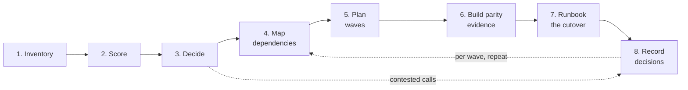

# The Playbook: One Artifact Lifecycle, Eight Phases

**Exec summary.** Strip the branding from AWS MAP, Azure CAF, Google's migration framework, the Thoughtworks Legacy Displacement patterns, and the UK and US government playbooks, and the same artifact lifecycle appears in all of them: inventory what you have, score it, decide its disposition, map dependencies, plan waves, build parity evidence, runbook the cutover, and record every decision. This page is the operating loop of the whole repo: each phase below says what you do, which [template](../templates/README.md) you fill, which [decision doc](../decide/README.md) applies, and what done looks like. The phases are a dependency order, not a waterfall: waves 2 and 3 are being inventoried and scored while wave 1 is cutting over. The one thing that never compresses is phase 6: parity evidence is the program's credibility currency, and in the AI era it is the part that stays human-owned.

## The lifecycle

This is the convergence point of every major framework, not an invention of this repo:

- **AWS MAP**: Assess produces the portfolio inventory and readiness assessment, Mobilize produces the wave plan and landing zone, Migrate & Modernize executes runbooked cutovers [AWS MAP](https://aws.amazon.com/migration-acceleration-program/).
- **Azure CAF**: Strategy and Plan produce the digital estate inventory and adoption plan before Ready and Adopt [Microsoft, 2024](https://learn.microsoft.com/en-us/azure/cloud-adoption-framework/overview).
- **Google Cloud**: Assess, Plan, Deploy, Optimize, with Migration Center as the assessment tool and Dual Run as the parity mechanism [Google Cloud](https://docs.cloud.google.com/architecture/migration-to-gcp-getting-started), [Dual Run, 2022](https://cloud.google.com/blog/products/infrastructure-modernization/dual-run-by-google-cloud-helps-mitigate-mainframe-migration-risks).
- **Thoughtworks**: understand outcomes, break into parts, deliver incrementally, change the organization; Feature Parity and Transitional Architecture are the evidence and delivery machinery [Thoughtworks](https://martinfowler.com/articles/patterns-legacy-displacement/).
- **UK GDS and CDDO**: RAG-scored legacy risk register, wrap-and-migrate pacing, dark-launch comparison evidence [GDS Service Manual](https://www.gov.uk/service-manual/technology/moving-away-from-legacy-systems), [CDDO framework](https://gov.uk/government/publications/guidance-on-the-legacy-it-risk-assessment-framework/guidance-on-the-legacy-it-risk-assessment-framework).
- **18F / USDS**: de-risking through modular delivery, phased rollout with revert paths, decision records in contracts and QASPs [18F De-risking Guide, 2024](https://guides.18f.gov/derisking/federal-field-guide/), [USDS Playbook](https://playbook.usds.gov/).

## Phase 1: Inventory

List every application, batch job, integration, report, and external consumer. No organization has this on day one: SAP and Oracle licensing audits regularly surface systems the CMDB never knew about, and only 16 percent of organizations say their workflows are well documented [Lucid via Sentra, 2025](https://www.sentra.app/articles/tribal-knowledge). Pull from network scans, license records, batch schedulers, and interviews, and record who still understands each system: the tribal-knowledge dimension matters because 76.6 percent of firms cite institutional knowledge loss as their top offboarding concern [Enboarder, 2025](https://blog.kintone.com/business-with-heart/tribal-knowledge-into-team-knowledge).

- **Template:** [application-inventory.md](../templates/application-inventory.md) plus [legacy-knowledge-map.md](../templates/legacy-knowledge-map.md)
- **Done when:** every production workload has a row, an owner, and a named human who understands it (or an explicit "nobody" flag, which is itself a risk-register entry).

## Phase 2: Score

Score each inventoried application on business value, technical fit, cost, and risk. Use the Gartner TIME 2x2 for the portfolio view [LeanIX](https://www.leanix.net/en/wiki/apm/gartner-time-model) and the CDDO seven legacy indicators for the technical-fit rubric, where a risk score of 16 or more is red [CDDO framework](https://gov.uk/government/publications/guidance-on-the-legacy-it-risk-assessment-framework/guidance-on-the-legacy-it-risk-assessment-framework). AWS's application portfolio assessment pattern runs a 2 to 4 week directional business case first, then a detailed one with NPV and payback for what survives [AWS APA guide](https://docs.aws.amazon.com/pdfs/prescriptive-guidance/latest/application-portfolio-assessment-guide/application-portfolio-assessment-guide.pdf).

- **Template:** scoring columns in [application-inventory.md](../templates/application-inventory.md); [risk-register.md](../templates/risk-register.md); [business-case.md](../templates/business-case.md)
- **Done when:** every app has a TIME quadrant, red risks have named owners, and the directional business case exists.

## Phase 3: Decide

Assign one 7R disposition per application, then for each Refactor/Re-architect pick the replacement approach. This is the whole [decide/](../decide/README.md) section: [choose-your-strategy.md](../decide/choose-your-strategy.md) for the 7R call, [rewrite-vs-strangle-vs-wrap.md](../decide/rewrite-vs-strangle-vs-wrap.md) for the approach. Expect Retire to claim a meaningful share of the estate; every retired app is a modernization you did not have to fund.

- **Template:** 7R disposition columns in [application-inventory.md](../templates/application-inventory.md); contested calls as [adr.md](../templates/adr.md)
- **Done when:** every app has exactly one R with a one-line rationale, and no disposition says "TBD."

## Phase 4: Map dependencies

Discover what talks to what: app to app, app to database, batch chains, file drops, external consumers. This is the prerequisite for wave planning, because dependencies decide what must move together [AWS wave planning](https://docs.aws.amazon.com/prescriptive-guidance/latest/large-migration-portfolio-playbook/wave-planning.html). Use discovery tooling (AWS ADS, Dynatrace, Faddom, ServiceNow class tools [Faddom, 2026](https://faddom.com/best-application-dependency-mapping-tools-top-10-tools-in-2026/)) plus observed production traffic; interviews alone miss the month-end feed that only fires twelve times a year. Every Retire decision from phase 3 gets re-checked here for hidden consumers.

- **Template:** dependency columns and adjacency notes in [application-inventory.md](../templates/application-inventory.md); findings that constrain sequencing go in [wave-plan.md](../templates/wave-plan.md)
- **Done when:** each application's inbound and outbound dependencies are listed with direction and mechanism, and no Retire candidate has unexplained inbound traffic.

## Phase 5: Plan waves

Group applications into migration waves by dependency cluster, risk, and similarity, sequenced so early waves are low-risk and exercise the machinery [AWS wave planning](https://docs.aws.amazon.com/prescriptive-guidance/latest/large-migration-portfolio-playbook/wave-planning.html). Wave 1 should be chosen to debug your runbook process, not to deliver the biggest business win. Assign owners per wave with a [RACI](../templates/raci.md); HealthCare.gov's 60 contracts across 33 companies with no integrator is the standing warning about unowned seams [Harvard D3, 2016](https://d3.harvard.edu/platform-rctom/submission/the-failed-launch-of-www-healthcare-gov/).

- **Template:** [wave-plan.md](../templates/wave-plan.md); [raci.md](../templates/raci.md)
- **Done when:** every non-retained app is in a wave, no wave splits a dependency cluster without a designed interim bridge, and each wave has an accountable owner.

## Phase 6: Build parity evidence

Before any cutover, prove the new system behaves like the old on evidence, not assertion. The mechanisms, in increasing strength: characterization tests that pin current behavior [Feathers, 2004](https://understandlegacycode.com/blog/key-points-of-working-effectively-with-legacy-code/), dark-launch comparisons on production queries [GDS Service Manual](https://www.gov.uk/service-manual/technology/moving-away-from-legacy-systems), and full parallel run with record-level reconciliation [Google Dual Run, 2022](https://cloud.google.com/blog/products/infrastructure-modernization/dual-run-by-google-cloud-helps-mitigate-mainframe-migration-risks). Differences are logged, dispositioned as defect or accepted difference, and signed. This phase is the one that never compresses: TSB went live with 4,424 open defects and paid roughly £1B for it [Slaughter and May, 2019](https://www.techmonitor.ai/leadership/digital-transformation/slaughter-and-may-tsb). Our flagship program ran 5,000+ business-test scenarios and a 12+ week production parallel run before retiring the legacy path.

- **Template:** [characterization-test-plan.md](../templates/characterization-test-plan.md); [parity-report.md](../templates/parity-report.md)
- **Decision doc:** [cutover-strategy.md](../decide/cutover-strategy.md) determines which evidence type each system needs
- **Done when:** the parity report shows reconciliation across a full business cycle (including month-end class events), and every open difference has a signed disposition.

## Phase 7: Runbook the cutover

Turn the cutover into a timed script: every step with an owner, expected timestamp, success criteria, and rollback trigger, per the AWS runbook structure [AWS cutover runbook guide](https://docs.aws.amazon.com/prescriptive-guidance/latest/cutover-runbook/welcome.html). The rollback plan is mandatory and rehearsed, with pre-agreed trigger conditions [AWS pre-cutover practices](https://docs.aws.amazon.com/prescriptive-guidance/latest/best-practices-migration-cutover/pre-cutover-stage.html), and the legacy revert path stays open post-launch per the USDS play [USDS Playbook](https://playbook.usds.gov/). Dress-rehearse at production volume; a runbook that has only run in a quiet environment is untested.

- **Template:** [cutover-runbook.md](../templates/cutover-runbook.md); [rollback-plan.md](../templates/rollback-plan.md)
- **Decision doc:** [cutover-strategy.md](../decide/cutover-strategy.md)
- **Done when:** a full rehearsal has executed the runbook and the rollback end to end, and the go/no-go gate has thresholds agreed before the meeting.

## Phase 8: Record decisions

Every consequential choice becomes an Architecture Decision Record: context, decision, consequences, in Nygard format [adr.github.io](https://adr.github.io/). ADRs are cheap insurance against the two failure modes that kill long programs: relitigating settled decisions when sponsors rotate, and repeating rejected options because nobody remembers why they were rejected. Record decisions as they happen, not retrospectively; a five-year program will outlive most of its original decision-makers.

- **Template:** [adr.md](../templates/adr.md)
- **Done when:** a new senior engineer can reconstruct why the architecture looks the way it does from the ADR log alone.

## Then loop

Phases 4 through 8 repeat per wave. Each wave's cutover feeds lessons back into the next wave's dependency map and runbook, and the inventory and scores get refreshed as the estate shrinks. A program is done when the inventory's legacy column is empty, not when the first go-live succeeds.

## The cross-cutting insight: AI moves the bottleneck, not the burden of proof

AI-era tooling now automates most artifact production across this lifecycle: AWS Transform generates documentation, business-rule catalogs, and test suites from COBOL estates [AWS, 2025](https://aws.amazon.com/about-aws/whats-new/2025/05/aws-transform-mainframe-generally-available); IBM watsonx Code Assistant for Z translates COBOL services to Java [IBM, 2023](https://www.ibm.com/new/announcements/ibm-watsonx-code-assistant-for-z-accelerate-the-application-lifecycle-with-generative-ai-and-automation); OpenRewrite executes deterministic mass refactoring [OpenRewrite](https://docs.openrewrite.org/). What AI does not automate is certification. LLMs default to surface similarity over semantic preservation [arXiv, 2024](https://arxiv.org/abs/2404.00971), and even execution-plus-LLM-judging approaches top out near 95 percent equivalence detection [MatchFixAgent, 2025](https://arxiv.org/pdf/2509.16187): the last percent is where the money-critical defects live. The industry consensus, from Mechanical Orchard's behavior-first stance [HyperFRAME, 2026](https://hyperframeresearch.com/2026/05/22/the-behavior-first-paradigm-moving-mainframe-modernization-past-llm-wishful-thinking/) to Google Dual Run, has settled into one sentence: **AI translates, execution-based parity evidence certifies.** Phases 1 through 5 and 7 are getting radically cheaper. Phase 6 is the human-owned bottleneck, and owning it well is what separates the programs that ship from the 79 percent that fail [vFunction/Wakefield, 2022](https://info.vfunction.com/hubfs/Download%20Assets/Wakefield-Report-2022-Why-App-Modernization-Projects-Fail.pdf). See [../ai/README.md](../ai/README.md) for the full tool landscape and its documented limits.

**Next:** [../decide/README.md](../decide/README.md) | [../templates/README.md](../templates/README.md) | [../case-studies/flagship-program.md](../case-studies/flagship-program.md)
