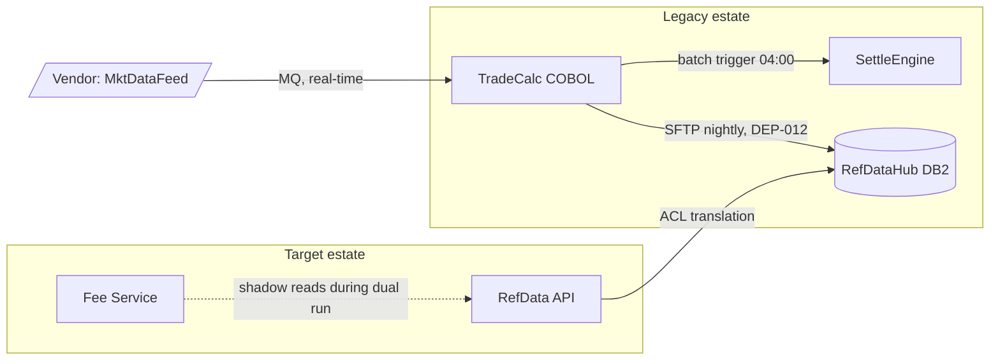

# Dependency Map Template

**Exec summary.** The dependency map records who calls whom, who reads whose data, and what breaks when something moves. It is the prerequisite for wave planning: apps that depend on each other migrate together or need a bridge across the seam. Tooling discovers dependencies at runtime, from agent-based discovery like AWS Application Discovery Service [AWS ADS, 2016](https://aws.amazon.com/about-aws/whats-new/2016/05/now-available-aws-application-discovery-service/) to agentless mappers like Faddom, Dynatrace, and ServiceNow Service Mapping [Faddom tooling roundup, 2026](https://faddom.com/best-application-dependency-mapping-tools-top-10-tools-in-2026/). But tool output is a haystack of TCP flows; this template is where humans distill it into named, typed, cutover-relevant dependencies, in markdown with a Mermaid graph the whole program can read and diff.

**Produced in:** the Map Dependencies phase of the [artifact lifecycle](../playbook/README.md).
**Owner:** enterprise architect or infrastructure lead. **Signs off:** chief architect.

## The template

````markdown
# Dependency Map: <program name or wave scope>

Version: <x.y> | Date: <YYYY-MM-DD> | Owner: <name, role>
Discovery sources: <tool runs, dates> + <SME interviews, dates>
Confidence key: Observed = seen in discovery traffic | Declared = SME-asserted, not yet observed

## Dependency register

| ID | From | To | Type | Interface / mechanism | Direction | Frequency | Criticality | Confidence | Cutover handling |
|---|---|---|---|---|---|---|---|---|---|
| DEP-012 | TradeCalc | RefDataHub | Data read | Nightly SFTP file REFDATA.D* | TradeCalc pulls | Daily 02:00 | Critical: batch abends without it | Observed | Wave 2: dual-feed file to both legacy and new until TradeCalc migrates in wave 3 |
| <DEP-nnn> | <app/component> | <app/component> | <API call / data read / data write / shared DB / file transfer / message topic / batch trigger / shared infra / auth dependency> | <protocol, endpoint, file, table, queue> | <A calls B / B pushes to A / bidirectional> | <real-time / hourly / daily / monthly> | <Critical / High / Medium / Low, with one-line consequence> | <Observed / Declared> | <migrate together / bridge via <mechanism> / break and re-point / retire> |

## Graph



Conventions: solid arrows = live dependencies; dotted = dual-run or shadow;
[(...)] = data stores; [/.../] = external parties; subgraphs = estates or zones.
Label edges with mechanism and register ID so the graph and the table stay joined.

## Hotspots

| Finding | Evidence | Implication for wave plan |
|---|---|---|
| RefDataHub has 23 inbound dependents | Register DEP-001..DEP-023 | Cannot move late; wrap with RefData API in wave 1 so dependents re-point gradually |
| <shared database / god-app / hidden batch chain> | <register IDs> | <sequencing consequence> |
````

## Method

1. **Run discovery first, interview second.** Agent or agentless discovery (AWS ADS, Faddom, Dynatrace, ServiceNow) finds the flows nobody declared; SMEs explain what the flows mean and which ones are dead. Record confidence per row: Observed beats Declared.
2. **Watch a full business cycle.** Month-end, quarter-end, and year-end dependencies are the classic wave-plan killers; a two-week discovery window misses them.
3. **Data dependencies outrank call dependencies.** Shared databases and file drops are the couplings that force joint migration; API calls can usually be bridged.
4. **Every Critical dependency gets a cutover handling decision.** "Migrate together, bridge, break and re-point, or retire" per row; unresolved rows block the [wave plan](wave-plan.md).
5. **Keep the graph small and cut it by wave.** One Mermaid graph per wave or domain stays readable and diffs cleanly; a 400-node graph is discovery output, not a map.

## Quality bar

- [ ] Every row has a typed dependency, a named mechanism, and a criticality with a consequence
- [ ] Discovery covered at least one full business cycle including period-end
- [ ] Observed vs Declared confidence is recorded; Declared-only Critical rows have a verification task
- [ ] Every Critical and High dependency has a cutover handling decision
- [ ] Mermaid graph edge labels carry register IDs so table and graph reconcile
- [ ] External and vendor dependencies (feeds, auth, licensing servers) are included, not just internal apps

Next: [wave plan](wave-plan.md) | [application inventory](application-inventory.md) | [strangler fig pattern](../patterns/02-strangler-fig.md)
