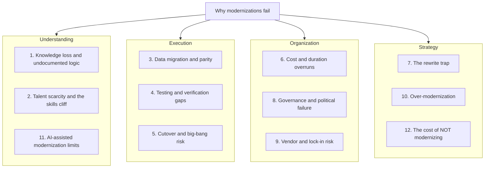

# Why Legacy Modernizations Fail

**Exec summary:** Most modernization programs fail, and they fail in predictable ways. Surveyed failure rates run from 67% to 79% of projects [vFunction/Wakefield, 2022](https://info.vfunction.com/hubfs/Download%20Assets/Wakefield-Report-2022-Why-App-Modernization-Projects-Fail.pdf), and the postmortems of the biggest disasters (TSB, Queensland Health, HealthCare.gov, Lidl) repeat the same root causes. This page organizes those root causes into 12 categories under 4 super-groups: Understanding, Execution, Organization, and Strategy. Every category links to the chapter of this playbook that addresses it. If you only read one thing here, read the [headline numbers](#headline-numbers) and the [post-mortems](post-mortems/README.md).

## Headline numbers

| # | Stat | Source |
|---|------|--------|
| 1 | 79% of application modernization projects fail, at an average cost of $1.5M and 16 months | [vFunction/Wakefield, 2022](https://info.vfunction.com/hubfs/Download%20Assets/Wakefield-Report-2022-Why-App-Modernization-Projects-Fail.pdf) |
| 2 | 83% of data migrations fail or exceed budget/schedule | Widely attributed to Gartner, via [QuerySurge](https://www.querysurge.com/resource-center/white-papers/strategic-optimization-of-enterprise-data-migration-testing); see [source-quality note](#a-note-on-source-quality) |
| 3 | Large IT projects: 45% over budget, deliver 56% less value than predicted, under 10% succeed outright | [Standish Group CHAOS](https://www.standishgroup.com/) |
| 4 | TSB 2018 migration: roughly £1B total damage, including £48.65M in regulator fines | [Slaughter and May review, 2019](https://www.techmonitor.ai/leadership/digital-transformation/slaughter-and-may-tsb); [FCA/PRA, 2022](https://www.techmonitor.ai/policy/privacy-and-data-protection/tsb-it-crash-migration-bank-fca) |
| 5 | TSB went live with 4,424 open defects out of 34,671 logged | [Slaughter and May review, 2019](https://www.techmonitor.ai/leadership/digital-transformation/slaughter-and-may-tsb) |
| 6 | Queensland Health payroll: AU$6.2M contract became AU$1.2B+ total cost, roughly 200x | [Queensland Commission of Inquiry, 2013](https://cabinet.qld.gov.au/documents/2013/aug/health%20payroll%20response/Attachments/Report.pdf) |
| 7 | 67% of organizations report failing to complete legacy modernization programs | [Advanced/ModernSystems, cited in industry surveys](https://www.techtarget.com/searchsoftwarequality/news/252523671/) |
| 8 | 79% of financial firms cite mainframe talent acquisition as a top challenge; 71% say teams are understaffed | [Deloitte, 2025](https://biztechmagazine.com/article/2025/04/how-financial-services-companies-can-maintain-mainframes-cobol-experts-retire) |
| 9 | 90% of enterprises are pursuing mainframe-to-cloud moves, but only 19.5% of workloads have actually moved; 58% carry $21M to $100M in annual mainframe cost | [Accenture C-suite survey, 2025](https://aws.amazon.com/blogs/migration-and-modernization/reimagining-mainframe-applications-with-accenture-and-aws-transform/) |
| 10 | 220B+ lines of COBOL remain in production | Widely circulated; via [Adalo](https://www.adalo.com/posts/b2b-reliance-legacy-coding-languages-stats); see [source-quality note](#a-note-on-source-quality) |
| 11 | Developers lose 33% to 42% of their week to tech debt and bad code, roughly $85B/yr globally | [Stripe Developer Coefficient, 2018](https://stripe.com/reports/developer-coefficient) |
| 12 | By 2026, 80% of tech debt will be architectural, not code-level | [Gartner, 2023, via industry coverage](https://byteiota.com/microservices-rollback-2026-42-return-to-monoliths/) |

Counter-stat worth knowing: organizations report a median of only 28% of applications modernized, yet 85%+ satisfaction with hybrid approaches [IBM IBV, 2024](https://www.ibm.com/thought-leadership/institute-business-value/). Incremental beats heroic.

## The map: 12 categories, 4 super-groups

Read the categories below, then score your own program against them with the [readiness scorecard](../assessment/readiness-scorecard.md).

## Understanding failures

### 1. Knowledge loss and undocumented logic

**What it is.** Decades of business rules live only in code, batch jobs, stored procedures, spreadsheets, and people's heads. The "crufty" parts of old code are often hard-earned fixes for real corner cases [Spolsky, 2000](https://www.joelonsoftware.com/2000/04/06/things-you-should-never-do-part-i/).

**Why it happens.** Documentation decays faster than code. Only 16% of organizations say their workflows are well documented [Lucid survey via Sentra, 2025](https://www.sentra.app/articles/tribal-knowledge). Nobody budgets for archaeology until the migration team hits a rule no one can explain.

**The numbers.**
- 76.6% of organizations cite institutional knowledge loss as their top offboarding concern [Enboarder via Kintone, 2025](https://blog.kintone.com/business-with-heart/tribal-knowledge-into-team-knowledge)
- Fortune 500 firms lose roughly $31.5B/yr from failure to share knowledge [IDC via Kintone](https://blog.kintone.com/business-with-heart/tribal-knowledge-into-team-knowledge)
- The IRS Individual Master File is 60+ years old and still running [GAO-25-107611](https://www.gao.gov/assets/gao-25-107611.pdf)

**Where this playbook addresses it:** [AI legacy archaeology](../ai/legacy-archaeology.md), [legacy knowledge map template](../templates/legacy-knowledge-map.md), [application inventory template](../templates/application-inventory.md).

### 2. Talent scarcity and the skills cliff

**What it is.** The people who understand the legacy estate are retiring faster than replacements arrive, and the same scarce people are needed to validate the new system [TechTarget](https://www.techtarget.com/searchsoftwarequality/news/252523671/).

**Why it happens.** 85%+ of universities dropped COBOL from curricula since the 1990s, and new mainframe talent takes 1 to 2 years to ramp [Metaintro, 2026](https://www.metaintro.com/blog/cobol-developer-shortage-legacy-systems-career-opportunity-2026). The Open Mainframe Project put the average COBOL developer near age 55, with roughly 10% retiring each year.

**The numbers.**
- 79% of financial firms cite mainframe talent acquisition as a top challenge; 71% are understaffed [Deloitte, 2025](https://biztechmagazine.com/article/2025/04/how-financial-services-companies-can-maintain-mainframes-cobol-experts-retire)

**Where this playbook addresses it:** [legacy knowledge map template](../templates/legacy-knowledge-map.md), [readiness scorecard](../assessment/readiness-scorecard.md), [AI-era modernization](../ai/README.md).

### 11. AI-assisted modernization limits

**What it is.** LLMs translate code but cannot certify equivalence. Naive translation produces "JOBOL": Java that is structurally COBOL, unverified and unmaintainable [DataStealth](https://datastealth.io/blogs/mainframe-modernization-claude-code-cobol).

**Why it happens.** Context windows cannot hold a mainframe estate; cross-program dependencies and JCL orchestration get missed; COBOL training data is thin [DataStealth](https://datastealth.io/blogs/mainframe-modernization-claude-code-cobol). Academic work finds LLMs help comprehension more than conversion [arXiv 2411.14971](https://arxiv.org/abs/2411.14971), [arXiv 2508.19663](https://arxiv.org/abs/2508.19663).

**The numbers.**
- 61% of executives say generative AI is important to their mainframe modernization plans [IBM IBV, 2024](https://www.ibm.com/thought-leadership/institute-business-value/)
- The consensus position: AI translates, execution-based parity evidence certifies [Mechanical Orchard](https://www.mechanical-orchard.com/platform)

**Where this playbook addresses it:** [AI-era modernization](../ai/README.md), [the parity pattern](../patterns/01-parity.md).

## Execution failures

### 3. Data migration and parity

**What it is.** Moving decades of data between systems whose data models disagree about what the data means, then proving the new system behaves identically.

**Why it happens.** Semantic mismatches hide until reconciliation. Lidl's inventory system keyed on purchase prices while SAP assumed retail prices; the collision cost €500M [Computer Weekly, 2018](https://www.computerweekly.com/news/252446965/Lidl-dumps-500m-SAP-project). Tooling auto-converts only about 70% of stored-procedure logic; the remaining 30% is manual work with behavioral regression risk [AWS Database Blog](https://aws.amazon.com/blogs/database/challenges-when-migrating-from-oracle-to-postgresql-and-how-to-overcome-them/).

**The numbers.**
- 83% of data migrations fail or overrun (widely attributed to Gartner); Bloor Research found ~75% fail with average 30% cost overrun and only 16% on time and budget [QuerySurge](https://www.querysurge.com/resource-center/white-papers/strategic-optimization-of-enterprise-data-migration-testing)
- TSB migrated 1.3B records for 5.2M customers in a single weekend [iceDQ](https://icedq.com/resources/case-studies/tsb-bank-data-migration-failure)

**Where this playbook addresses it:** [the parity pattern](../patterns/01-parity.md), [parity report template](../templates/parity-report.md), [taming stored procedures](../patterns/03-taming-stored-procedures.md).

### 4. Testing and verification gaps

**What it is.** Going live without evidence that the new system reproduces the old system's behavior. "Legacy code is simply code without tests" [Feathers, Working Effectively with Legacy Code, 2004](https://www.oreilly.com/library/view/working-effectively-with/0131177052/).

**Why it happens.** Deadline pressure compresses test windows. HealthCare.gov compressed its end-to-end testing from months into a fraction of the plan [Harvard D3, 2016](https://d3.harvard.edu/platform-rctom/submission/the-failed-launch-of-www-healthcare-gov/). TSB never load-tested one of its two data centers [Slaughter and May, 2019](https://www.techmonitor.ai/leadership/digital-transformation/slaughter-and-may-tsb).

**The numbers.**
- TSB: 34,671 defects logged, 4,424 still open at go-live [Slaughter and May, 2019](https://www.techmonitor.ai/leadership/digital-transformation/slaughter-and-may-tsb)
- Queensland Health went live with 2,422 known defects and generated 35,000 payroll anomalies [Commission of Inquiry, 2013](https://cabinet.qld.gov.au/documents/2013/aug/health%20payroll%20response/Attachments/Report.pdf)

**Where this playbook addresses it:** [characterization test plan template](../templates/characterization-test-plan.md), [the parity pattern](../patterns/01-parity.md), [parity harness deep dive](../patterns/parity-harness-deepdive.md).

### 5. Cutover and big-bang risk

**What it is.** Migrating everything in one irreversible event. One bad weekend can consume a decade of goodwill.

**Why it happens.** Big-bang looks cheaper on paper; parallel running doubles operating cost and demands continuous reconciliation [Brainhub](https://brainhub.eu/library/big-bang-migration-vs-trickle-migration). Political and contractual deadlines force premature go-lives: HealthCare.gov leadership received 18 written warnings and launched anyway [Harvard D3, 2016](https://d3.harvard.edu/platform-rctom/submission/the-failed-launch-of-www-healthcare-gov/).

**The numbers.**
- TSB's one-weekend cutover: £366M direct cost, £48.65M in fines, CEO resignation, roughly £1B total [Tech Monitor, 2022](https://www.techmonitor.ai/policy/privacy-and-data-protection/tsb-it-crash-migration-bank-fca)
- Roughly 64% of migrations suffer unforeseen outages [Oracle white paper via iceDQ](https://icedq.com/resources/case-studies/tsb-bank-data-migration-failure)

**Where this playbook addresses it:** [cutover strategy decision](../decide/cutover-strategy.md), [cutover pattern](../patterns/06-cutover.md), [cutover runbook template](../templates/cutover-runbook.md), [rollback plan template](../templates/rollback-plan.md).

## Organization failures

### 6. Cost and duration overruns

**What it is.** Programs that cost multiples of the estimate and run years late, destroying sponsorship before delivery.

**Why it happens.** Estimates anchor on the happy path; discovery happens during execution, when it is most expensive. Even the success stories overrun: Commonwealth Bank's core banking replacement went from $580M to $1B+ over five years, and is celebrated because it delivered (McKinsey; widely cited, no single public primary document).

**The numbers.**
- 79% of modernization projects fail at an average of $1.5M and 16 months [vFunction/Wakefield, 2022](https://info.vfunction.com/hubfs/Download%20Assets/Wakefield-Report-2022-Why-App-Modernization-Projects-Fail.pdf)
- Queensland Health: AU$6.2M to AU$1.2B+, roughly 200x [Commission of Inquiry, 2013](https://cabinet.qld.gov.au/documents/2013/aug/health%20payroll%20response/Attachments/Report.pdf); Birmingham City Council: £19M to £144M [The Register, 2026](https://www.theregister.com/2026/01/29/birmingham_oracle_latest/); HealthCare.gov: $464M to $824M [Harvard D3, 2016](https://d3.harvard.edu/platform-rctom/submission/the-failed-launch-of-www-healthcare-gov/)
- Banks spend an estimated $350B/yr maintaining legacy, 70 to 80% of IT budgets (McKinsey; widely cited, treat as directional). Federal agencies spend about 80% of $100B+ IT budgets on operations and maintenance [GAO-23-106821](https://www.gao.gov/products/gao-23-106821)

**Where this playbook addresses it:** [business case template](../templates/business-case.md), [wave plan template](../templates/wave-plan.md), [the playbook lifecycle](../playbook/README.md).

### 8. Governance, politics, and accountability failure

**What it is.** The root causes of the biggest failures are organizational, not technical: "the system around the system" [Bellotti, Kill It with Fire, 2021](https://nostarch.com/kill-it-fire).

**Why it happens.** Nobody owns the outcome. HealthCare.gov had 60 contracts across 33 companies and no systems integrator; CMS assumed the role without the capacity for it [HHS OIG, 2016](https://oig.hhs.gov/reports/all/2016/healthcaregov-case-study-of-cms-management-of-the-federal-marketplace). Executives and architects disagree about why modernization even matters [vFunction/Wakefield, 2022](https://info.vfunction.com/hubfs/Download%20Assets/Wakefield-Report-2022-Why-App-Modernization-Projects-Fail.pdf). At the extreme, institutions defend the system against the evidence: the Post Office prosecuted roughly 900 subpostmasters rather than admit Horizon had bugs [Computer Weekly](https://www.computerweekly.com/feature/Post-Office-Horizon-scandal-explained-everything-you-need-to-know).

**The numbers.**
- Roughly 900 wrongful prosecutions over two decades in the Horizon scandal [Computer Weekly](https://www.computerweekly.com/feature/Post-Office-Horizon-scandal-explained-everything-you-need-to-know)
- Queensland's inquiry called its payroll project possibly the worst failure of public administration in the country [Commission of Inquiry, 2013](https://cabinet.qld.gov.au/documents/2013/aug/health%20payroll%20response/Attachments/Report.pdf)

**Where this playbook addresses it:** [RACI template](../templates/raci.md), [ADR template](../templates/adr.md), [risk register template](../templates/risk-register.md), [readiness scorecard](../assessment/readiness-scorecard.md).

### 9. Vendor, consultant, and lock-in risk

**What it is.** Betting the program on a supplier whose incentives diverge from yours, or being forced to migrate on a vendor's schedule instead of your own.

**Why it happens.** Contracts reward delivery milestones, not business outcomes. Hertz sued Accenture for $32M after receiving no working website [CMSWire, 2019](https://www.cmswire.com/information-management/10-lessons-from-hertzs-32m-web-design-lawsuit-against-accenture/). Queensland banned IBM from new government contracts after the payroll disaster [Wikipedia](https://en.wikipedia.org/wiki/2010_Queensland_Health_payroll_system_implementation). Vendor support deadlines create forced marches: SAP ECC support ends in 2027, and only about 39% of 35,000 ECC customers had migrated by end of 2024 [CIO, 2025](https://www.cio.com/article/4000543/).

**The numbers.**
- 58% of organizations carry $21M to $100M in annual mainframe cost; 90% are pursuing cloud but only 19.5% of workloads have moved [Accenture, 2025](https://aws.amazon.com/blogs/migration-and-modernization/reimagining-mainframe-applications-with-accenture-and-aws-transform/)

**Where this playbook addresses it:** [choose your strategy](../decide/choose-your-strategy.md), [risk register template](../templates/risk-register.md), [decision hub](../decide/README.md).

## Strategy failures

### 7. The rewrite trap

**What it is.** Deciding to rebuild from scratch because the old code is "unreadable." Spolsky called the full rewrite the "single worst strategic mistake" a software company can make [Spolsky, 2000](https://www.joelonsoftware.com/2000/04/06/things-you-should-never-do-part-i/).

**Why it happens.** Reading code is harder than writing it, so old code always looks worse than it is. Meanwhile feature parity is a moving target: the business keeps changing the old system while you rebuild it. The FBI's Virtual Case File died this way: $170M scrapped after continuous requirements churn [IEEE Spectrum](https://spectrum.ieee.org/who-killed-the-virtual-case-file). For a balanced counterpoint on when rewrites do work, see [Caudill, Lessons from 6 software rewrite stories](https://medium.com/@herbcaudill/lessons-from-6-software-rewrite-stories-635e4c8f7c22).

**The numbers.**
- 72% of large rewrites exceed budget or fail outright (widely cited; treat as directional)
- FBI VCF: $170M spent, including $105M of unusable code [CNN, 2005](https://www.cnn.com/2005/US/02/03/fbi.computers/)

**Where this playbook addresses it:** [rewrite vs strangle vs wrap](../decide/rewrite-vs-strangle-vs-wrap.md), [strangler fig pattern](../patterns/02-strangler-fig.md).

### 10. Over-modernization and architecture pitfalls

**What it is.** Replacing a working monolith with a distributed system the organization cannot operate. Modernize for value, not fashion [Bellotti, 2021](https://nostarch.com/kill-it-fire).

**Why it happens.** Architecture follows conference talks instead of team topology. The operational bill (observability, on-call, distributed debugging) arrives after the migration.

**The numbers.**
- 73% of monolith-to-microservices migrations fail or produce slower, more complex systems [Fabres](https://fabres.eu/blog/why-most-monolith-to-microservices-migrations-fail-part2/)
- Roughly 42% of adopters are consolidating back toward modular monoliths, citing 2 to 3x infrastructure cost and 35% more debugging time [ByteIota, 2026](https://byteiota.com/microservices-rollback-2026-42-return-to-monoliths/)
- By 2026, 80% of tech debt will be architectural [Gartner, 2023, via ByteIota](https://byteiota.com/microservices-rollback-2026-42-return-to-monoliths/)

**Where this playbook addresses it:** [choose your strategy](../decide/choose-your-strategy.md), [event-driven saga pattern](../patterns/04-event-driven-saga.md).

### 12. The cost of NOT modernizing

**What it is.** Doing nothing is also a decision, and it has a price: fragility under load, fraud exposure, and perpetual maintenance purgatory.

**Why it happens.** Legacy risk is invisible until a shock arrives. California EDD's COBOL-era systems collapsed under pandemic claim volume, with an estimated $20B lost to fraud [CalMatters, 2023](https://calmatters.org/economy/2023/11/california-unemployment-covid/); [CA State Auditor 2020-128/628.1](https://information.auditor.ca.gov/reports/2020-128and628.1/responses.html). The IRS abandoned CADE in 2009 and CADE 2 keeps slipping, now toward roughly 2030 [GAO-25-107795](https://www.gao.gov/products/gao-25-107795).

**The numbers.**
- Of GAO's 10 most critical federal legacy systems flagged for modernization, only 3 were modernized six years later [GAO](https://www.gao.gov/products/gao-23-106821)
- Developers lose 33 to 42% of their week to tech debt, roughly $85B/yr [Stripe, 2018](https://stripe.com/reports/developer-coefficient)

**Where this playbook addresses it:** [business case template](../templates/business-case.md), [readiness scorecard](../assessment/readiness-scorecard.md).

## Learn from the disasters

Eight fully sourced post-mortems, each mapped to these categories and to the pattern that would have prevented it: [post-mortems index](post-mortems/README.md).

| If your biggest fear is... | Read |
|---|---|
| A cutover weekend going wrong | [TSB Bank](post-mortems/tsb-bank.md) |
| Trusting the system over your people | [Post Office Horizon](post-mortems/post-office-horizon.md) |
| Going live with known defects | [Queensland Health](post-mortems/queensland-health.md) |
| Nobody owning integration | [HealthCare.gov](post-mortems/healthcare-gov.md) |
| Data models that do not match | [Lidl SAP](post-mortems/lidl-sap.md) |
| The big rewrite | [FBI Virtual Case File](post-mortems/fbi-virtual-case-file.md) |
| ERP customization spiral | [Birmingham City Council](post-mortems/birmingham-oracle.md) |
| Doing nothing until the crisis | [California EDD](post-mortems/california-edd.md) |

## A note on source quality

Not all circulating statistics are equal. The "83% of data migrations fail" figure and several 70 to 88% failure rates circulate mostly through vendor content and are hard to trace to a primary Gartner document; this page flags them as "widely attributed." The same applies to the 220B-lines-of-COBOL figure and the McKinsey $350B/yr bank-maintenance estimate. The strongest primary sources, safe to quote in a board deck, are: GAO reports, the Slaughter and May TSB review, the Queensland Commission of Inquiry report, the California State Auditor reports, the Post Office Horizon IT Inquiry, Standish CHAOS, the Stripe Developer Coefficient, the vFunction/Wakefield survey PDF, and the Accenture 2025 C-suite survey. When in doubt, prefer a named public report over a percentage from a vendor blog.

**Next:** [Post-mortems index](post-mortems/README.md) | [Readiness scorecard](../assessment/readiness-scorecard.md) | [Decision hub](../decide/README.md)
