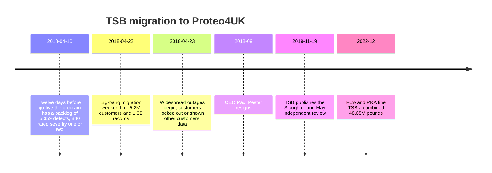

# TSB Bank: The Big-Bang Cutover That Cost £1B

**Exec summary:** On the evening of Sunday 22 April 2018, TSB migrated 5.2M customers and 1.3B records from the Lloyds Banking Group platform to Proteo4UK, a new platform built by Sabis, in a single weekend [iceDQ](https://icedq.com/resources/case-studies/tsb-bank-data-migration-failure). Customers were locked out or shown other people's accounts for weeks. Direct costs hit £366M, the FCA and PRA levied £48.65M in fines, the CEO resigned, and total damage approached £1B [Tech Monitor, 2022](https://www.techmonitor.ai/policy/privacy-and-data-protection/tsb-it-crash-migration-bank-fca). This is the canonical case against big-bang cutover without parity evidence.

## By the numbers

| Metric | Value |
|---|---|
| Customers migrated in one weekend | 5.2M |
| Records migrated | 1.3B |
| Defects logged over the program | 34,671 |
| Defects open at go-live | 4,424 |
| Direct cost | £366M |
| FCA and PRA fines (2022) | £48.65M |
| Estimated total damage | ~£1B |

## Timeline

Dates per [Slaughter and May, 2019](https://www.slaughterandmay.com/news/slaughter-and-may-s-independent-review-of-tsb-s-2018-migration-to-a-new-it-platform/), [TSB, 2019](https://www.tsb.co.uk/news-releases/slaughter-and-may.html), and [Tech Monitor, 2022](https://www.techmonitor.ai/policy/privacy-and-data-protection/tsb-it-crash-migration-bank-fca).

## What went wrong

- **A platform built and customized in flight.** Proteo4UK was not a proven product being configured; it was simultaneously customized for UK banking requirements and upgraded from Proteo3 to Proteo4 architecture, involving over 70 suppliers and 1,400+ people under Sabis [Slaughter and May, 2019](https://www.slaughterandmay.com/news/slaughter-and-may-s-independent-review-of-tsb-s-2018-migration-to-a-new-it-platform/).
- **Known defect debt at go-live.** The program logged 34,671 defects; 4,424 were still open at go-live. Twelve days before migration the backlog stood at 5,359, including 840 severity one or two defects [Slaughter and May via Tech Monitor, 2019](https://www.techmonitor.ai/leadership/digital-transformation/slaughter-and-may-tsb).
- **Untested infrastructure.** One of the two production data centers was never load-tested before the full customer base landed on it [Slaughter and May via Tech Monitor, 2019](https://www.techmonitor.ai/leadership/digital-transformation/slaughter-and-may-tsb).
- **One-weekend, all-or-nothing design.** The entire bank moved in a single event, so there was no way to limit blast radius and no practical rollback once the migration completed [iceDQ](https://icedq.com/resources/case-studies/tsb-bank-data-migration-failure).
- **The bill.** £366M in direct costs (customer compensation, fraud losses, remediation), £48.65M in regulator fines, and a total widely estimated near £1B [Tech Monitor, 2022](https://www.techmonitor.ai/policy/privacy-and-data-protection/tsb-it-crash-migration-bank-fca).

## Root causes (taxonomy)

| Category | How it showed up |
|---|---|
| [5. Cutover and big-bang risk](../README.md#5-cutover-and-big-bang-risk) | Single-weekend migration of the whole bank, no phased fallback |
| [4. Testing and verification gaps](../README.md#4-testing-and-verification-gaps) | 4,424 open defects at go-live; one data center never load-tested |
| [8. Governance failure](../README.md#8-governance-politics-and-accountability-failure) | Board go-live decision made against visible defect data; FCA cited operational risk governance failings |

## What would have prevented it

- **A phased or parallel-run cutover.** Migrating cohorts of customers in waves, or running old and new in parallel with continuous reconciliation, would have capped the blast radius. See [cutover strategy](../../decide/cutover-strategy.md) and the [cutover pattern](../../patterns/06-cutover.md).
- **Parity evidence as a go-live gate.** A parity harness producing record-level reconciliation and behavior-equivalence evidence, with explicit accepted-difference logs, turns "are we ready?" from opinion into data. See [the parity pattern](../../patterns/01-parity.md) and the [parity report template](../../templates/parity-report.md).
- **A runbook with rollback triggers.** Pre-agreed success criteria and rollback triggers per step, signed before the weekend. See the [cutover runbook template](../../templates/cutover-runbook.md) and [rollback plan template](../../templates/rollback-plan.md).
- **Defect-based go/no-go criteria.** A written rule such as "zero open severity 1-2 defects in money-moving paths" would have forced the conversation 12 days out.

## Lessons checklist

- [ ] Is any part of our cutover a single irreversible event? If yes, has an executive signed the rollback plan for it?
- [ ] Do we have record-level reconciliation between old and new for money-touching data?
- [ ] Have both production sites (or all failover paths) been load-tested at peak volume?
- [ ] Is there a written defect threshold that blocks go-live, agreed before the date pressure arrives?
- [ ] Has the go-live decision maker seen the raw open-defect list, not a RAG summary?

## Sources

- [Slaughter and May, Independent Review of TSB's 2018 migration, 2019](https://www.slaughterandmay.com/news/slaughter-and-may-s-independent-review-of-tsb-s-2018-migration-to-a-new-it-platform/)
- [TSB Board publishes independent review, 2019](https://www.tsb.co.uk/news-releases/slaughter-and-may.html)
- [Tech Monitor, 5 takeaways from the Slaughter and May report, 2019](https://www.techmonitor.ai/leadership/digital-transformation/slaughter-and-may-tsb)
- [Tech Monitor, FCA fine coverage, 2022](https://www.techmonitor.ai/policy/privacy-and-data-protection/tsb-it-crash-migration-bank-fca)
- [iceDQ, TSB data migration failure case study](https://icedq.com/resources/case-studies/tsb-bank-data-migration-failure)
- [Computer Weekly, TSB programme pulled apart in report, 2019](https://www.computerweekly.com/news/252474170/TSB-programme-pulled-apart-in-report-on-IT-meltdown)

**Next:** [Cutover strategy](../../decide/cutover-strategy.md) | [The parity pattern](../../patterns/01-parity.md) | [Post-mortems index](README.md)
